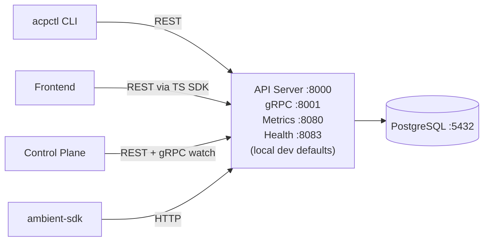

# Ambient API Server

REST + gRPC microservice built on the [rh-trex-ai](https://github.com/openshift-online/rh-trex-ai) framework. It is the single source of truth for platform data: sessions, projects, users, and project settings are persisted in PostgreSQL and exposed via auto-generated CRUD endpoints. The Control Plane and CLI consume this API via the Go SDK; the Frontend consumes it via the TypeScript SDK.

## Architecture



Three servers run concurrently:

| Server | Port | Purpose |
|--------|------|---------|
| REST API | 8000 | CRUD endpoints for all Kinds |
| gRPC | 8001 | Watch streams (Control Plane) |
| Metrics | 8080 (local) / 4433 (cluster) | Prometheus |
| Health | 8083 (local) / 4434 (cluster) | `/health` liveness probe |

## Quick Start

**Prerequisite:** Podman or Docker for the PostgreSQL container.

```bash
make db/setup        # start PostgreSQL :5432
make run-no-auth     # migrate schema + start server (no auth, dev mode)
```

Verify:
```bash
curl http://localhost:8083/health
curl http://localhost:8000/api/ambient/v1/sessions
```

For auth-enabled mode: `make run` (requires OIDC configuration).

## Makefile Targets

| Target | Description |
|--------|-------------|
| `make binary` | Build the binary |
| `make run` | Migrate + start (with auth) |
| `make run-no-auth` | Migrate + start (no auth) |
| `make test` | All tests (integration, requires Podman/Docker for testcontainer) |
| `make test-integration` | Integration tests only |
| `make generate` | Regenerate OpenAPI Go client from YAML specs |
| `make db/setup` | Start PostgreSQL container |
| `make db/teardown` | Stop PostgreSQL container |

## Database

Credentials are read from files in `secrets/`:

| File | Default |
|------|---------|
| `secrets/db.host` | `localhost` |
| `secrets/db.port` | `5432` |
| `secrets/db.name` | `ambient_api_server` |
| `secrets/db.user` | `postgres` |
| `secrets/db.password` | `postgres` |

Schema migrations run automatically on startup (`./ambient-api-server migrate`).

## API Endpoints

All routes under `/api/ambient/v1/`:

| Method | Path | Operation |
|--------|------|-----------|
| GET | `/{kinds}` | List (supports `?search=`, `?page=`, `?size=`, `?orderBy=`) |
| POST | `/{kinds}` | Create |
| GET | `/{kinds}/{id}` | Get |
| PATCH | `/{kinds}/{id}` | Update |
| DELETE | `/{kinds}/{id}` | Delete |

Active Kinds: `sessions`, `users`, `projects`, `project_settings`

Search uses [Tree Search Language](https://github.com/yaacov/tree-search-language): `?search=name='foo' and status='running'`

## Plugin System

Each Kind is a self-contained plugin in `plugins/{kinds}/` that self-registers via `init()`:

```
plugins/sessions/
├── plugin.go       registers routes, controller, migration
├── model.go        GORM struct + PatchRequest
├── handler.go      HTTP handlers
├── service.go      business logic + event hooks (OnUpsert, OnDelete)
├── dao.go          database operations
├── presenter.go    model ↔ OpenAPI conversion
├── migration.go    schema migration
└── *_test.go       integration tests
```

## Adding a New Kind

```bash
go run ./scripts/generator.go \
  --kind MyResource \
  --fields "name:string:required,description:string,priority:int" \
  --project ambient-api-server \
  --repo github.com/ambient-code/platform/components
```

Then add a side-effect import in `cmd/ambient-api-server/main.go`, run `make binary`, migrate, and regenerate the OpenAPI spec with `make generate`.

See [code-generation.md](../../docs/internal/developer/code-generation.md) for the full workflow including SDK regeneration.

## Project Layout

```
cmd/ambient-api-server/
  main.go                    entry point, plugin imports
  environments/              dev / integration_testing / production envs
plugins/{kinds}/             one directory per resource Kind
openapi/                     OpenAPI YAML specs (source of truth)
pkg/api/openapi/             generated Go client (do not edit manually)
scripts/generator.go         Kind code generator
templates/                   generator templates
secrets/                     database credentials
test/                        shared test infrastructure
```

## Environment System

Selected via `AMBIENT_ENV`:

| Value | Database | Auth | Use For |
|-------|----------|------|---------|
| `development` | External PostgreSQL | Disabled | Local dev |
| `integration_testing` | Testcontainer | Mock | CI / `make test-integration` |
| `production` | External PostgreSQL | OIDC | Production |
