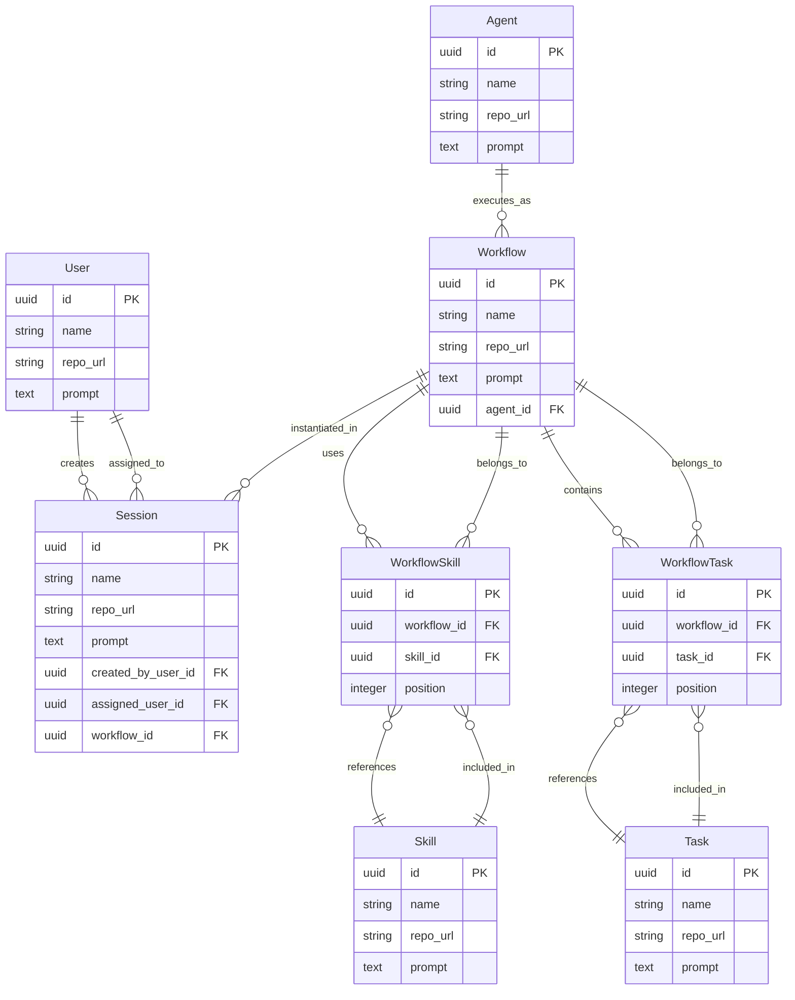

# Ambient Platform Data Model

## Overview

The Ambient Platform data model defines the core business entities (Kinds) and their behaviors (Verbs) for managing AI agents, workflows, tasks, and user sessions. This document focuses on the conceptual model and business relationships.

## Design Philosophy

The platform follows **Domain-Driven Design** principles where:
- **Kinds** represent business entities as nouns
- **Verbs** represent actions and behaviors
- **Relationships** define how entities interact
- **State Machines** govern entity lifecycles

## Entity Relationships



## Core Kinds (Entities)

### Standardized Entity Pattern
All entities follow the same structure:
- `id`: Unique identifier (UUID)
- `name`: Human-readable name
- `repo_url`: Optional URL to markdown documentation (e.g., GitHub repo/file)
- `prompt`: Optional additional prose description

### User
**What it is**: A person who interacts with the platform  
**Purpose**: Authentication, authorization, and ownership tracking

**Verbs (Actions)**:
- `creates` Sessions
- `gets_assigned` Sessions (for human attention/collaboration)
- `administers` the platform
- `collaborates` on workflows
- `participates` in workflow execution

### Agent
**What it is**: An AI entity that executes workflows with skills  
**Purpose**: Autonomous workflow execution with specified capabilities

**Verbs (Actions)**:
- `executes` Workflows AS the specified agent
- `utilizes` Skills during execution
- `collaborates` with users
- `reports` execution status
- `adapts` behavior based on context

### Skill
**What it is**: A reusable capability or tool  
**Purpose**: Modular functionality that enhances agent capabilities

**Verbs (Actions)**:
- `enhances` agent capabilities
- `provides` specific functionality
- `integrates` with external systems
- `gets_combined` with other skills

### Task
**What it is**: An individual unit of work  
**Purpose**: Atomic work definitions that can be composed into workflows

**Verbs (Actions)**:
- `defines` specific work to be done
- `gets_sequenced` in workflows
- `provides` building blocks for processes
- `can_be_reused` across workflows

### Workflow
**What it is**: A composition pattern "AS agent WITH skill1 skill2 DO task1 task2"  
**Purpose**: Defines WHO (agent) with WHAT capabilities (skills) does WHICH work (tasks)

**Structure**: `AS {agent} WITH {skills...} DO {tasks...}`

**Verbs (Actions)**:
- `specifies` execution agent
- `assembles` required skills
- `sequences` tasks to execute
- `defines` complete work process
- `gets_instantiated` in sessions

### Session
**What it is**: A concrete execution instance of a workflow  
**Purpose**: Active workspace where workflows are executed and humans can collaborate

**Verbs (Actions)**:
- `executes` a specific workflow
- `tracks` execution progress
- `enables` human collaboration
- `maintains` execution context
- `preserves` state across interactions
- `notifies` assigned users

### WorkflowSkill (Junction)
**What it is**: Links skills to workflows with ordering  
**Purpose**: Defines WHICH skills WITH what priority

### WorkflowTask (Junction)
**What it is**: Links tasks to workflows with ordering  
**Purpose**: Defines WHICH tasks in WHAT sequence

## Business Rules & State Machines

### User Lifecycle
```
registration → active → (suspended) → active → archived
```

### Agent Status Transitions
```
offline → idle → active → busy → idle
              ↓
           offline
```

### Session States
```
created → active → paused → active → completed
                        → archived
                        → failed
```

## Key Business Concepts

### Workflow Orchestration
- **Hierarchical**: Workflows can contain other workflows
- **Session-Based**: Workflows are executed within sessions
- **Direct Execution**: Sessions directly instantiate and run workflows
- **Stateful**: Execution state is tracked at the session level

### Human-AI Collaboration
- **User Creation**: Users create sessions to start workflows
- **User Assignment**: Sessions can be assigned to users for attention/collaboration
- **Mixed Execution**: Both agents and humans can participate in workflow execution
- **Notification System**: Assigned users are notified when attention is needed

### Multi-Tenancy
- **User-Scoped**: Sessions and workflows belong to users
- **Role-Based**: Users have different permission levels
- **Collaborative**: Users can be assigned to sessions for collaboration

### Agent Coordination
- **Workflow Execution**: Agents execute entire workflows within sessions
- **Load Balancing**: Agent status indicates availability
- **Skill Utilization**: Agents leverage skills for enhanced capabilities

### Execution Context
- **Session-Centric**: Work happens within user sessions
- **Direct Workflow Instance**: Sessions directly execute workflows
- **Audit-Ready**: All entities maintain creation and update timestamps

## Common Interaction Patterns

### Workflow Composition
1. User `defines` workflow: "AS {agent} WITH {skill1} {skill2} DO {task1} {task2}"
2. WorkflowSkill entries `link` skills to workflow with position
3. WorkflowTask entries `link` tasks to workflow with sequence
4. Workflow `references` the executing agent
5. Workflow becomes a reusable template

### Workflow Execution
1. User `creates` a Session and selects a Workflow
2. Session `loads` the workflow specification
3. Session `identifies` the assigned Agent from workflow
4. Agent `acquires` the specified Skills in order
5. Agent `executes` the sequenced Tasks
6. Session `tracks` execution progress and state

### Human-AI Collaboration
1. User `creates` a Session for a workflow
2. Session can be `assigned` to another User for collaboration
3. Assigned User `receives` notification to pay attention
4. Human can `modify` workflow or provide input
5. Agent `adapts` execution based on human input
6. Session `preserves` both AI and human contributions

### Skill and Task Reusability
1. Skills can be `reused` across multiple workflows
2. Tasks can be `sequenced` differently in various workflows
3. Same Agent can `execute` different skill combinations
4. WorkflowSkill and WorkflowTask provide `flexible composition`

This conceptual model provides the foundation for understanding how the Ambient Platform organizes and executes AI-driven work. For complete technical specifications including database schemas, constraints, and implementation details, refer to [ambient-data-model-explicit.md](./ambient-data-model-explicit.md).