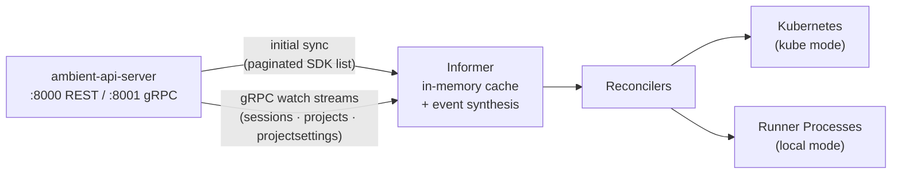

# Ambient Control Plane

Bridges the Ambient API Server with Kubernetes — the same relationship as `kube-controller-manager` to `kube-apiserver`. It performs an initial list-sync via the Go SDK, subscribes to gRPC watch streams for real-time events, and dispatches to resource reconcilers.

## Architecture



## Operating Modes

| Mode | Set via | What it does |
|------|---------|--------------|
| `kube` (default) | `MODE=kube` | Reconciles sessions → AgenticSession CRs, projects → Namespaces, projectSettings → RoleBindings |
| `local` | `MODE=local` | Spawns runner processes directly; AG-UI proxy on `:9080` |
| `test` | `MODE=test` | Tally reconcilers only — counts events, no side effects |

## Quick Start

**Prerequisite:** API Server running at `http://localhost:8000`.

```bash
make binary

# Local mode (no Kubernetes required)
AMBIENT_API_TOKEN=dev-token \
AMBIENT_API_SERVER_URL=http://localhost:8000 \
MODE=local \
./ambient-control-plane

# Kube mode
AMBIENT_API_TOKEN=<token> \
AMBIENT_API_SERVER_URL=http://localhost:8000 \
KUBECONFIG=~/.kube/config \
./ambient-control-plane
```

## Makefile Targets

| Target | Description |
|--------|-------------|
| `make binary` | Build the binary |
| `make run` | Build + run |
| `make test` | Run tests with race detector |
| `make lint` | `gofmt -l` + `go vet` |
| `make fmt` | Auto-format |

## Configuration

All configuration is via environment variables — no config files, no flags.

### Core

| Variable | Default | Description |
|----------|---------|-------------|
| `AMBIENT_API_SERVER_URL` | `http://localhost:8000` | API Server base URL |
| `AMBIENT_API_TOKEN` | **(required)** | Bearer token |
| `AMBIENT_API_PROJECT` | `default` | Default project |
| `AMBIENT_GRPC_SERVER_ADDR` | `localhost:8001` | gRPC address |
| `AMBIENT_GRPC_USE_TLS` | `false` | Enable TLS for gRPC |
| `MODE` | `kube` | `kube` \| `local` \| `test` |
| `LOG_LEVEL` | `info` | `debug` \| `info` \| `warn` \| `error` |

### Kube Mode

| Variable | Default | Description |
|----------|---------|-------------|
| `KUBECONFIG` | (empty) | Path to kubeconfig |
| `NAMESPACE` | `ambient-code` | Default K8s namespace |

### Local Mode

| Variable | Default | Description |
|----------|---------|-------------|
| `LOCAL_WORKSPACE_ROOT` | `~/.ambient/workspaces` | Runner workspace root |
| `LOCAL_PROXY_ADDR` | `127.0.0.1:9080` | AG-UI proxy address |
| `CORS_ALLOWED_ORIGIN` | `http://localhost:3000` | AG-UI proxy CORS origin |
| `LOCAL_RUNNER_COMMAND` | `python local_entry.py` | Runner launch command |
| `LOCAL_PORT_RANGE` | `9100-9199` | Port pool for runner processes |
| `LOCAL_MAX_SESSIONS` | `10` | Max concurrent sessions |

## Package Layout

```
cmd/ambient-control-plane/main.go    entry point, signal handling
internal/config/config.go            env-based configuration
internal/informer/informer.go        list-sync + gRPC watch engine
internal/watcher/watcher.go          gRPC stream management + reconnect
internal/reconciler/reconciler.go    K8s reconcilers (kube mode)
internal/reconciler/local_session.go process-spawning reconciler (local mode)
internal/reconciler/tally.go         event-counting reconciler (test mode)
internal/kubeclient/kubeclient.go    Kubernetes dynamic client wrapper
internal/process/manager.go          runner process lifecycle
internal/proxy/agui_proxy.go         AG-UI reverse proxy (local mode)
```

## Key Behaviors

- **Write-back echo detection** — after patching session status back to the API server, the next watch event for that resource is skipped (compared by `UpdatedAt`) to prevent infinite loops.
- **Reconnect backoff** — gRPC watch streams reconnect with exponential backoff, capped at 30s.
- **Graceful shutdown** — `SIGINT`/`SIGTERM` propagates through context cancellation to the informer loop and process manager.

## Dependencies

- [`ambient-sdk/go-sdk`](../ambient-sdk/) — API client for list + status patch calls
- `ambient-api-server/pkg/api/grpc` — gRPC proto definitions for watch streams
- `k8s.io/client-go` — Kubernetes dynamic client (kube mode only)

See [docs/architecture.md](docs/architecture.md) for a deep-dive on concurrency, cache consistency, and known limitations.
