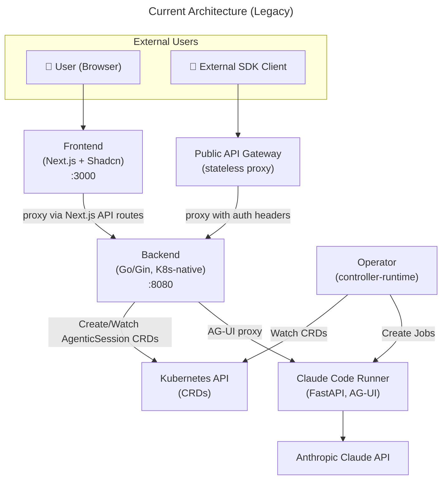
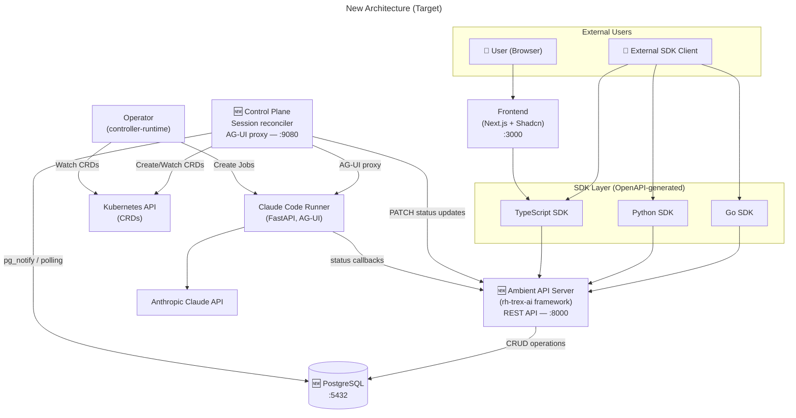

# Ambient Code Platform — Architecture Transition

## Current Architecture (Legacy)

## New Architecture (Target)

## Why This Architecture? The Foundation Story

### The Problems We're Solving

**1. Model Proliferation**
- **Current**: Duplicate model definitions across backend (Go structs), frontend (TypeScript types), public-api (DTOs)
- **Solution**: Single source of truth in `openapi.yaml` → generated SDKs eliminate drift

**2. Kubernetes Overhead**
- **Current**: Many Ambient entities (Users, Projects, Skills, Tasks) stored as CRDs in etcd
- **Problem**: etcd doesn't scale as well as PostgreSQL for relational data
- **Solution**: All resources are stored in PostgreSQL. Only true Kubernetes resources (Sessions, Jobs) get reconciled as CRDs.

**3. API Fragmentation**
- **Current**: Backend handles both REST API + Kubernetes orchestration
- **Solution**: Clean separation → API Server (data/auth) + Control Plane (K8s bridge)

### The TRex Foundation

**Trusted REST Example (TRex)** underpins production services behind `api.openshift.com` — a battle-tested API platform with:
- **OIDC built-in** → eliminates need for separate auth gateway
- **PostgreSQL-native** → proven scalability for relational workloads  
- **OpenAPI-first** → consistent schema-driven development
- **RBAC-extensible** → authorization as needed

### Strategic Intent

**V2 API in Parallel**
- Frontend dual-mode: toggle between v1 (Kubernetes) and v2 (REST) APIs
- Old backend keeps running for reference and testing
- **Additive changes only** → no disruption to existing workflows

**SDK-Driven Integration**
- TypeScript SDK → Frontend consistency
- Go SDK → Control Plane bridge logic
- Python SDK → CI/CD and automation scripts
- All generated from canonical `openapi.yaml`

**Public Gateway Consolidation**
- `ambient-api-server` replaces both backend API + public-api gateway
- OIDC built-in eliminates proxy complexity
- Single endpoint for all external integrations

## Replacement Summary

| Old Component | Replaced By | Why |
|---|---|---|
| **Backend** (Go/Gin) | **API Server** (REST/CRUD) + **Control Plane** (K8s bridge) | Split concerns: data ops vs. orchestration. TRex foundation scales better than custom backend. |
| **Public API** (gateway) | **API Server** directly | OIDC built-in eliminates proxy. Single endpoint consolidation. |
| **Multiple model definitions** | **OpenAPI spec** → **Generated SDKs** | Single source of truth prevents drift. Schema-driven development. |
| **CRDs for business entities** | **PostgreSQL** storage | Relational data scales better in Postgres than etcd. Reserve CRDs for true K8s resources. |

## SDK Consumption Strategy

| Component | Uses SDK | Language | Purpose |
|---|---|---|---|
| **Frontend** | TypeScript SDK | TypeScript | Type-safe API calls, generated from OpenAPI |
| **Control Plane** | Go SDK | Go | Reconcile Postgres ↔ Kubernetes state |
| **Runner** | Python SDK | Python | Status callbacks to API Server |
| **CI/CD Pipelines** | Python SDK | Python | Automation scripts, easy integration |
| **External Clients** | Any SDK | Go/Python/TS | Customer integrations, tooling |

## Migration Benefits

✅ **Zero Breaking Changes** — V1 and V2 APIs run in parallel  
✅ **Proven Foundation** — TRex powers production OpenShift APIs  
✅ **Eliminated Drift** — Single OpenAPI spec generates all types  
✅ **Better Scalability** — PostgreSQL for relations, etcd for K8s resources  
✅ **Simplified Auth** — OIDC built-in, no gateway complexity  
✅ **Developer Velocity** — SDK-first integration, consistent patterns