# Ambient Code Platform — Architecture Transition

## Current Architecture (Legacy)

```mermaid
---
title: Current Architecture (Legacy)
---
graph TB
    subgraph "External Users"
        User["👤 User (Browser)"]
        ExtClient["🔧 External SDK Client"]
    end

    User --> Frontend
    ExtClient --> PublicAPI

    Frontend["Frontend<br/>(Next.js + Shadcn)<br/>:3000"]
    PublicAPI["Public API Gateway<br/>(stateless proxy)"]
    Backend["Backend<br/>(Go/Gin, K8s-native)<br/>:8080"]
    Operator["Operator<br/>(controller-runtime)"]

    Frontend -- "proxy via Next.js API routes" --> Backend
    PublicAPI -- "proxy with auth headers" --> Backend
    Backend -- "Create/Watch AgenticSession CRDs" --> K8s["Kubernetes API<br/>(CRDs)"]
    Operator -- "Watch CRDs" --> K8s
    Operator -- "Create Jobs" --> Runner["Claude Code Runner<br/>(FastAPI, AG-UI)"]
    Backend -- "AG-UI proxy" --> Runner
    Runner --> Claude["Anthropic Claude API"]

    
    class Frontend,PublicAPI,Backend,Operator,Runner,K8s,Claude current
    class User,ExtClient external
```

## New Architecture (Target)

```mermaid
---
title: New Architecture (Target)
---
graph TB
    subgraph "External Users"
        User["👤 User (Browser)"]
        ExtClient["🔧 External SDK Client"]
    end

    subgraph "SDK Layer (OpenAPI-generated)"
        GoSDK["Go SDK"]
        PySDK["Python SDK"] 
        TsSDK["TypeScript SDK"]
    end

    User --> Frontend
    ExtClient --> TsSDK & PySDK & GoSDK

    %% All SDKs connect to API Server
    GoSDK --> APIServer
    PySDK --> APIServer
    TsSDK --> APIServer

    %% Frontend uses TypeScript SDK
    Frontend["Frontend<br/>(Next.js + Shadcn)<br/>:3000"] --> TsSDK

    %% Core new components
    APIServer["🆕 Ambient API Server<br/>(rh-trex-ai framework)<br/>REST API — :8000"]
    ControlPlane["🆕 Control Plane<br/>Session reconciler<br/>AG-UI proxy — :9080"]
    Postgres[("🆕 PostgreSQL<br/>:5432")]

    %% API Server is the single source of truth
    APIServer -- "CRUD operations" --> Postgres

    %% Control Plane bridges Postgres ↔ Kubernetes
    ControlPlane -- "pg_notify / polling" --> Postgres
    ControlPlane -- "PATCH status updates" --> APIServer
    ControlPlane -- "Create/Watch CRDs" --> K8s["Kubernetes API<br/>(CRDs)"]
    ControlPlane -- "AG-UI proxy" --> Runner["Claude Code Runner<br/>(FastAPI, AG-UI)"]

    %% Operator unchanged (still watches K8s)
    Operator["Operator<br/>(controller-runtime)"] -- "Watch CRDs" --> K8s
    Operator -- "Create Jobs" --> Runner

    %% Runner callbacks to API Server
    Runner --> Claude["Anthropic Claude API"]
    Runner -- "status callbacks" --> APIServer
    
    class APIServer,ControlPlane,Postgres new
    class GoSDK,PySDK,TsSDK sdk
    class Frontend,Runner,K8s,Operator,Claude unchanged
    class User,ExtClient external
```

## Why This Architecture? The Foundation Story

### The Problems We're Solving

**1. Model Proliferation**
- **Current**: Duplicate model definitions across backend (Go structs), frontend (TypeScript types), public-api (DTOs)
- **Solution**: Single source of truth in `openapi.yaml` → generated SDKs eliminate drift

**2. Kubernetes Overhead**
- **Current**: Many Ambient entities (Users, Projects, Skills, Tasks) stored as CRDs in etcd
- **Problem**: etcd doesn't scale as well as PostgreSQL for relational data
- **Solution**: All resources are stored in PostgreSQL. Only true Kubernetes resources (Sessions, Jobs) get reconciled as CRDs.

**3. API Fragmentation**
- **Current**: Backend handles both REST API + Kubernetes orchestration
- **Solution**: Clean separation → API Server (data/auth) + Control Plane (K8s bridge)

### The TRex Foundation

**Trusted REST Example (TRex)** underpins production services behind `api.openshift.com` — a battle-tested API platform with:
- **OIDC built-in** → eliminates need for separate auth gateway
- **PostgreSQL-native** → proven scalability for relational workloads  
- **OpenAPI-first** → consistent schema-driven development
- **RBAC-extensible** → authorization as needed

### Strategic Intent

**V2 API in Parallel**
- Frontend dual-mode: toggle between v1 (Kubernetes) and v2 (REST) APIs
- Old backend keeps running for reference and testing
- **Additive changes only** → no disruption to existing workflows

**SDK-Driven Integration**
- TypeScript SDK → Frontend consistency
- Go SDK → Control Plane bridge logic
- Python SDK → CI/CD and automation scripts
- All generated from canonical `openapi.yaml`

**Public Gateway Consolidation**
- `ambient-api-server` replaces both backend API + public-api gateway
- OIDC built-in eliminates proxy complexity
- Single endpoint for all external integrations

## Replacement Summary

| Old Component | Replaced By | Why |
|---|---|---|
| **Backend** (Go/Gin) | **API Server** (REST/CRUD) + **Control Plane** (K8s bridge) | Split concerns: data ops vs. orchestration. TRex foundation scales better than custom backend. |
| **Public API** (gateway) | **API Server** directly | OIDC built-in eliminates proxy. Single endpoint consolidation. |
| **Multiple model definitions** | **OpenAPI spec** → **Generated SDKs** | Single source of truth prevents drift. Schema-driven development. |
| **CRDs for business entities** | **PostgreSQL** storage | Relational data scales better in Postgres than etcd. Reserve CRDs for true K8s resources. |

## SDK Consumption Strategy

| Component | Uses SDK | Language | Purpose |
|---|---|---|---|
| **Frontend** | TypeScript SDK | TypeScript | Type-safe API calls, generated from OpenAPI |
| **Control Plane** | Go SDK | Go | Reconcile Postgres ↔ Kubernetes state |
| **Runner** | Python SDK | Python | Status callbacks to API Server |
| **CI/CD Pipelines** | Python SDK | Python | Automation scripts, easy integration |
| **External Clients** | Any SDK | Go/Python/TS | Customer integrations, tooling |

## Migration Benefits

✅ **Zero Breaking Changes** — V1 and V2 APIs run in parallel  
✅ **Proven Foundation** — TRex powers production OpenShift APIs  
✅ **Eliminated Drift** — Single OpenAPI spec generates all types  
✅ **Better Scalability** — PostgreSQL for relations, etcd for K8s resources  
✅ **Simplified Auth** — OIDC built-in, no gateway complexity  
✅ **Developer Velocity** — SDK-first integration, consistent patterns