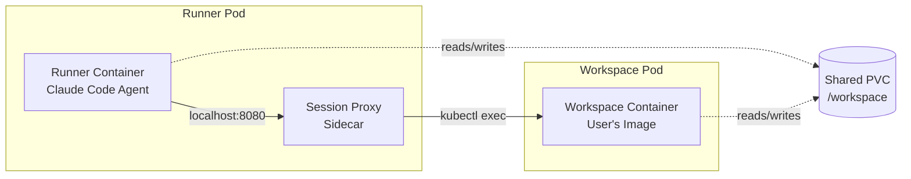
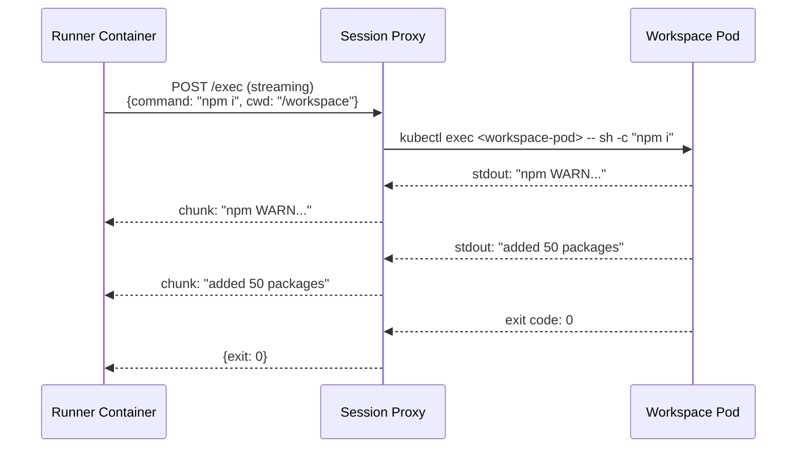
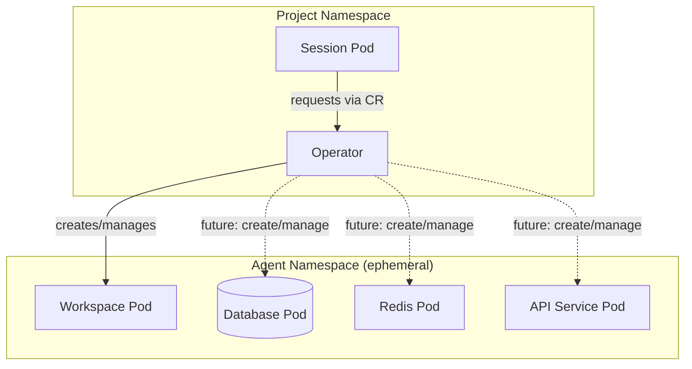

# ADR-0006: Workspace Container Architecture

**Status**: Pending
**Date**: 2025-11-24 (Updated: 2025-12-04)
**Deciders**: Platform Architecture Team
**Related**: [ADR-0001 Kubernetes Native Architecture](0001-kubernetes-native-architecture.md)

## Context

Agents need access to tools specific to their task: compilers, test frameworks, language runtimes. Previously, the agent ran directly in the runner container with limited, fixed tooling.

This ADR introduces **workspace containers**: separate pods where agents execute commands, with user-configurable container images.

## Decision

### Workspace Containers

Each agentic session runs with two pods:

1. **Runner Pod**: Contains the Claude Code agent and a session proxy sidecar. The agent has no direct shell access—all command execution goes through the proxy.
2. **Workspace Pod**: A user-configurable container where commands actually execute. Shares a PVC with the runner for file access.



By default, the workspace pod uses a base development image (`quay.io/ambient_code/vteam_workspace`). Users can customize this per-project via ProjectSettings.

### Configuration

Users configure workspace containers in the ProjectSettings UI under "Workspace Container". The **Container Image** field accepts a custom image with required tooling (e.g., `node:20`, `rust:1.75`, `python:3.12`); leaving it empty uses the platform default. The **Resource Limits** field allows setting CPU and memory requests/limits for the workspace pod.

The ProjectSettings CR schema:

```yaml
apiVersion: vteam.ambient-code/v1alpha1
kind: ProjectSettings
metadata:
  name: settings
  namespace: my-project
spec:
  workspaceContainer:
    image: "node:20-slim"           # Optional - defaults to runner image
    resources:                       # Optional
      cpuRequest: "500m"
      cpuLimit: "2"
      memoryRequest: "512Mi"
      memoryLimit: "4Gi"
```

### Session Proxy Sidecar

The session proxy is a lightweight Go binary that runs as a sidecar container within the runner pod. It listens on localhost:8080 and provides an HTTP streaming endpoint for command execution. The agent's MCP workspace tool makes streaming HTTP calls to the proxy, which uses kubectl exec to run commands in the workspace pod and streams output back in real-time.



**Why a sidecar instead of the operator?** Keeping the exec API within the runner pod eliminates a network hop to the operator and avoids exposing an HTTP endpoint on the operator. The operator remains a pure watch-based controller. The proxy holds the credentials for pod exec—the runner container has no Kubernetes API access.

### Why Streaming

For long-running commands (npm install, cargo build, pytest), users need real-time feedback:

| Approach | Latency | Streaming | UX |
|----------|---------|-----------|-----|
| CRD polling | ~200ms + poll interval | No | Wait for completion, then see all output |
| Direct streaming | ~10ms | Yes | See output as it happens |

The MCP protocol supports streaming tool responses, enabling the agent to observe build output, test results, and errors in real-time.

### Pod Isolation

The runner and workspace run as separate pods. Within the runner pod, the agent container and proxy sidecar share a network namespace (allowing localhost communication) but have separate filesystem namespaces. The agent cannot directly access the proxy's credentials or make Kubernetes API calls.

**Session Isolation**: The proxy discovers its workspace pod by label selector (`session=<name>,type=workspace`), not by user-provided pod names. This prevents an agent from targeting another session's workspace even if it could somehow influence the proxy's requests.

**Privilege Separation**: The runner pod disables automatic service account token mounting (`automountServiceAccountToken: false`). The proxy sidecar alone receives the token via a projected volume mount, giving it `pods/exec` permission scoped to workspace pods in the namespace. The runner container has no token and cannot make Kubernetes API calls. The workspace pod has no special permissions.

### Disabling Native Bash

The agent MUST NOT have access to the native Bash tool. This prevents bypassing the proxy, direct execution in the runner container, and running kubectl or other cluster tools.

The runner wrapper configures allowed tools explicitly, excluding Bash:

```python
allowed_tools = ["Read", "Write", "Glob", "Grep", "Edit", "WebSearch", "WebFetch"]
# Bash is NOT in the list - all execution goes through workspace MCP tool
```

### Security Model

| Layer | Enforcement |
|-------|-------------|
| **Network isolation** | Proxy listens only on localhost; no external network access to exec API |
| **Session isolation** | Proxy discovers workspace by label; cannot target other sessions |
| **Token isolation** | Only proxy sidecar receives SA token via projected volume |
| **Privilege separation** | Runner has no K8s API access; proxy has only `pods/exec` |
| **No Bash** | Agent cannot execute commands outside the proxy workflow |

### Threat Mitigations

| Threat | Mitigation |
|--------|------------|
| Agent creates arbitrary pods | Runner has no SA token; proxy SA only has `pods/exec` |
| Agent accesses other session's workspace | Proxy uses label selector; validates namespace match |
| Agent escalates privileges in workspace | SecurityContext enforces non-root, dropped capabilities |
| Agent steals proxy token | Token mounted only in proxy container, not runner |
| Agent bypasses proxy | No Bash tool; no kubectl binary in runner container |

### Transparent Version Upgrades

The operator handles platform upgrades transparently without disrupting running sessions. When the operator deployment is upgraded with new workspace container images or session proxy versions, the system maintains continuity by allowing running sessions to continue with their current images while new sessions automatically receive the updated components.

This separation of concerns is made possible by the pod-based architecture. Each AgenticSession creates its own runner and workspace pods with image references resolved at creation time. Upgrading the operator deployment updates the default image references in the operator's configuration but does not affect pods that already exist in the cluster. When a running session's runner pod continues executing, it uses the workspace container image and proxy sidecar version that were current when the session started.

The workspace pod and runner pod are separate entities, enabling independent lifecycle management. In theory, workspace container images could be upgraded without touching the runner pod, though this would require additional controller logic to detect configuration changes and recreate only the workspace pod. The current implementation treats both pods as immutable—upgrading either component means creating a new session.

Session proxy upgrades require restarting the runner pod because the proxy runs as a sidecar container within that pod. Kubernetes does not support in-place container updates; the entire pod must be replaced. However, this limitation has minimal impact because AgenticSessions are typically short-lived (minutes to hours, not days). Long-running interactive sessions could theoretically be migrated gracefully by checkpointing state and recreating the pod, but this complexity is not justified given current usage patterns. Users can always resume work by starting a new session if an upgrade interrupts a running one.

The operator tracks component versions through pod annotations and labels. Each runner and workspace pod receives annotations indicating which operator version created it and which image versions are in use. This metadata enables debugging (identifying which sessions run old vs. new images), monitoring (tracking rollout progress as old sessions complete and new ones start), and potential future migration logic (triggering graceful session termination when a deprecated image version reaches end-of-life).

Version tracking also prevents accidental downgrades. If an operator deployment rolls back to an earlier version, new sessions will use older images, but the operator will not attempt to "fix" newer sessions by restarting them with downgraded images. Each session's image references are immutable once created, stored in the pod spec rather than dynamically resolved.

This approach balances operational simplicity with user experience. Platform administrators can deploy operator upgrades at any time without coordinating with active users. Running sessions continue uninterrupted, and users benefit from improvements when they start their next session. The upgrade window is effectively zero—there is no maintenance downtime where new sessions cannot be created.

### AgenticTask CRD (Tekton-inspired)

Create a Custom Resource for each command, with the operator reconciling execution.

**Rejected** because it provides no streaming (the agent must poll for final results), adds significant latency (CR creation + etcd write + reconciliation adds ~200ms+ overhead), and causes CR pollution (completed tasks accumulate, requiring TTL/GC logic).

### Namespace-per-Session

Create an ephemeral namespace for each AgenticSession.

**Deferred**: Adds ~200-500ms namespace creation overhead. Current pod-level isolation is sufficient. May revisit for stricter multi-tenancy requirements—see Future Directions.

### Operator Exec API

Have the operator expose an HTTP endpoint that the runner calls to execute commands in the workspace.

**Rejected** because it adds a network hop and latency, requires the operator to expose an HTTP API (moving beyond pure watch-based design), and creates a single point of failure for all command execution across the cluster.

### Direct kubectl exec from Runner

Give runner SA `pods/exec` permission and exec directly into a separate workspace pod.

**Rejected** because the runner could exec into any pod in the namespace and it would require mounting a service account token, expanding the attack surface.

## Consequences

### Positive

This architecture delivers real-time feedback through streaming output for builds, tests, and other long-running commands. The localhost HTTP call within the pod provides minimal latency. The operator remains a pure watch-based controller with no HTTP API exposure. Each session is self-contained—the proxy sidecar requires no cluster-wide coordination. Since there are no command CRs, no garbage collection is needed.

### Negative

The sidecar adds resource overhead to each runner pod (though the proxy is lightweight). The proxy requires a service account with `pods/exec` permission, adding RBAC complexity. In-flight commands are lost if the pod restarts, though this is inherent to any streaming approach.

## Implementation Status

| Phase | Status |
|-------|--------|
| Session proxy sidecar | In Progress |
| Runner pod with sidecar spec | In Progress |
| Proxy SA and RBAC | In Progress |
| MCP workspace tools | In Progress |
| Hardening (rate limits, resource limits) | Pending |

## Future Directions

### Agent-Managed Namespaces

The current architecture restricts agents to executing commands in a single workspace container. A natural evolution would allow agents to create and manage their own Kubernetes namespaces with full infrastructure capabilities:



**Use cases** include running integration tests that need a database, cache, and API services; deploying and testing microservices architectures; and spinning up ephemeral preview environments.

**Design considerations**: The system would enforce strict resource quotas on namespace resources (CPU, memory, pods, services) and network policies for isolation from other namespaces with controlled egress. Automatic namespace deletion when the session ends (TTL/cleanup) ensures resources don't accumulate. Pods within the agent namespace would be able to discover and communicate with each other, and scoped secrets would handle database credentials and API keys.

**Security model**: The operator creates the namespace with predefined RBAC and quotas. The agent receives a scoped ServiceAccount within that namespace but cannot modify namespace-level resources such as quotas or network policies. All resources inherit OwnerReference to the AgenticSession for cleanup.

This approach maintains the security boundary (agent never directly touches the host cluster) while enabling more sophisticated workloads.

### Devcontainer Auto-Detection

Many repositories include a `.devcontainer/devcontainer.json` file that specifies the development environment—container image, features, extensions, and post-create commands. A natural enhancement would have the operator automatically detect and honor this configuration when creating workspace containers.

When a session starts, the operator would check the cloned repository for `.devcontainer/devcontainer.json` (or `.devcontainer.json` at the root). If found, the operator extracts the `image` field (or builds from `dockerfile`/`build.dockerfile`) and applies relevant configuration such as environment variables, mount points, and post-create commands. This eliminates the need for users to manually configure workspace containers in ProjectSettings when the repository already defines its environment.

**Precedence**: Explicit ProjectSettings configuration would override devcontainer detection, allowing users to force a specific image when needed. Repositories without devcontainer configuration fall back to the platform default.

**Scope limitations**: Not all devcontainer features translate directly to Kubernetes. VS Code extensions, port forwarding rules, and certain lifecycle hooks would be ignored or adapted. The operator would support a subset focused on container image, environment variables, and initialization commands.

**Security considerations**: The operator must validate devcontainer configurations before applying them. Arbitrary image references from untrusted repositories pose supply chain risks, so organizations may want to restrict allowed registries or require image allowlisting. Post-create commands execute in the workspace container's security context, inheriting all existing sandboxing.

## References

- [Kubernetes Pod Security](https://kubernetes.io/docs/concepts/security/pod-security-standards/)
- [Projected Volumes](https://kubernetes.io/docs/concepts/storage/projected-volumes/)
- [Server-Sent Events](https://developer.mozilla.org/en-US/docs/Web/API/Server-sent_events)
- [Dev Container Specification](https://containers.dev/implementors/json_reference/)
