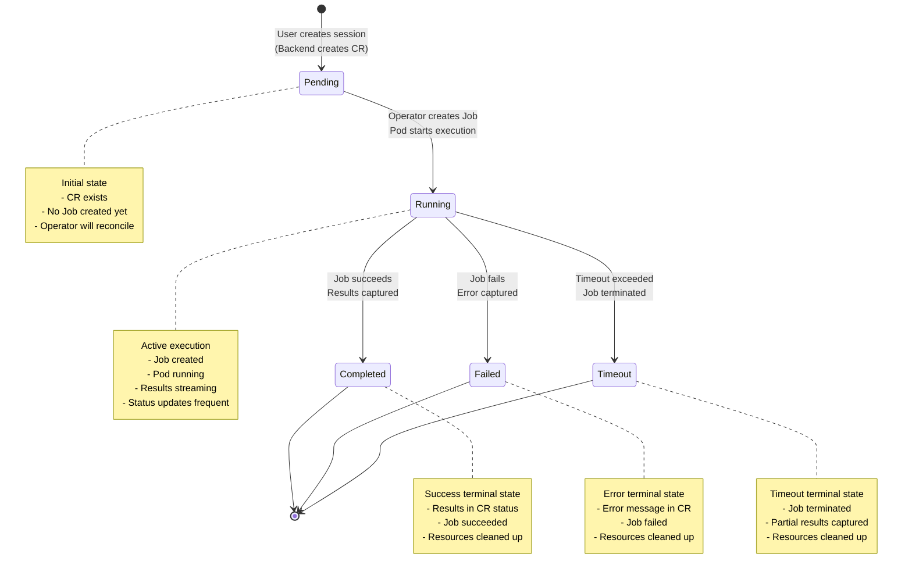
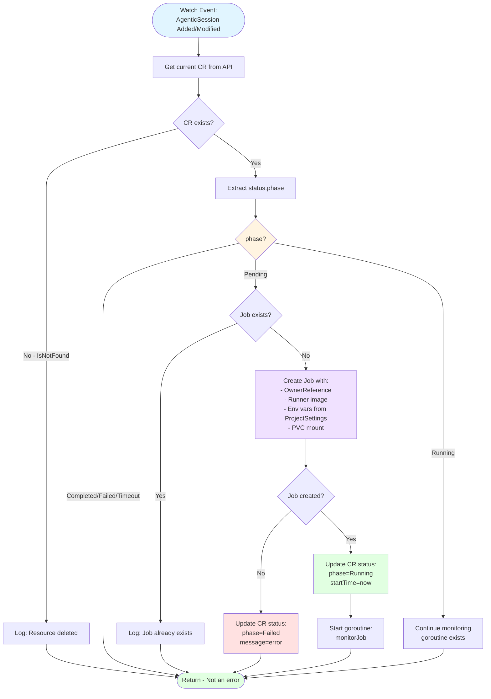
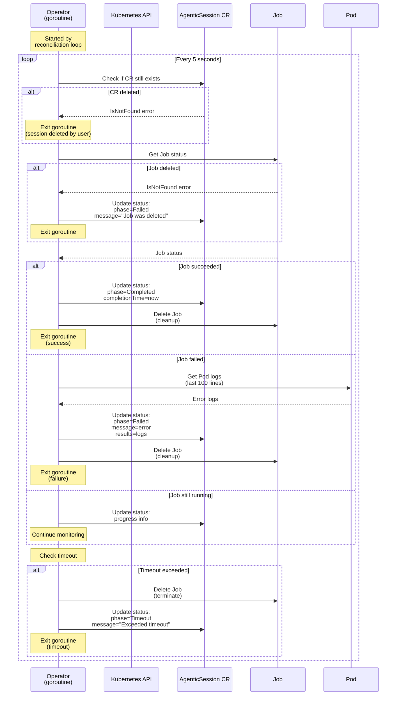
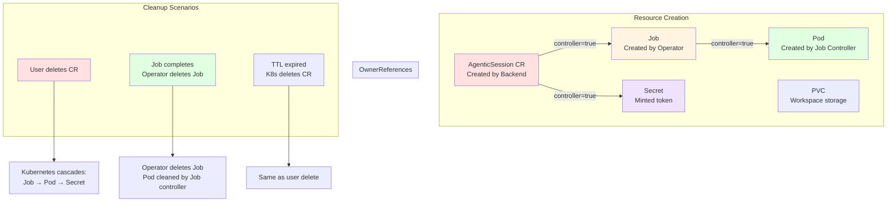

# Agentic Session Lifecycle

## Overview

An **AgenticSession** represents a single AI-powered automation task. This document describes the complete lifecycle from creation to completion, including state transitions, operator reconciliation, and error handling.

## State Machine



## Phase Descriptions

### Pending

**Entry Condition:** Backend API creates AgenticSession CR

**State Characteristics:**
- CR exists with `spec` populated
- No `status` or `status.phase = "Pending"`
- No Job created yet
- No Pod running

**Next Transition:** Operator detects CR and creates Job → `Running`

**Typical Duration:** 1-5 seconds

---

### Running

**Entry Condition:** Operator creates Job successfully

**State Characteristics:**
- Job exists with OwnerReference to AgenticSession
- Pod scheduled and executing
- `status.phase = "Running"`
- `status.startTime` set
- `status.results` may contain partial results

**Status Updates:**
- Operator monitors Job status every 5 seconds
- Runner updates CR with progress logs
- WebSocket broadcasts updates to frontend

**Next Transitions:**
- Job succeeds → `Completed`
- Job fails → `Failed`
- Timeout exceeded → `Timeout`

**Typical Duration:** 30 seconds to 2 hours (configurable)

---

### Completed

**Entry Condition:** Job completes successfully (exit code 0)

**State Characteristics:**
- `status.phase = "Completed"`
- `status.completionTime` set
- `status.results` contains final output
- Per-repo `pushed` or `abandoned` status
- Job and Pod cleaned up (OwnerReference cascade)

**Terminal State:** No further transitions

**Typical Retention:** CR persists for audit/history (manual deletion or TTL)

---

### Failed

**Entry Condition:** Job fails (non-zero exit code)

**State Characteristics:**
- `status.phase = "Failed"`
- `status.completionTime` set
- `status.message` contains error details
- `status.results` may contain partial output
- Job and Pod cleaned up

**Common Failure Reasons:**
- Invalid Anthropic API key
- Git authentication failure
- Runner execution error
- Resource limits exceeded

**Terminal State:** No further transitions

**Typical Retention:** CR persists for debugging (manual deletion)

---

### Timeout

**Entry Condition:** Execution exceeds configured timeout

**State Characteristics:**
- `status.phase = "Timeout"`
- `status.completionTime` set
- `status.message` indicates timeout
- `status.results` contains partial output
- Job terminated by operator
- Pod cleaned up

**Timeout Configuration:**
- Default: 1 hour
- Configurable via `spec.timeout` (seconds)
- ProjectSettings can set default per project

**Terminal State:** No further transitions

---

## Operator Reconciliation Flow



## Job Monitoring Loop



## Status Update Patterns

### Operator Status Updates

**Use Case:** Operator updates phase transitions

**Pattern:** Update via `/status` subresource

```go
// components/operator/internal/handlers/sessions.go
func updateAgenticSessionStatus(namespace, name string, updates map[string]interface{}) error {
    gvr := types.GetAgenticSessionResource()

    // Get current CR
    obj, err := config.DynamicClient.Resource(gvr).
        Namespace(namespace).
        Get(ctx, name, v1.GetOptions{})

    if errors.IsNotFound(err) {
        log.Printf("CR deleted, skipping status update")
        return nil  // Not an error
    }

    // Initialize status if needed
    if obj.Object["status"] == nil {
        obj.Object["status"] = make(map[string]interface{})
    }

    status := obj.Object["status"].(map[string]interface{})
    for k, v := range updates {
        status[k] = v
    }

    // Update via /status subresource
    _, err = config.DynamicClient.Resource(gvr).
        Namespace(namespace).
        UpdateStatus(ctx, obj, v1.UpdateOptions{})

    if errors.IsNotFound(err) {
        return nil  // CR deleted during update
    }

    return err
}
```

### Runner Status Updates

**Use Case:** Runner pod updates results incrementally

**Pattern:** Runner has minted token with limited permissions

```python
# components/runners/claude-code-runner/runner.py
def update_session_status(results: Dict[str, Any]):
    """Update CR status from runner pod."""
    try:
        # Use minted token from Secret
        token = os.environ.get("RUNNER_TOKEN")

        # Update via Kubernetes API
        response = requests.patch(
            f"{k8s_api}/apis/vteam.ambient-code/v1alpha1/namespaces/{namespace}/agenticsessions/{name}/status",
            headers={"Authorization": f"Bearer {token}"},
            json={"status": {"results": results}}
        )

        response.raise_for_status()
    except Exception as e:
        log.error(f"Failed to update status: {e}")
        # Non-fatal: operator will update eventually
```

## Resource Lifecycle and Cleanup



**Key Cleanup Principles:**

1. **OwnerReferences** ensure automatic cleanup when parent is deleted
2. **Controller=true** on primary owner (only one per resource)
3. **No BlockOwnerDeletion** (causes permission issues in multi-tenant)
4. Operator explicitly deletes Jobs on completion (don't wait for cascade)
5. PVCs persist for debugging (manual cleanup or TTL)

**Reference:** [Backend/Operator Development Standards](../../CLAUDE.md#resource-management)

---

## Error Handling Patterns

### Non-Fatal Errors (Operator)

**Scenario:** Resource deleted during processing

```go
if errors.IsNotFound(err) {
    log.Printf("AgenticSession %s no longer exists, skipping", name)
    return nil  // Not treated as error - user deleted it
}
```

### Retriable Errors (Operator)

**Scenario:** Transient K8s API failure

```go
if err != nil {
    log.Printf("Failed to create Job: %v", err)
    updateAgenticSessionStatus(ns, name, map[string]interface{}{
        "phase":   "Error",
        "message": fmt.Sprintf("Failed to create Job: %v", err),
    })
    return fmt.Errorf("failed to create Job: %w", err)
    // Operator watch loop will retry on next event
}
```

### Terminal Errors (Runner)

**Scenario:** Invalid API key

```python
try:
    client = anthropic.Anthropic(api_key=api_key)
    response = client.messages.create(...)
except anthropic.AuthenticationError as e:
    # Update CR with terminal error
    update_session_status({
        "phase": "Failed",
        "message": f"Invalid Anthropic API key: {e}",
        "completionTime": datetime.now().isoformat()
    })
    sys.exit(1)  # Exit pod with failure
```

---

## Interactive vs Batch Execution

### Batch Mode (Default)

**Characteristics:**
- Single prompt execution
- Timeout enforced (default 1 hour)
- Results written to CR on completion
- Pod exits after execution

**Use Cases:**
- One-off automation tasks
- Scripted workflows
- RFE generation

**Flow:**
```
User → Prompt → Runner executes → Results → Pod exits
```

---

### Interactive Mode

**Characteristics:**
- Long-running session (no timeout)
- User sends messages via inbox file
- Runner responds via outbox file
- Pod continues running until explicitly stopped

**Use Cases:**
- Iterative development
- Multi-turn conversations
- Complex debugging sessions

**Flow:**
```
User → Initial prompt → Runner starts
  ↓
User writes to inbox → Runner reads → Executes → Writes to outbox
  ↓
User reads outbox → Continues conversation...
  ↓
User signals completion → Pod exits
```

**Configuration:**
```yaml
apiVersion: vteam.ambient-code/v1alpha1
kind: AgenticSession
metadata:
  name: interactive-session
spec:
  interactive: true  # Enable interactive mode
  prompt: "Initial prompt"
  repos:
    - input:
        url: https://github.com/org/repo
        branch: main
```

**File Locations:**
- Inbox: `/workspace/inbox.txt` (user writes)
- Outbox: `/workspace/outbox.txt` (runner writes)
- Workspace: `/workspace/repos/` (cloned repositories)

---

## Multi-Repo Execution

```mermaid
flowchart LR
    subgraph "AgenticSession Spec"
        MainIdx[mainRepoIndex: 1]
        Repos[repos array:<br/>0: repo-A<br/>1: repo-B<br/>2: repo-C]
    end

    subgraph "Runner Workspace"
        WS[/workspace/repos/]
        RepoA[repo-A/<br/>cloned from repos[0]]
        RepoB[repo-B/<br/>cloned from repos[1]<br/>WORKING DIRECTORY]
        RepoC[repo-C/<br/>cloned from repos[2]]
    end

    subgraph "Status Tracking"
        StatusA[repos[0].status:<br/>pushed=true]
        StatusB[repos[1].status:<br/>pushed=true]
        StatusC[repos[2].status:<br/>abandoned=true]
    end

    MainIdx -->|Specifies| RepoB
    Repos --> WS
    WS --> RepoA
    WS --> RepoB
    WS --> RepoC

    RepoA -.-> StatusA
    RepoB -.-> StatusB
    RepoC -.-> StatusC

    style RepoB fill:#e1ffe1
    style MainIdx fill:#fff4e1
```

**Key Concepts:**

1. **mainRepoIndex** (default: 0): Sets Claude Code working directory
2. **Cloning Order**: Repos cloned in array order
3. **Per-Repo Status**: Each repo tracked individually (pushed/abandoned)
4. **Cross-Repo References**: Claude can access all repos in workspace

**Reference:** [ADR-0003: Multi-Repository Support](../adr/0003-multi-repo-support.md)

---

## Timeout Handling

### Timeout Configuration

```yaml
apiVersion: vteam.ambient-code/v1alpha1
kind: AgenticSession
spec:
  timeout: 3600  # seconds (1 hour)
```

**Timeout Sources (priority order):**
1. `spec.timeout` on AgenticSession CR
2. `defaultTimeout` in ProjectSettings CR
3. Global default (1 hour)

### Timeout Enforcement

**Operator monitors elapsed time:**

```go
func monitorJob(jobName, sessionName, namespace string) {
    startTime := time.Now()
    timeout := getTimeoutForSession(namespace, sessionName)

    for {
        time.Sleep(5 * time.Second)

        elapsed := time.Since(startTime)
        if elapsed > timeout {
            log.Printf("Session %s exceeded timeout (%v)", sessionName, timeout)

            // Terminate Job
            deleteJob(namespace, jobName)

            // Update CR status
            updateAgenticSessionStatus(namespace, sessionName, map[string]interface{}{
                "phase": "Timeout",
                "message": fmt.Sprintf("Exceeded timeout of %v", timeout),
                "completionTime": time.Now().Format(time.RFC3339),
            })

            return  // Exit monitoring
        }

        // ... check Job status ...
    }
}
```

**Graceful Shutdown:**
- Runner receives SIGTERM from Kubernetes
- Runner captures partial results
- Runner updates CR status before exit

---

## Related Documentation

- [Core System Architecture](./core-system-architecture.md) - Component overview
- [Kubernetes Resources](./kubernetes-resources.md) - CR schemas
- [Multi-Tenancy Architecture](./multi-tenancy-architecture.md) - Project isolation
- [Operator Development Standards](../../CLAUDE.md#operator-patterns)
- [ADR-0001: Kubernetes-Native Architecture](../adr/0001-kubernetes-native-architecture.md)
