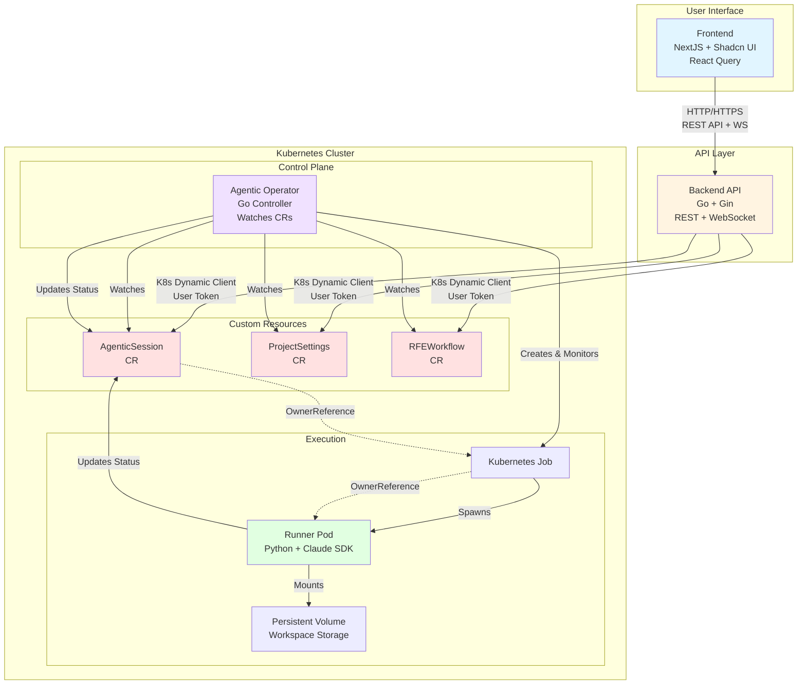
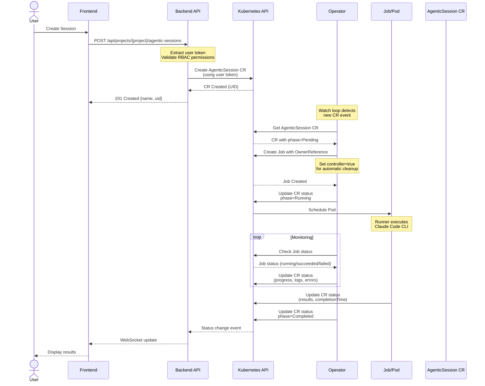
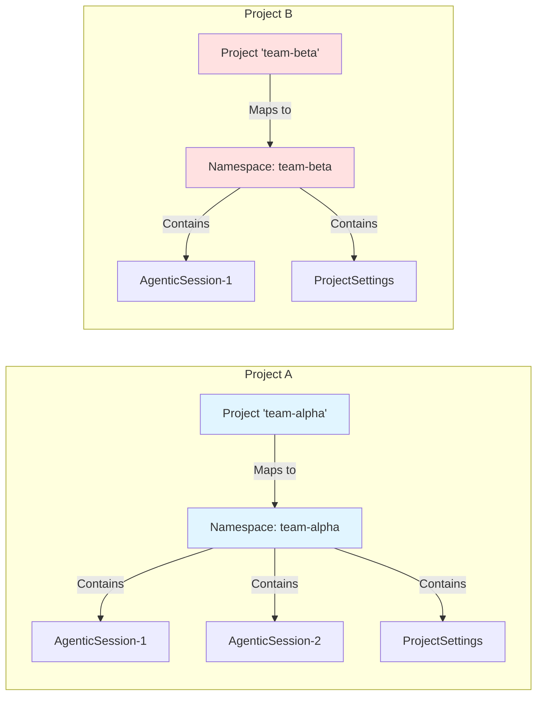

# Core System Architecture

## Overview

The Ambient Code Platform follows a Kubernetes-native architecture with four primary components that work together to orchestrate AI-powered automation tasks.

## High-Level Architecture



## Component Breakdown

### 1. Frontend (NextJS + Shadcn UI)

**Technology Stack:**
- NextJS 14+ with App Router
- Shadcn UI component library
- React Query for data fetching
- TypeScript for type safety

**Responsibilities:**
- User interface for session management
- Real-time status updates via WebSocket
- Project and settings management
- RFE workflow visualization

**Key Patterns:**
- Server-side rendering for performance
- Optimistic updates with React Query
- Type-safe API client integration

**Reference:** [Frontend Development Standards](../../CLAUDE.md#frontend-development-standards)

---

### 2. Backend API (Go + Gin)

**Technology Stack:**
- Go 1.21+
- Gin web framework
- Kubernetes Dynamic Client
- OpenShift OAuth integration

**Responsibilities:**
- REST API for CRUD operations on Custom Resources
- WebSocket server for real-time updates
- Multi-tenant project isolation (namespace mapping)
- User authentication and authorization (RBAC)
- Git operations (clone, fork, PR creation)

**Key Endpoints:**
- `/api/projects/:project/agentic-sessions` - Session management
- `/api/projects/:project/project-settings` - Configuration
- `/api/projects/:project/rfe-workflows` - RFE orchestration
- `/ws` - WebSocket for real-time updates

**Key Patterns:**
- User token authentication for all operations
- Project-scoped endpoints with RBAC validation
- Middleware chain: Recovery → Logging → CORS → Auth → Validation
- Error handling with structured responses

**Reference:** [Backend Development Standards](../../CLAUDE.md#backend-and-operator-development-standards)

---

### 3. Agentic Operator (Go Controller)

**Technology Stack:**
- Go 1.21+
- Kubernetes controller-runtime patterns
- Watch/reconciliation loop
- Custom Resource Definitions (CRDs)

**Responsibilities:**
- Watch AgenticSession, ProjectSettings, RFEWorkflow CRs
- Reconcile desired state with actual state
- Create and manage Kubernetes Jobs for session execution
- Monitor Job completion and update CR status
- Handle timeouts and cleanup

**Reconciliation Flow:**
1. Watch for CR events (Added, Modified, Deleted)
2. Check resource phase (Pending, Running, Completed, Failed)
3. Create Job if phase is Pending
4. Monitor Job status and update CR
5. Handle errors and retries with exponential backoff

**Key Patterns:**
- Reconnection logic for watch failures
- Idempotent resource creation
- OwnerReferences for automatic cleanup
- Status updates via `/status` subresource
- Goroutine monitoring for long-running jobs

**Reference:** [Operator Development Standards](../../CLAUDE.md#operator-patterns)

---

### 4. Claude Code Runner (Python)

**Technology Stack:**
- Python 3.11+
- Claude Code SDK (≥0.0.23)
- Anthropic API (≥0.68.0)
- Git integration

**Responsibilities:**
- Execute Claude Code CLI in containerized environment
- Manage workspace synchronization via PVC
- Handle interactive vs. batch execution modes
- Capture results and update CR status
- Multi-agent collaboration coordination

**Execution Modes:**
- **Batch Mode:** Single prompt execution with timeout
- **Interactive Mode:** Long-running chat using inbox/outbox files

**Key Patterns:**
- Workspace isolation per session
- Multi-repo support with mainRepoIndex
- Result capture and structured output
- Error propagation to operator

**Reference:** [Runner Documentation](../../components/runners/claude-code-runner/README.md)

---

## Data Flow: Agentic Session Execution



## Multi-Tenancy Model



**Isolation Guarantees:**
- Each project maps to a dedicated Kubernetes namespace (1:1 mapping)
- User tokens enforce RBAC at namespace boundaries
- Resources cannot cross namespace boundaries
- Backend validates project access before CR operations

**Reference:** [Multi-Tenancy Architecture](./multi-tenancy-architecture.md)

---

## Key Architectural Decisions

### 1. Kubernetes-Native Design

**Why:** Leverage Kubernetes for orchestration, scheduling, resource management, and RBAC.

**Benefits:**
- Declarative resource model via Custom Resources
- Built-in RBAC and multi-tenancy
- Horizontal scalability
- Self-healing and automatic cleanup via OwnerReferences

**Reference:** [ADR-0001: Kubernetes-Native Architecture](../adr/0001-kubernetes-native-architecture.md)

---

### 2. User Token Authentication

**Why:** Enforce per-user RBAC for all API operations instead of using elevated service account permissions.

**Pattern:**
- Frontend extracts user token from OAuth flow
- Backend validates token and uses it for K8s API calls
- Service account only for CR writes and token minting

**Security Benefits:**
- Audit trail per user
- Least-privilege access
- No privilege escalation risks

**Reference:** [ADR-0002: User Token Authentication](../adr/0002-user-token-authentication.md)

---

### 3. Asynchronous Execution Model

**Why:** Long-running AI tasks cannot block HTTP requests.

**Pattern:**
- **Synchronous:** User request → Backend creates CR → Return immediately
- **Asynchronous:** Operator watches → Creates Job → Monitors → Updates status
- **Feedback:** WebSocket or polling for status updates

**Benefits:**
- Responsive UI (no hanging requests)
- Resilient to operator/pod restarts
- Kubernetes handles scheduling and retries

---

### 4. Go Backend + Python Runner

**Why:** Use the best tool for each layer.

**Rationale:**
- **Go for Backend/Operator:** Performance, K8s client libraries, concurrency
- **Python for Runner:** Claude SDK, rich AI/ML ecosystem, rapid development

**Reference:** [ADR-0004: Go Backend + Python Runner](../adr/0004-go-backend-python-runner.md)

---

## Component Communication Matrix

| Source | Target | Protocol | Auth | Purpose |
|--------|--------|----------|------|---------|
| Frontend | Backend API | HTTPS (REST) | OAuth Token | CRUD operations |
| Frontend | Backend API | WebSocket | OAuth Token | Real-time updates |
| Backend API | Kubernetes API | K8s Dynamic Client | User Token | CR operations |
| Operator | Kubernetes API | K8s Dynamic Client | Service Account | Watch CRs, manage Jobs |
| Runner Pod | Kubernetes API | K8s Dynamic Client | Pod SA + Minted Token | Update CR status |
| Operator | Runner Job | - | OwnerReference | Lifecycle management |

---

## Scalability Considerations

### Horizontal Scaling

**Frontend:**
- Stateless NextJS instances
- Scale with Kubernetes Deployment replicas
- Load balancing via Ingress/Route

**Backend API:**
- Stateless Go instances
- Scale with Kubernetes Deployment replicas
- WebSocket sessions require session affinity (sticky sessions)

**Operator:**
- Single-replica controller (leader election for HA)
- Watch multiple namespaces concurrently
- Goroutine per Job for monitoring

**Runner Pods:**
- One Pod per AgenticSession (isolation)
- Kubernetes handles scheduling across nodes
- Resource limits prevent resource exhaustion

### Resource Limits

```yaml
# Example resource configuration
resources:
  requests:
    memory: "512Mi"
    cpu: "250m"
  limits:
    memory: "2Gi"
    cpu: "1000m"
```

**Reference:** [Production Considerations](../../CLAUDE.md#production-considerations)

---

## Related Documentation

- [Agentic Session Lifecycle](./agentic-session-lifecycle.md) - State machine and reconciliation flow
- [Multi-Tenancy Architecture](./multi-tenancy-architecture.md) - Project isolation and RBAC
- [Kubernetes Resources](./kubernetes-resources.md) - CRD structures and schemas
- [Backend Development Standards](../../CLAUDE.md#backend-and-operator-development-standards)
- [Frontend Development Standards](../../components/frontend/DESIGN_GUIDELINES.md)
