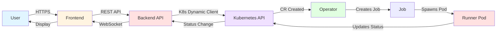

# Architecture Overview

Welcome to the **Ambient Code Platform Architecture Documentation**. This section provides comprehensive visual diagrams and detailed explanations of the platform's design, components, and patterns.

## Purpose

This architecture documentation helps you:

- **Understand** the platform's component interactions and data flows
- **Navigate** complex distributed systems with clear visual aids
- **Make informed decisions** when extending or modifying the platform
- **Onboard quickly** with structured visual learning

## Navigation Guide

### Core Architecture

Start here to understand the foundational platform architecture:

| Document | Description | Key Diagrams |
|----------|-------------|--------------|
| **[Core System Architecture](./core-system-architecture.md)** | 4-component system overview, data flows, and component responsibilities | System architecture, sequence diagrams, multi-tenancy model |
| **[Agentic Session Lifecycle](./agentic-session-lifecycle.md)** | Session state machine, operator reconciliation, and execution patterns | State diagram, reconciliation flowchart, monitoring loop |
| **[Multi-Tenancy Architecture](./multi-tenancy-architecture.md)** | Project isolation, RBAC enforcement, and security boundaries | Namespace mapping, authentication flow, permission matrix |
| **[Kubernetes Resources](./kubernetes-resources.md)** | Custom Resource Definitions (CRDs), schemas, and resource relationships | CR hierarchy, class diagrams, cleanup strategies |

---

## Quick Start by Role

### For Developers

**Start here if you're:**
- Adding new features to the backend or frontend
- Debugging session execution issues
- Understanding component interactions

**Recommended Reading Order:**
1. [Core System Architecture](./core-system-architecture.md) - Get the big picture
2. [Agentic Session Lifecycle](./agentic-session-lifecycle.md) - Understand execution flow
3. [Kubernetes Resources](./kubernetes-resources.md) - Learn CR structures

---

### For Platform Engineers

**Start here if you're:**
- Deploying the platform to production
- Setting up multi-tenancy and RBAC
- Troubleshooting operator issues

**Recommended Reading Order:**
1. [Core System Architecture](./core-system-architecture.md) - Component overview
2. [Multi-Tenancy Architecture](./multi-tenancy-architecture.md) - Isolation and security
3. [Agentic Session Lifecycle](./agentic-session-lifecycle.md) - Operator patterns

---

### For Architects

**Start here if you're:**
- Evaluating the platform for adoption
- Planning integrations or extensions
- Understanding architectural decisions

**Recommended Reading Order:**
1. [Core System Architecture](./core-system-architecture.md) - Full system design
2. Review [Architecture Decision Records](../adr/) - Understand "why" behind decisions
3. [Multi-Tenancy Architecture](./multi-tenancy-architecture.md) - Security model
4. [Kubernetes Resources](./kubernetes-resources.md) - Resource model

---

## Architectural Principles

The Ambient Code Platform is built on these core principles:

### 1. Kubernetes-Native Design

**Why:** Leverage Kubernetes for orchestration, scheduling, and resource management.

**How:**
- Custom Resource Definitions (CRDs) for declarative state
- Operator pattern for reconciliation
- Built-in RBAC for multi-tenancy
- OwnerReferences for automatic cleanup

**Reference:** [ADR-0001: Kubernetes-Native Architecture](../adr/0001-kubernetes-native-architecture.md)

---

### 2. User Token Authentication

**Why:** Enforce per-user RBAC instead of using elevated service account permissions.

**How:**
- Frontend extracts OAuth token
- Backend validates and uses token for K8s API calls
- Service account only for specific elevated operations (CR writes, token minting)

**Reference:** [ADR-0002: User Token Authentication](../adr/0002-user-token-authentication.md)

---

### 3. Asynchronous Execution

**Why:** Long-running AI tasks cannot block HTTP requests.

**How:**
- Synchronous: User request → Backend creates CR → Return immediately
- Asynchronous: Operator watches → Creates Job → Monitors → Updates status
- Feedback: WebSocket or polling for status updates

**Benefits:**
- Responsive UI
- Resilient to restarts
- Kubernetes handles scheduling

---

### 4. Multi-Repository Support

**Why:** Real-world automation often requires changes across multiple codebases.

**How:**
- Sessions can reference multiple Git repositories
- `mainRepoIndex` specifies working directory
- Per-repo status tracking (pushed, abandoned, PR URL)

**Reference:** [ADR-0003: Multi-Repository Support](../adr/0003-multi-repo-support.md)

---

### 5. Polyglot Architecture

**Why:** Use the best language for each layer.

**How:**
- **Go** for backend/operator: Performance, K8s libraries, concurrency
- **Python** for runner: Claude SDK, AI/ML ecosystem, rapid development
- **TypeScript/NextJS** for frontend: Modern web development, type safety

**Reference:** [ADR-0004: Go Backend + Python Runner](../adr/0004-go-backend-python-runner.md)

---

## System Components

### Frontend (NextJS + Shadcn UI)

**Purpose:** Web UI for session management and monitoring

**Technology:**
- NextJS 14+ with App Router
- Shadcn UI component library
- React Query for data fetching
- TypeScript for type safety

**Reference:** [Frontend Development Standards](../../components/frontend/DESIGN_GUIDELINES.md)

---

### Backend API (Go + Gin)

**Purpose:** REST API for CRUD operations on Custom Resources

**Technology:**
- Go 1.21+
- Gin web framework
- Kubernetes Dynamic Client
- OpenShift OAuth integration

**Key Endpoints:**
- `/api/projects/:project/agentic-sessions` - Session management
- `/api/projects/:project/project-settings` - Configuration
- `/api/projects/:project/rfe-workflows` - RFE orchestration
- `/ws` - WebSocket for real-time updates

**Reference:** [Backend Development Standards](../../CLAUDE.md#backend-and-operator-development-standards)

---

### Agentic Operator (Go Controller)

**Purpose:** Watch Custom Resources and reconcile state

**Technology:**
- Go 1.21+
- Kubernetes controller-runtime patterns
- Watch/reconciliation loop

**Responsibilities:**
- Watch AgenticSession, ProjectSettings, RFEWorkflow CRs
- Create and manage Kubernetes Jobs
- Monitor Job completion and update CR status
- Handle timeouts and cleanup

**Reference:** [Operator Development Standards](../../CLAUDE.md#operator-patterns)

---

### Claude Code Runner (Python)

**Purpose:** Execute Claude Code CLI in containerized environment

**Technology:**
- Python 3.11+
- Claude Code SDK (≥0.0.23)
- Anthropic API (≥0.68.0)
- Git integration

**Responsibilities:**
- Execute AI-powered automation tasks
- Manage workspace synchronization
- Capture results and update CR status
- Handle interactive and batch modes

**Reference:** [Runner Documentation](../../components/runners/claude-code-runner/README.md)

---

## Data Flow Summary

**High-Level Flow:**

1. **User** interacts with **Frontend** UI
2. **Frontend** sends API request to **Backend**
3. **Backend** creates Custom Resource via **Kubernetes API** (using user token)
4. **Operator** detects CR and creates **Job**
5. **Job** spawns **Runner Pod** to execute task
6. **Runner** updates CR status with results
7. **Backend** sends WebSocket update to **Frontend**
8. **Frontend** displays results to **User**

**Reference:** [Core System Architecture - Data Flow](./core-system-architecture.md#data-flow-agentic-session-execution)

---

## Architecture Decision Records (ADRs)

ADRs document **why** architectural decisions were made, not just **what** was implemented.

| ADR | Title | Date | Status |
|-----|-------|------|--------|
| [0001](../adr/0001-kubernetes-native-architecture.md) | Kubernetes-Native Architecture | 2024-11 | Accepted |
| [0002](../adr/0002-user-token-authentication.md) | User Token Authentication for API Operations | 2024-11 | Accepted |
| [0003](../adr/0003-multi-repo-support.md) | Multi-Repository Support in AgenticSessions | 2024-11 | Accepted |
| [0004](../adr/0004-go-backend-python-runner.md) | Go Backend + Python Runner Technology Stack | 2024-11 | Accepted |
| [0005](../adr/0005-nextjs-shadcn-react-query.md) | NextJS + Shadcn + React Query Frontend Stack | 2024-11 | Accepted |

**See also:** [Decision Log](../decisions.md) for chronological record of all major decisions.

---

## Design Documents

Detailed design documents for specific features:

| Document | Description |
|----------|-------------|
| [Declarative Session Reconciliation](../design/declarative-session-reconciliation.md) | Operator reconciliation patterns |
| [Session Initialization Flows](../design/session-initialization-flows.md) | Session creation and startup |
| [Session Status Redesign](../design/session-status-redesign.md) | Status tracking and reporting |
| [Runner-Operator Contracts](../design/runner-operator-contracts.md) | Communication between runner and operator |

---

## Related Context Files

Loadable context files for specific development tasks:

| Context File | Use When |
|--------------|----------|
| [Backend Development](../../.claude/context/backend-development.md) | Working on Go backend or operator |
| [Frontend Development](../../.claude/context/frontend-development.md) | Working on NextJS frontend |
| [Security Standards](../../.claude/context/security-standards.md) | Reviewing security practices |

**Reference:** [Repomix Usage Guide](../../.claude/repomix-guide.md) for using architecture views.

---

## Code Pattern Catalog

Common patterns used throughout the codebase:

| Pattern File | Description |
|--------------|-------------|
| [Error Handling](../../.claude/patterns/error-handling.md) | Consistent error patterns (backend, operator, runner) |
| [K8s Client Usage](../../.claude/patterns/k8s-client-usage.md) | When to use user token vs. service account |
| [React Query Usage](../../.claude/patterns/react-query-usage.md) | Data fetching patterns (queries, mutations, caching) |

---

## Contributing to Architecture Docs

When adding or updating architecture documentation:

1. **Use Mermaid diagrams** for visualizations (compatible with MkDocs and GitHub)
2. **Follow established patterns** (see existing architecture docs for examples)
3. **Link to related documentation** (ADRs, design docs, code patterns)
4. **Update this index** when adding new architecture pages
5. **Test diagrams** at [mermaid.live](https://mermaid.live) before committing

**Diagram Format Examples:**
- System architecture → `graph TB` or `graph LR`
- State transitions → `stateDiagram-v2`
- Workflows → `sequenceDiagram`
- Class structures → `classDiagram`
- Flows → `flowchart`

---

## Questions or Feedback?

For questions about the architecture:

- **Technical questions:** See [Developer Guide](../developer/index.md)
- **Architecture proposals:** Create an issue with the `architecture` label
- **Corrections:** Submit a PR with proposed changes

**Repository:** [https://github.com/ambient-code/platform](https://github.com/ambient-code/platform)
