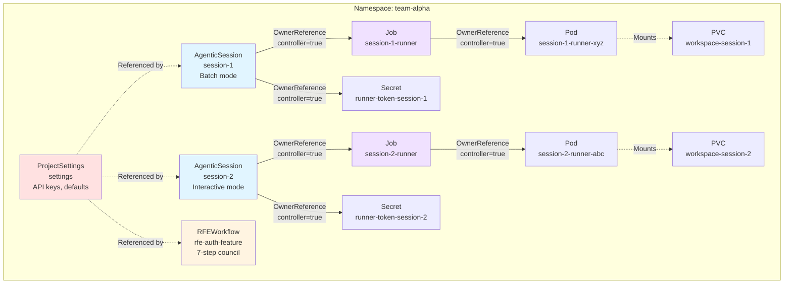
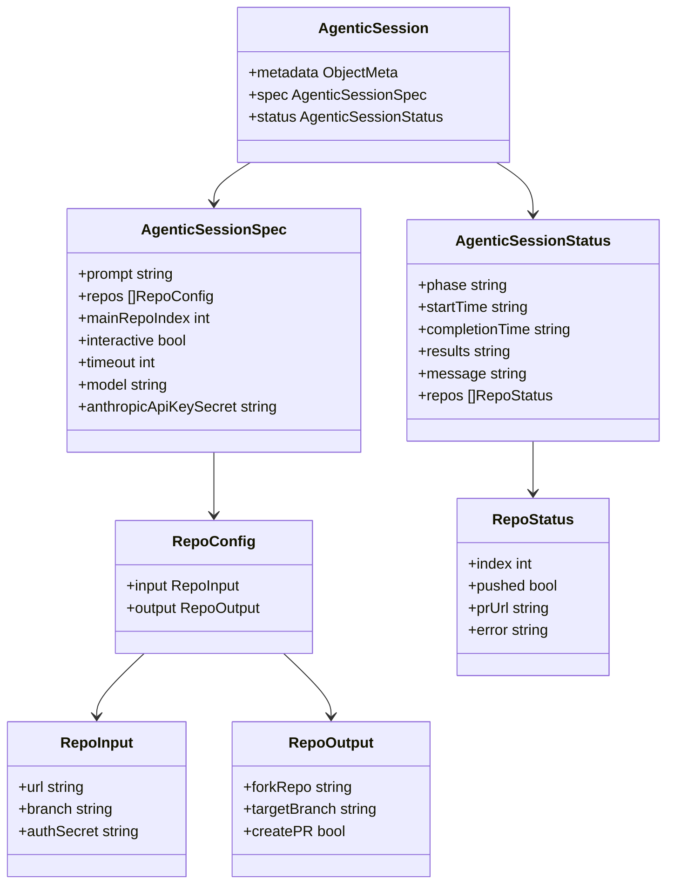
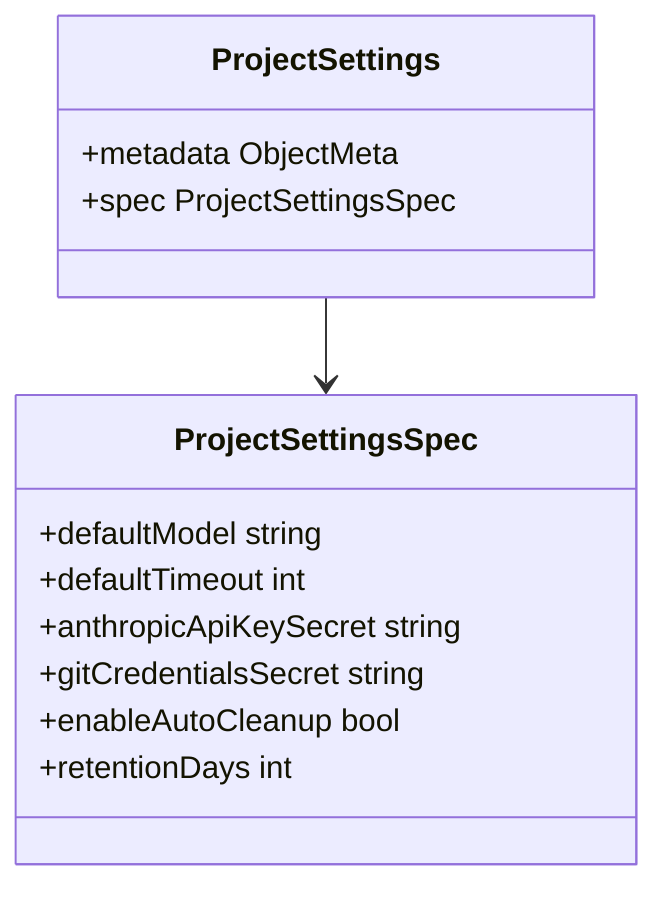
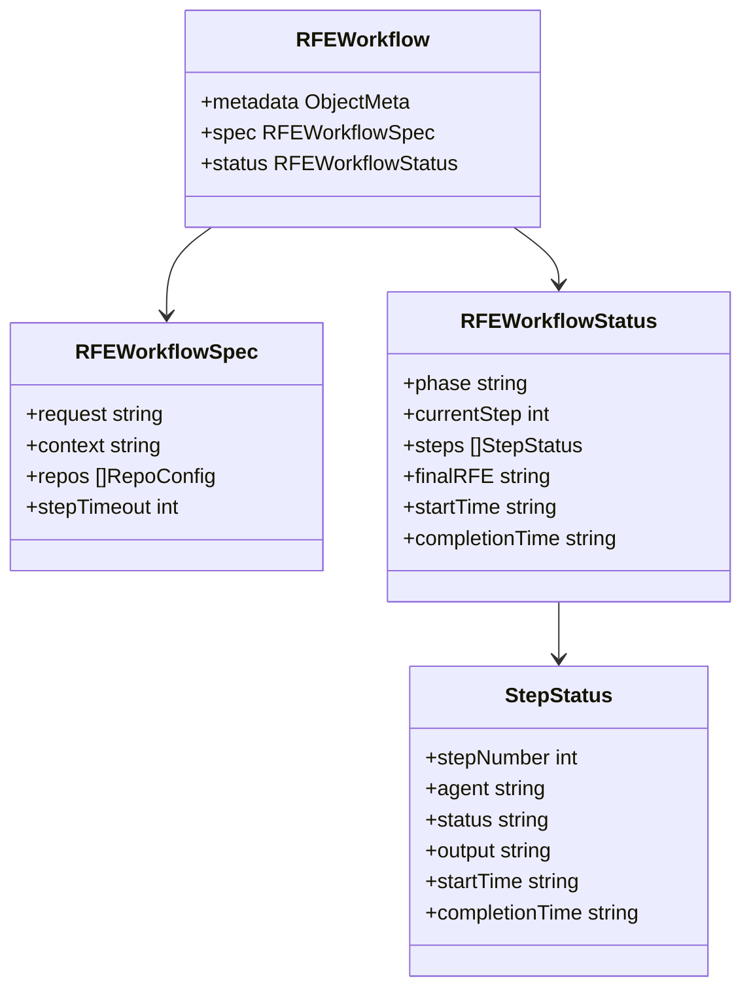

# Kubernetes Custom Resources

## Overview

The Ambient Code Platform uses Kubernetes Custom Resource Definitions (CRDs) to represent AI automation tasks and configuration. This document details the structure, lifecycle, and relationships of the three primary CRDs.

## Custom Resource Hierarchy



**Legend:**
- Solid arrows (→): OwnerReference (parent → child)
- Dashed arrows (-.->): Reference or mount (not ownership)

---

## AgenticSession Custom Resource

### Purpose

Represents a single AI-powered automation task executed via Claude Code.

### API Definition

**Group:** `vteam.ambient-code`
**Version:** `v1alpha1`
**Kind:** `AgenticSession`
**Plural:** `agenticsessions`
**Shortname:** `as`

### Resource Structure



### Spec Fields

#### `spec.prompt` (required)

**Type:** `string`

**Description:** The instruction or task for Claude Code to execute.

**Examples:**
```yaml
prompt: "Add unit tests for the authentication module"
```

```yaml
prompt: "Refactor the database connection logic to use connection pooling"
```

---

#### `spec.repos` (required)

**Type:** `[]RepoConfig`

**Description:** Array of Git repositories to operate on. At least one repo required.

**Structure:**

```yaml
repos:
  - input:
      url: "https://github.com/org/backend"
      branch: "main"
      authSecret: "git-credentials"  # optional
    output:
      forkRepo: "https://github.com/user/backend"  # optional
      targetBranch: "feature/auth-refactor"         # optional
      createPR: true                                # optional
```

**Fields:**

- **`input.url`** (required): Git repository URL (HTTPS or SSH)
- **`input.branch`** (required): Branch to clone and work on
- **`input.authSecret`** (optional): Secret name containing Git credentials
- **`output.forkRepo`** (optional): Fork repository URL for pushing changes
- **`output.targetBranch`** (optional): Target branch for PR creation
- **`output.createPR`** (optional): Whether to create PR after pushing

**Reference:** [ADR-0003: Multi-Repository Support](../adr/0003-multi-repo-support.md)

---

#### `spec.mainRepoIndex` (optional)

**Type:** `int`

**Description:** Index of the repository to use as Claude Code's working directory.

**Default:** `0` (first repository)

**Example:**

```yaml
repos:
  - input:
      url: "https://github.com/org/shared-lib"
      branch: "main"
  - input:
      url: "https://github.com/org/api-service"
      branch: "develop"
mainRepoIndex: 1  # Work in api-service repo
```

---

#### `spec.interactive` (optional)

**Type:** `bool`

**Description:** Enable interactive mode for multi-turn conversations.

**Default:** `false` (batch mode)

**Interactive Mode:**
- Pod continues running after initial execution
- User sends messages via inbox file (`/workspace/inbox.txt`)
- Runner responds via outbox file (`/workspace/outbox.txt`)
- No timeout enforced

**Example:**

```yaml
interactive: true
prompt: "Help me debug the authentication flow"
```

---

#### `spec.timeout` (optional)

**Type:** `int`

**Description:** Timeout in seconds for batch mode execution.

**Default:** Uses ProjectSettings default or 3600 (1 hour)

**Ignored in interactive mode**

**Example:**

```yaml
timeout: 7200  # 2 hours
```

---

#### `spec.model` (optional)

**Type:** `string`

**Description:** Claude model to use for execution.

**Default:** Uses ProjectSettings default or `claude-sonnet-4-5`

**Valid Values:**
- `claude-opus-4-5`
- `claude-sonnet-4-5`
- `claude-haiku-4`

**Example:**

```yaml
model: "claude-opus-4-5"  # Use most capable model
```

---

#### `spec.anthropicApiKeySecret` (optional)

**Type:** `string`

**Description:** Secret name containing Anthropic API key.

**Default:** Uses ProjectSettings default

**Secret Format:**

```yaml
apiVersion: v1
kind: Secret
metadata:
  name: anthropic-api-key
type: Opaque
stringData:
  ANTHROPIC_API_KEY: sk-ant-...
```

---

### Status Fields

#### `status.phase` (set by operator)

**Type:** `string`

**Description:** Current phase of session execution.

**Valid Values:**
- `Pending` - CR created, waiting for operator to create Job
- `Running` - Job created, pod executing
- `Completed` - Execution succeeded
- `Failed` - Execution failed
- `Timeout` - Execution exceeded timeout

**Reference:** [Agentic Session Lifecycle](./agentic-session-lifecycle.md)

---

#### `status.startTime` (set by operator)

**Type:** `string` (RFC3339 timestamp)

**Description:** When execution started (Job created).

**Example:** `"2025-12-08T14:30:00Z"`

---

#### `status.completionTime` (set by operator/runner)

**Type:** `string` (RFC3339 timestamp)

**Description:** When execution completed (success, failure, or timeout).

**Example:** `"2025-12-08T15:45:00Z"`

---

#### `status.results` (set by runner)

**Type:** `string`

**Description:** Execution results, logs, or output from Claude Code.

**May contain:**
- Generated code snippets
- File paths modified
- Test results
- Error messages
- Partial results (if timeout/failure)

---

#### `status.message` (set by operator/runner)

**Type:** `string`

**Description:** Human-readable status message (especially for errors).

**Examples:**
- `"Execution completed successfully"`
- `"Failed to authenticate with Anthropic API"`
- `"Exceeded timeout of 3600 seconds"`
- `"Git repository not found"`

---

#### `status.repos` (set by runner)

**Type:** `[]RepoStatus`

**Description:** Per-repository status tracking.

**Structure:**

```yaml
status:
  repos:
    - index: 0
      pushed: true
      prUrl: "https://github.com/org/backend/pulls/123"
    - index: 1
      pushed: false
      error: "No changes to push"
```

**Fields:**

- **`index`**: Corresponds to `spec.repos[index]`
- **`pushed`**: Whether changes were pushed to remote
- **`prUrl`**: Pull request URL (if created)
- **`error`**: Error message (if push/PR creation failed)

---

### Complete Example

```yaml
apiVersion: vteam.ambient-code/v1alpha1
kind: AgenticSession
metadata:
  name: add-auth-tests
  namespace: team-alpha
  labels:
    project: backend-api
    type: testing
spec:
  prompt: |
    Add comprehensive unit tests for the authentication module.
    Ensure coverage of:
    - Login/logout flows
    - Token validation
    - Password reset
    - Edge cases (expired tokens, invalid credentials)

  repos:
    - input:
        url: "https://github.com/org/backend-api"
        branch: "develop"
        authSecret: "github-pat"
      output:
        forkRepo: "https://github.com/user/backend-api"
        targetBranch: "feature/auth-tests"
        createPR: true

  mainRepoIndex: 0
  interactive: false
  timeout: 3600
  model: "claude-sonnet-4-5"
  anthropicApiKeySecret: "anthropic-api-key"

status:
  phase: "Completed"
  startTime: "2025-12-08T14:30:00Z"
  completionTime: "2025-12-08T14:52:30Z"
  results: |
    Successfully added unit tests:
    - tests/auth/test_login.py (12 tests)
    - tests/auth/test_token_validation.py (8 tests)
    - tests/auth/test_password_reset.py (6 tests)

    Coverage increased from 68% to 89% for auth module.

  message: "Execution completed successfully"

  repos:
    - index: 0
      pushed: true
      prUrl: "https://github.com/org/backend-api/pulls/456"
```

---

## ProjectSettings Custom Resource

### Purpose

Stores project-wide configuration such as default models, API keys, and timeout settings.

### API Definition

**Group:** `vteam.ambient-code`
**Version:** `v1alpha1`
**Kind:** `ProjectSettings`
**Plural:** `projectsettings`
**Shortname:** `ps`

### Resource Structure



### Spec Fields

#### `spec.defaultModel` (optional)

**Type:** `string`

**Description:** Default Claude model for sessions without explicit `model` field.

**Default:** `claude-sonnet-4-5`

**Example:**

```yaml
defaultModel: "claude-opus-4-5"  # Use most capable model by default
```

---

#### `spec.defaultTimeout` (optional)

**Type:** `int`

**Description:** Default timeout (seconds) for batch mode sessions.

**Default:** `3600` (1 hour)

**Example:**

```yaml
defaultTimeout: 7200  # 2 hours for complex tasks
```

---

#### `spec.anthropicApiKeySecret` (optional)

**Type:** `string`

**Description:** Default Secret name for Anthropic API key.

**Sessions without explicit `anthropicApiKeySecret` use this default.**

**Example:**

```yaml
anthropicApiKeySecret: "anthropic-api-key"
```

---

#### `spec.gitCredentialsSecret` (optional)

**Type:** `string`

**Description:** Default Secret name for Git authentication.

**Sessions without explicit `authSecret` in repo config use this default.**

**Example:**

```yaml
gitCredentialsSecret: "github-pat"
```

---

#### `spec.enableAutoCleanup` (optional)

**Type:** `bool`

**Description:** Enable automatic cleanup of completed sessions.

**Default:** `false`

**Example:**

```yaml
enableAutoCleanup: true
retentionDays: 7  # Delete completed sessions after 7 days
```

---

#### `spec.retentionDays` (optional)

**Type:** `int`

**Description:** Days to retain completed sessions before auto-cleanup.

**Default:** `7`

**Only applies if `enableAutoCleanup: true`**

---

### Complete Example

```yaml
apiVersion: vteam.ambient-code/v1alpha1
kind: ProjectSettings
metadata:
  name: settings
  namespace: team-alpha
spec:
  defaultModel: "claude-sonnet-4-5"
  defaultTimeout: 5400  # 90 minutes
  anthropicApiKeySecret: "anthropic-api-key"
  gitCredentialsSecret: "github-pat"
  enableAutoCleanup: true
  retentionDays: 14
```

---

## RFEWorkflow Custom Resource

### Purpose

Orchestrates a 7-step agent council process for Request For Enhancement (RFE) refinement.

### API Definition

**Group:** `vteam.ambient-code`
**Version:** `v1alpha1`
**Kind:** `RFEWorkflow`
**Plural:** `rfeworkflows`
**Shortname:** `rfe`

### Resource Structure



### 7-Step Agent Council

```mermaid
flowchart LR
    Request[User Request] --> Step1

    Step1[Step 1:<br/>Product Manager<br/>Requirements clarification] --> Step2
    Step2[Step 2:<br/>Solution Architect<br/>Technical design] --> Step3
    Step3[Step 3:<br/>Staff Engineer<br/>Implementation plan] --> Step4
    Step4[Step 4:<br/>Product Owner<br/>Acceptance criteria] --> Step5
    Step5[Step 5:<br/>Team Lead<br/>Task breakdown] --> Step6
    Step6[Step 6:<br/>Team Member<br/>Effort estimation] --> Step7
    Step7[Step 7:<br/>Delivery Owner<br/>Risk assessment] --> Final

    Final[Final RFE Document]

    style Request fill:#e1f5ff
    style Final fill:#e1ffe1
    style Step1 fill:#ffe1e1
    style Step2 fill:#fff4e1
    style Step3 fill:#f0e1ff
    style Step4 fill:#ffe1e1
    style Step5 fill:#fff4e1
    style Step6 fill:#f0e1ff
    style Step7 fill:#ffe1e1
```



**Agent Roles:**

1. **Product Manager:** Clarifies requirements, defines user stories
2. **Solution Architect:** Designs technical architecture, identifies dependencies
3. **Staff Engineer:** Creates implementation plan, reviews code patterns
4. **Product Owner:** Defines acceptance criteria and success metrics
5. **Team Lead:** Breaks down into tasks, assigns priorities
6. **Team Member:** Estimates effort, identifies blockers
7. **Delivery Owner:** Assesses risks, creates rollback plan

---

### Spec Fields

#### `spec.request` (required)

**Type:** `string`

**Description:** Initial RFE request or feature description.

**Example:**

```yaml
request: |
  Add support for OAuth2 authentication in the API.
  Users should be able to authenticate using Google, GitHub, and Microsoft accounts.
```

---

#### `spec.context` (optional)

**Type:** `string`

**Description:** Additional context for the council (codebase state, constraints, preferences).

**Example:**

```yaml
context: |
  - Existing authentication uses JWT tokens
  - Frontend is React-based
  - Backend is Go + Gin framework
  - Prefer minimal dependencies
```

---

#### `spec.repos` (required)

**Type:** `[]RepoConfig`

**Description:** Repositories for council to analyze (same structure as AgenticSession).

---

#### `spec.stepTimeout` (optional)

**Type:** `int`

**Description:** Timeout (seconds) per step.

**Default:** `1800` (30 minutes)

---

### Status Fields

#### `status.phase` (set by operator)

**Type:** `string`

**Valid Values:**
- `Pending` - Workflow created, not started
- `Running` - Executing steps
- `Completed` - All steps completed
- `Failed` - One or more steps failed

---

#### `status.currentStep` (set by operator)

**Type:** `int`

**Description:** Currently executing step (1-7).

---

#### `status.steps` (set by operator/runner)

**Type:** `[]StepStatus`

**Description:** Status for each of the 7 steps.

**Fields:**

- **`stepNumber`**: 1-7
- **`agent`**: Agent role (e.g., "Product Manager")
- **`status`**: `Pending`, `Running`, `Completed`, `Failed`
- **`output`**: Agent's output for this step
- **`startTime`**: RFC3339 timestamp
- **`completionTime`**: RFC3339 timestamp

---

#### `status.finalRFE` (set by runner)

**Type:** `string`

**Description:** Final synthesized RFE document combining all agent outputs.

---

### Complete Example

```yaml
apiVersion: vteam.ambient-code/v1alpha1
kind: RFEWorkflow
metadata:
  name: oauth-authentication
  namespace: team-alpha
spec:
  request: |
    Add OAuth2 authentication to the API supporting Google, GitHub, and Microsoft.

  context: |
    - Current auth uses JWT tokens
    - Backend: Go + Gin
    - Frontend: React + NextJS

  repos:
    - input:
        url: "https://github.com/org/backend-api"
        branch: "develop"
    - input:
        url: "https://github.com/org/frontend"
        branch: "develop"

  stepTimeout: 1800

status:
  phase: "Completed"
  currentStep: 7

  steps:
    - stepNumber: 1
      agent: "Product Manager"
      status: "Completed"
      output: |
        Requirements clarified:
        - Support 3 OAuth providers
        - Fallback to JWT for API clients
        - User profile sync on first login
      startTime: "2025-12-08T10:00:00Z"
      completionTime: "2025-12-08T10:15:00Z"

    - stepNumber: 2
      agent: "Solution Architect"
      status: "Completed"
      output: |
        Technical design:
        - Use golang.org/x/oauth2 library
        - Add OAuthProvider table (Postgres)
        - Extend User model with provider_id field
        - Create /auth/oauth/{provider} endpoints
      startTime: "2025-12-08T10:15:00Z"
      completionTime: "2025-12-08T10:35:00Z"

    # ... (steps 3-7)

  finalRFE: |
    # RFE: OAuth2 Authentication

    ## Overview
    Add OAuth2 authentication supporting Google, GitHub, and Microsoft.

    ## Requirements
    - Support 3 OAuth providers
    - Fallback to JWT for API clients
    - User profile sync on first login

    ## Technical Design
    - Use golang.org/x/oauth2 library
    - Add OAuthProvider table
    - Extend User model
    - Create /auth/oauth/{provider} endpoints

    ## Implementation Plan
    (Detailed steps from Staff Engineer)

    ## Acceptance Criteria
    (Criteria from Product Owner)

    ## Task Breakdown
    (Tasks from Team Lead)

    ## Effort Estimation
    (Estimates from Team Member)

    ## Risk Assessment
    (Risks and mitigation from Delivery Owner)

  startTime: "2025-12-08T10:00:00Z"
  completionTime: "2025-12-08T13:45:00Z"
```

---

## OwnerReferences and Cleanup

### OwnerReference Pattern

**Purpose:** Automatic resource cleanup when parent is deleted.

**Structure:**

```yaml
apiVersion: vteam.ambient-code/v1alpha1
kind: AgenticSession
metadata:
  name: session-1
  namespace: team-alpha
---
apiVersion: batch/v1
kind: Job
metadata:
  name: session-1-runner
  namespace: team-alpha
  ownerReferences:
    - apiVersion: vteam.ambient-code/v1alpha1
      kind: AgenticSession
      name: session-1
      uid: a1b2c3d4-e5f6-7890-abcd-ef1234567890
      controller: true
      # blockOwnerDeletion: false (default, do not set to true)
```

**Key Fields:**

- **`controller: true`**: Only ONE owner can be controller (primary parent)
- **`blockOwnerDeletion`**: **Omit this field** (causes permission issues in multi-tenant)

**Cleanup Behavior:**

1. User deletes AgenticSession CR
2. Kubernetes cascades delete to owned resources:
   - Job (which cascades to Pod)
   - Secret (runner token)
   - PVC (workspace, if configured)

**Reference:** [Backend/Operator Standards - OwnerReferences](../../CLAUDE.md#ownerreferences-pattern)

---

### Cleanup Strategies

#### Automatic (OwnerReferences)

**When:** Parent CR deleted

**How:** Kubernetes garbage collector cascades delete

**Pros:**
- No manual cleanup required
- Consistent behavior
- Works even if operator is down

**Cons:**
- Deletion order not controllable
- All child resources deleted (no selective retention)

---

#### Manual (Operator Cleanup)

**When:** Session completes successfully

**How:** Operator explicitly deletes Job (Pod cleaned by Job controller)

**Pattern:**

```go
func cleanupCompletedSession(namespace, jobName string) {
    policy := v1.DeletePropagationBackground

    err := K8sClient.BatchV1().Jobs(namespace).Delete(
        context.Background(), jobName, v1.DeleteOptions{
            PropagationPolicy: &policy,
        })

    if err != nil && !errors.IsNotFound(err) {
        log.Printf("Failed to delete job: %v", err)
    }
}
```

**Pros:**
- Immediate cleanup on completion
- Selective retention (e.g., keep PVC, delete Job)

**Cons:**
- Requires operator to be running
- More complex logic

---

#### Time-Based (TTL)

**When:** ProjectSettings enables `enableAutoCleanup`

**How:** Operator periodically deletes old completed CRs

**Pattern:**

```go
func cleanupOldSessions(namespace string, retentionDays int) {
    cutoff := time.Now().AddDate(0, 0, -retentionDays)

    list, _ := DynamicClient.Resource(gvr).Namespace(namespace).List(
        context.Background(), v1.ListOptions{})

    for _, item := range list.Items {
        phase, _, _ := unstructured.NestedString(item.Object, "status", "phase")
        if phase != "Completed" && phase != "Failed" {
            continue  // Only cleanup terminal states
        }

        completionTime, _, _ := unstructured.NestedString(item.Object, "status", "completionTime")
        if completionTime == "" {
            continue
        }

        t, err := time.Parse(time.RFC3339, completionTime)
        if err != nil || t.After(cutoff) {
            continue  // Too recent or invalid timestamp
        }

        // Delete old completed session
        DynamicClient.Resource(gvr).Namespace(namespace).Delete(
            context.Background(), item.GetName(), v1.DeleteOptions{})

        log.Printf("Deleted old session %s (completed %s)", item.GetName(), completionTime)
    }
}
```

**Pros:**
- Automatic space management
- Configurable retention period

**Cons:**
- Loses audit trail (consider archiving first)
- Requires periodic operator execution

---

## Related Documentation

- [Core System Architecture](./core-system-architecture.md) - Component overview
- [Agentic Session Lifecycle](./agentic-session-lifecycle.md) - Session state machine
- [Multi-Tenancy Architecture](./multi-tenancy-architecture.md) - Namespace isolation
- [ADR-0001: Kubernetes-Native Architecture](../adr/0001-kubernetes-native-architecture.md)
- [ADR-0003: Multi-Repository Support](../adr/0003-multi-repo-support.md)
