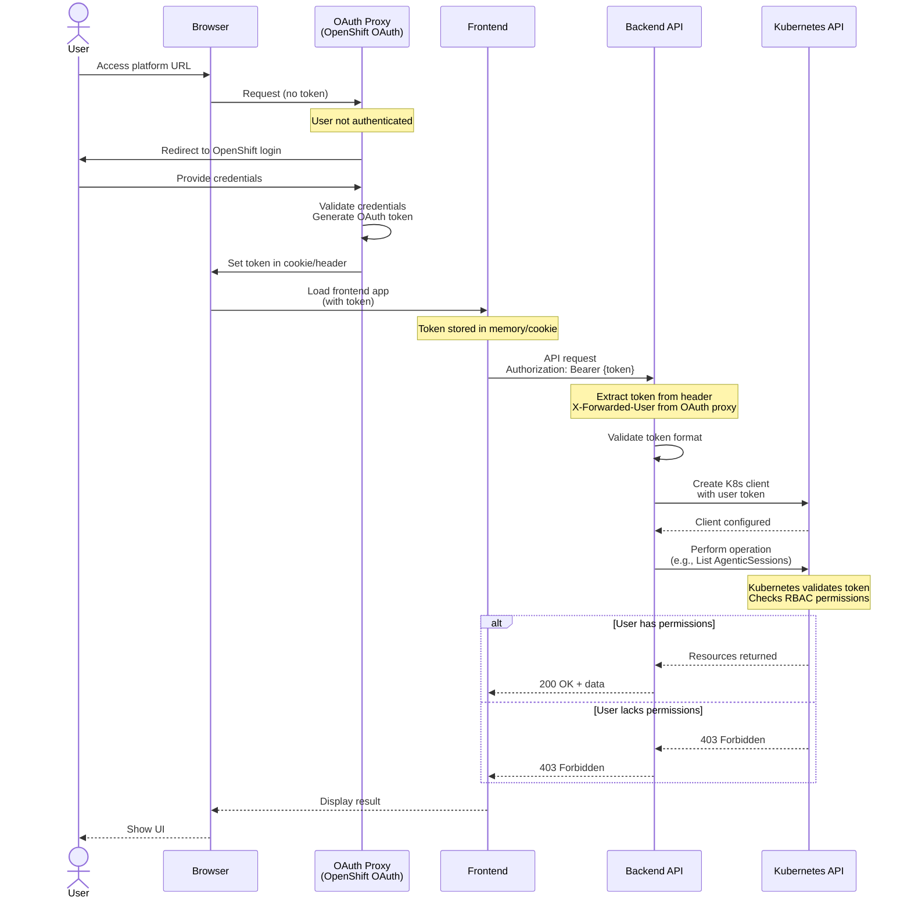
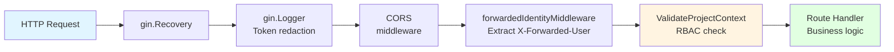
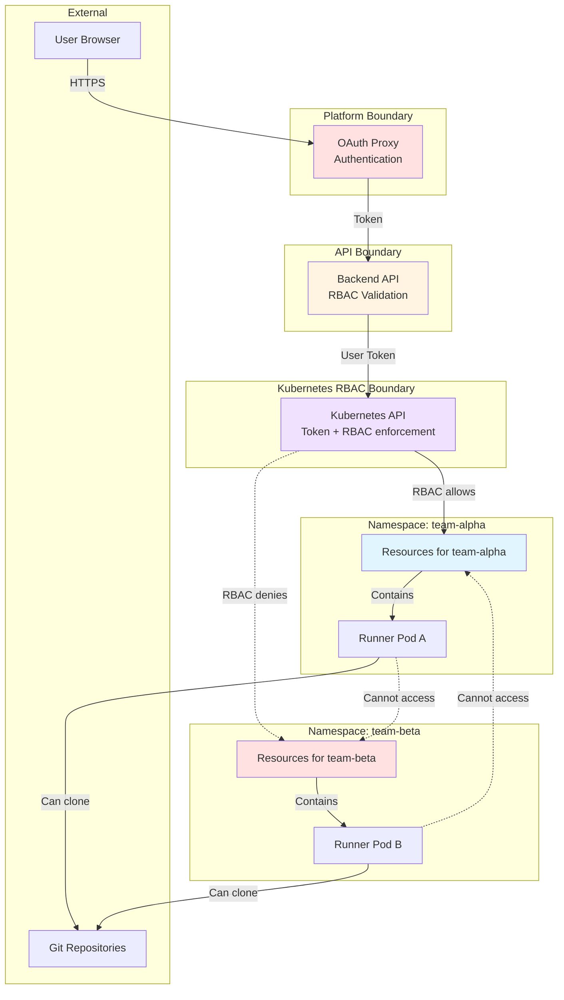
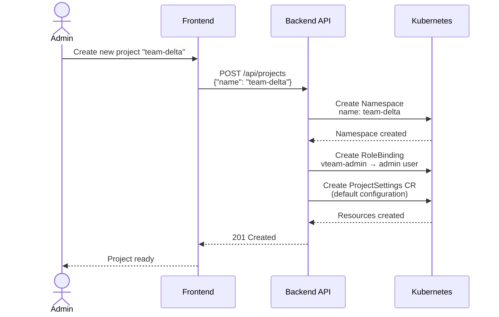
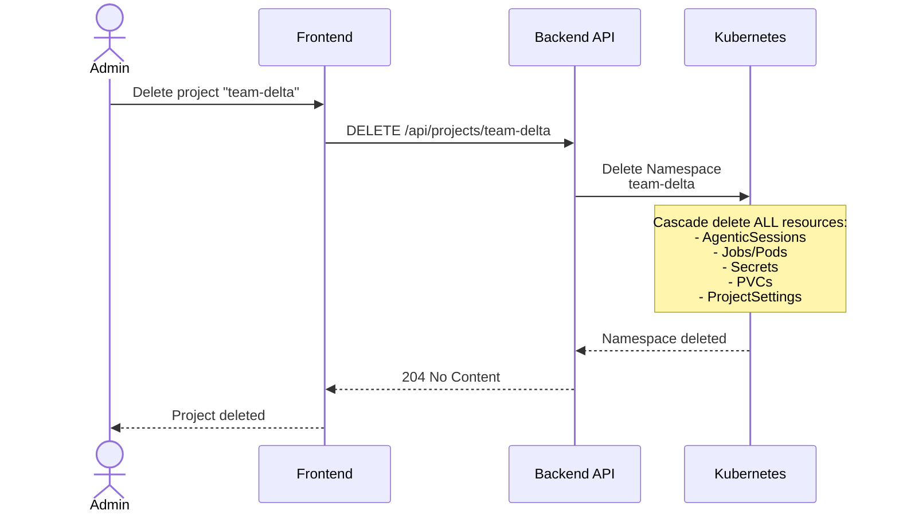

# Multi-Tenancy Architecture

## Overview

The Ambient Code Platform implements **namespace-based multi-tenancy** where each project maps to a dedicated Kubernetes namespace. This ensures complete isolation between tenants while leveraging Kubernetes RBAC for fine-grained access control.

## Project-to-Namespace Mapping

```mermaid
graph TB
    subgraph "Frontend Layer"
        UI[User Interface<br/>Project Selection]
    end

    subgraph "Backend API Layer"
        API[Backend API<br/>Project Context Validation]
        MW[Middleware:<br/>ValidateProjectContext]
    end

    subgraph "Kubernetes Cluster"
        subgraph "Project: team-alpha"
            NSA[Namespace: team-alpha]
            RBA[RoleBinding: team-alpha-users]
            ASA1[AgenticSession: session-1]
            ASA2[AgenticSession: session-2]
            PSA[ProjectSettings: settings]
            PVC_A[PVC: workspace-session-1]
        end

        subgraph "Project: team-beta"
            NSB[Namespace: team-beta]
            RBB[RoleBinding: team-beta-users]
            ASB1[AgenticSession: session-1]
            PSB[ProjectSettings: settings]
            PVC_B[PVC: workspace-session-1]
        end

        subgraph "Project: team-gamma"
            NSC[Namespace: team-gamma]
            RBC[RoleBinding: team-gamma-users]
            ASC1[AgenticSession: session-1]
            PSC[ProjectSettings: settings]
        end
    end

    UI -->|GET /api/projects| API
    API -->|List namespaces<br/>user has access to| NSA
    API -->|List namespaces<br/>user has access to| NSB
    API -->|List namespaces<br/>user has access to| NSC

    UI -->|POST /api/projects/team-alpha/agentic-sessions| MW
    MW -->|Validate RBAC| RBA
    MW -->|Create CR| ASA1

    style NSA fill:#e1f5ff
    style NSB fill:#ffe1e1
    style NSC fill:#e1ffe1
    style MW fill:#fff4e1
    style RBA fill:#f0e1ff
    style RBB fill:#f0e1ff
    style RBC fill:#f0e1ff
```



**Key Principles:**

1. **1:1 Mapping:** Each project corresponds to exactly one Kubernetes namespace
2. **Namespace = Isolation Boundary:** Resources cannot cross namespace boundaries
3. **Project Name = Namespace Name:** Simplifies mapping and debugging
4. **RBAC Enforced:** User must have permissions on namespace to access project

---

## User Authentication Flow



**Authentication Components:**

1. **OAuth Proxy:** Intercepts requests, enforces authentication, injects X-Forwarded-User header
2. **Frontend:** Receives token, includes in all API requests
3. **Backend:** Extracts token, creates K8s client with user credentials
4. **Kubernetes API:** Validates token against ServiceAccount/User, enforces RBAC

**Reference:** [ADR-0002: User Token Authentication](../adr/0002-user-token-authentication.md)

---

## RBAC Model

### Role Hierarchy

```mermaid
graph TB
    subgraph "Cluster Roles (Platform Admin)"
        CA[ClusterRole:<br/>cluster-admin]
        CVR[ClusterRole:<br/>vteam-view-all]
    end

    subgraph "Namespace Roles (Project Team)"
        NA[Role:<br/>vteam-admin<br/>(CRUD all resources)]
        NE[Role:<br/>vteam-editor<br/>(CRUD sessions)]
        NV[Role:<br/>vteam-viewer<br/>(Read-only)]
    end

    subgraph "Service Accounts"
        SAB[ServiceAccount:<br/>backend<br/>(CR writes, token minting)]
        SAO[ServiceAccount:<br/>operator<br/>(Watch CRs, manage Jobs)]
        SAR[ServiceAccount:<br/>runner<br/>(Update CR status)]
    end

    CA -->|Has all permissions| NA
    CA -->|Has all permissions| NE
    CA -->|Has all permissions| NV

    CVR -->|Can read| NV

    NA -->|Includes| NE
    NE -->|Includes| NV

    SAB -->|Bound to| NA
    SAO -->|Bound to| NA
    SAR -->|Bound to| NV

    style CA fill:#ffe1e1
    style CVR fill:#ffe1e1
    style NA fill:#e1f5ff
    style NE fill:#fff4e1
    style NV fill:#e1ffe1
    style SAB fill:#f0e1ff
    style SAO fill:#f0e1ff
    style SAR fill:#f0e1ff
```

### Permission Matrix

| Resource | vteam-viewer | vteam-editor | vteam-admin | backend SA | operator SA |
|----------|--------------|--------------|-------------|------------|-------------|
| **AgenticSession** |
| list | ✓ | ✓ | ✓ | ✓ | ✓ |
| get | ✓ | ✓ | ✓ | ✓ | ✓ |
| watch | - | - | - | - | ✓ |
| create | - | ✓ | ✓ | ✓ | - |
| update | - | ✓ | ✓ | ✓ | - |
| update/status | - | - | - | ✓ | ✓ |
| delete | - | ✓ | ✓ | ✓ | - |
| **ProjectSettings** |
| list | ✓ | ✓ | ✓ | ✓ | ✓ |
| get | ✓ | ✓ | ✓ | ✓ | ✓ |
| create | - | - | ✓ | ✓ | - |
| update | - | - | ✓ | ✓ | - |
| delete | - | - | ✓ | ✓ | - |
| **RFEWorkflow** |
| list | ✓ | ✓ | ✓ | ✓ | ✓ |
| get | ✓ | ✓ | ✓ | ✓ | ✓ |
| create | - | ✓ | ✓ | ✓ | - |
| update | - | ✓ | ✓ | ✓ | - |
| delete | - | ✓ | ✓ | ✓ | - |
| **Jobs** |
| list | ✓ | ✓ | ✓ | - | ✓ |
| get | ✓ | ✓ | ✓ | - | ✓ |
| create | - | - | - | - | ✓ |
| delete | - | - | ✓ | - | ✓ |
| **Secrets** |
| list | - | - | ✓ | ✓ | ✓ |
| get | - | - | ✓ | ✓ | ✓ |
| create | - | - | - | ✓ | ✓ |
| delete | - | - | ✓ | ✓ | ✓ |

**Legend:**
- ✓ = Permission granted
- \- = Permission denied

---

## Backend API Authorization Pattern

### Middleware Chain



### User Token Extraction

**Backend Pattern** (`components/backend/handlers/helpers.go`):

```go
// GetK8sClientsForRequest creates K8s clients using user token from request
func GetK8sClientsForRequest(c *gin.Context) (*kubernetes.Clientset, dynamic.Interface) {
    // 1. Extract Authorization header
    rawAuth := c.GetHeader("Authorization")
    if rawAuth == "" {
        log.Printf("Missing Authorization header")
        return nil, nil
    }

    // 2. Parse Bearer token
    parts := strings.SplitN(rawAuth, " ", 2)
    if len(parts) != 2 || !strings.EqualFold(parts[0], "Bearer") {
        log.Printf("Invalid Authorization header format")
        return nil, nil
    }

    token := strings.TrimSpace(parts[1])
    if token == "" {
        log.Printf("Empty token")
        return nil, nil
    }

    log.Printf("Creating K8s client with user token (len=%d)", len(token))

    // 3. Create K8s client with user token
    config := &rest.Config{
        Host:        os.Getenv("KUBERNETES_SERVICE_HOST"),
        BearerToken: token,
        TLSClientConfig: rest.TLSClientConfig{
            Insecure: false,
            CAFile:   "/var/run/secrets/kubernetes.io/serviceaccount/ca.crt",
        },
    }

    k8sClient, err := kubernetes.NewForConfig(config)
    if err != nil {
        log.Printf("Failed to create K8s client: %v", err)
        return nil, nil
    }

    dynClient, err := dynamic.NewForConfig(config)
    if err != nil {
        log.Printf("Failed to create dynamic client: %v", err)
        return nil, nil
    }

    return k8sClient, dynClient
}
```

### RBAC Validation Middleware

**Pattern** (`components/backend/handlers/middleware.go`):

```go
func ValidateProjectContext() gin.HandlerFunc {
    return func(c *gin.Context) {
        projectName := c.Param("projectName")
        if projectName == "" {
            c.JSON(http.StatusBadRequest, gin.H{"error": "Missing project name"})
            c.Abort()
            return
        }

        // Get user-scoped K8s client
        reqK8s, _ := GetK8sClientsForRequest(c)
        if reqK8s == nil {
            c.JSON(http.StatusUnauthorized, gin.H{"error": "Invalid or missing token"})
            c.Abort()
            return
        }

        // Check if user has access to namespace
        ssar := &authv1.SelfSubjectAccessReview{
            Spec: authv1.SelfSubjectAccessReviewSpec{
                ResourceAttributes: &authv1.ResourceAttributes{
                    Group:     "vteam.ambient-code",
                    Resource:  "agenticsessions",
                    Verb:      "list",
                    Namespace: projectName,
                },
            },
        }

        res, err := reqK8s.AuthorizationV1().SelfSubjectAccessReviews().Create(
            context.Background(), ssar, v1.CreateOptions{})

        if err != nil || !res.Status.Allowed {
            c.JSON(http.StatusForbidden, gin.H{
                "error": fmt.Sprintf("No access to project %s", projectName),
            })
            c.Abort()
            return
        }

        // Store project in context for handler
        c.Set("project", projectName)
        c.Next()
    }
}
```

### Handler Usage

**Example** (`components/backend/handlers/sessions.go`):

```go
func ListSessions(c *gin.Context) {
    project := c.GetString("project")  // From middleware

    // Get user-scoped K8s clients
    _, reqDyn := GetK8sClientsForRequest(c)
    if reqDyn == nil {
        c.JSON(http.StatusUnauthorized, gin.H{"error": "Invalid token"})
        return
    }

    gvr := schema.GroupVersionResource{
        Group:    "vteam.ambient-code",
        Version:  "v1alpha1",
        Resource: "agenticsessions",
    }

    // List sessions using user token (RBAC enforced by K8s)
    list, err := reqDyn.Resource(gvr).Namespace(project).List(
        context.Background(), v1.ListOptions{})

    if err != nil {
        log.Printf("Failed to list sessions in project %s: %v", project, err)
        c.JSON(http.StatusInternalServerError, gin.H{"error": "Failed to list sessions"})
        return
    }

    c.JSON(http.StatusOK, gin.H{"items": list.Items})
}
```

**Key Security Patterns:**

1. **Always use user token** for user-initiated operations
2. **Never fall back** to service account if user token is invalid
3. **Validate RBAC** before resource access
4. **Log securely** - never log token values (use `len(token)`)
5. **Return 401** for auth failures, **403** for authorization failures

**Reference:** [Backend Development Standards](../../CLAUDE.md#user-scoped-clients-for-api-operations)

---

## Service Account Usage

### Backend Service Account

**Purpose:** Limited elevated operations

**Permissions:**
- Create/update Custom Resources (after user validation)
- Create Secrets for runner token minting
- Read ProjectSettings for configuration

**Usage Pattern:**

```go
// ONLY use backend service account for:
// 1. Writing CRs after user token validation
// 2. Minting runner tokens

func CreateSession(c *gin.Context) {
    project := c.GetString("project")

    // Step 1: Validate user has permission using USER TOKEN
    reqK8s, reqDyn := GetK8sClientsForRequest(c)
    if reqK8s == nil {
        c.JSON(http.StatusUnauthorized, gin.H{"error": "Invalid token"})
        return
    }

    // Validate user can create sessions
    if !userCanCreateSessions(reqK8s, project) {
        c.JSON(http.StatusForbidden, gin.H{"error": "No permission to create sessions"})
        return
    }

    // Step 2: Create CR using BACKEND SERVICE ACCOUNT
    // (user token may not have write permissions on status subresource)
    obj := buildSessionObject(...)

    created, err := DynamicClient.Resource(gvr).Namespace(project).Create(
        context.Background(), obj, v1.CreateOptions{})

    if err != nil {
        log.Printf("Failed to create session: %v", err)
        c.JSON(http.StatusInternalServerError, gin.H{"error": "Failed to create session"})
        return
    }

    // Step 3: Mint token for runner using BACKEND SERVICE ACCOUNT
    runnerToken, err := mintRunnerToken(project, created.GetName())
    if err != nil {
        log.Printf("Failed to mint runner token: %v", err)
        // Continue - operator can handle missing token
    }

    c.JSON(http.StatusCreated, gin.H{
        "name": created.GetName(),
        "uid":  created.GetUID(),
    })
}
```

**Never Use Backend Service Account For:**
- ❌ List/Get operations on behalf of users
- ❌ Delete operations initiated by users
- ❌ Skipping RBAC validation
- ❌ Accessing resources user doesn't have permission for

---

### Operator Service Account

**Purpose:** Watch and reconcile Custom Resources

**Permissions:**
- Watch all Custom Resources (cluster-wide or namespace-scoped)
- Create/delete Jobs
- Create/delete Secrets
- Update CR status subresource

**Usage Pattern:**

```go
// Operator uses its service account for ALL operations
func WatchAgenticSessions() {
    gvr := types.GetAgenticSessionResource()

    // Watch using operator's service account
    watcher, err := config.DynamicClient.Resource(gvr).Watch(
        context.Background(), v1.ListOptions{})

    if err != nil {
        log.Printf("Failed to create watcher: %v", err)
        return
    }

    for event := range watcher.ResultChan() {
        obj := event.Object.(*unstructured.Unstructured)
        handleAgenticSession(obj)
    }
}
```

**Note:** Operator has **cluster-wide permissions** to watch and reconcile resources across all namespaces. This is acceptable because:
1. Operator is trusted infrastructure component
2. Operator only automates declarative state (no user input)
3. Operator does not expose user-facing API

---

### Runner Service Account

**Purpose:** Update CR status from pod

**Permissions:**
- Update `/status` subresource for parent AgenticSession
- Read ConfigMaps/Secrets in namespace
- Limited read access to other CRs (for RFE workflows)

**Token Minting:**

Backend mints a time-limited token for runner:

```go
func mintRunnerToken(namespace, sessionName string) (string, error) {
    // Create ServiceAccount for runner
    sa := &corev1.ServiceAccount{
        ObjectMeta: v1.ObjectMeta{
            Name:      fmt.Sprintf("runner-%s", sessionName),
            Namespace: namespace,
        },
    }

    _, err := K8sClient.CoreV1().ServiceAccounts(namespace).Create(
        context.Background(), sa, v1.CreateOptions{})

    if err != nil && !errors.IsAlreadyExists(err) {
        return "", err
    }

    // Create token for ServiceAccount
    treq := &authv1.TokenRequest{
        Spec: authv1.TokenRequestSpec{
            ExpirationSeconds: int64Ptr(3600),  // 1 hour
        },
    }

    token, err := K8sClient.CoreV1().ServiceAccounts(namespace).CreateToken(
        context.Background(), sa.Name, treq, v1.CreateOptions{})

    if err != nil {
        return "", err
    }

    return token.Status.Token, nil
}
```

**Usage in Runner:**

```python
# Runner reads minted token from environment
token = os.environ.get("RUNNER_TOKEN")

# Use token to update CR status
requests.patch(
    f"{k8s_api}/apis/vteam.ambient-code/v1alpha1/namespaces/{namespace}/agenticsessions/{name}/status",
    headers={"Authorization": f"Bearer {token}"},
    json={"status": {"results": results}}
)
```

---

## Isolation Guarantees

### Namespace Isolation

**What's Isolated:**
- ✓ Custom Resources (AgenticSession, ProjectSettings, RFEWorkflow)
- ✓ Jobs and Pods
- ✓ Secrets and ConfigMaps
- ✓ PersistentVolumeClaims
- ✓ NetworkPolicies (if configured)

**What's Shared:**
- Kubernetes cluster infrastructure (nodes, storage classes)
- CRDs (cluster-scoped)
- ClusterRoles and ClusterRoleBindings
- Platform services (backend, operator)

### RBAC Isolation

**User A (team-alpha):**
- ✓ Can list/create/delete sessions in `team-alpha` namespace
- ❌ Cannot list sessions in `team-beta` namespace
- ❌ Cannot modify ProjectSettings in `team-gamma` namespace

**User B (team-beta):**
- ✓ Can list sessions in `team-beta` namespace
- ❌ Cannot access `team-alpha` resources
- ❌ Cannot create sessions in `team-gamma` namespace

**Enforcement:**
- Backend validates user token + RBAC before operations
- Kubernetes API enforces RBAC on every request
- Operator uses namespace-scoped clients where possible

### Resource Quotas (Optional)

**Per-Namespace Limits:**

```yaml
apiVersion: v1
kind: ResourceQuota
metadata:
  name: project-quota
  namespace: team-alpha
spec:
  hard:
    requests.cpu: "10"
    requests.memory: "20Gi"
    limits.cpu: "20"
    limits.memory: "40Gi"
    pods: "50"
    persistentvolumeclaims: "10"
```

**Prevents:**
- Resource exhaustion by single tenant
- Noisy neighbor problems
- Runaway session costs

---

## Security Boundaries



**Security Layers:**

1. **OAuth Proxy:** Ensures user is authenticated
2. **Backend API:** Validates user token + RBAC permissions
3. **Kubernetes API:** Enforces RBAC on every resource access
4. **Namespace Isolation:** Resources cannot cross boundaries
5. **NetworkPolicies (optional):** Restrict pod-to-pod communication

---

## Project Lifecycle

### Project Creation



### Project Deletion



**Cleanup:**
- Kubernetes automatically deletes all resources in namespace
- No manual cleanup required
- PVCs deleted (data loss - consider backups)

---

## Related Documentation

- [Core System Architecture](./core-system-architecture.md) - Component overview
- [Agentic Session Lifecycle](./agentic-session-lifecycle.md) - Session execution flow
- [Backend Development Standards](../../CLAUDE.md#backend-and-operator-development-standards)
- [ADR-0001: Kubernetes-Native Architecture](../adr/0001-kubernetes-native-architecture.md)
- [ADR-0002: User Token Authentication](../adr/0002-user-token-authentication.md)
- [Security Standards Context](./.claude/context/security-standards.md)
