# Workspace RBAC & Quota System - Architecture Diagrams

This document contains visual diagrams to help understand the workspace RBAC and quota management system design.

---

## 1. Permission Hierarchy Overview

```mermaid
graph TD
    A["🔒 ROOT USER<br/>(Platform Level)"]
    B["👑 OWNER<br/>(Workspace Level)"]
    C["🔑 ADMIN<br/>(Workspace Level)"]
    D["✏️ USER/EDITOR<br/>(Workspace Level)"]
    E["👁️ VIEWER<br/>(Workspace Level)"]
    
    A -->|"Transfers Workspace"| B
    A -->|"Approves/Rejects"| B
    B -->|"Manages"| C
    B -->|"Invites"| D
    B -->|"Invites"| E
    C -->|"Can be elevated to"| B
    D -->|"Can be elevated to"| C
    E -->|"Can be elevated to"| D
    
    style A fill:#ff6b6b,stroke:#c00,stroke-width:3px,color:#fff
    style B fill:#ffd93d,stroke:#c90,stroke-width:2px,color:#000
    style C fill:#6bcf7f,stroke:#090,stroke-width:2px,color:#fff
    style D fill:#4d96ff,stroke:#009,stroke-width:2px,color:#fff
    style E fill:#999,stroke:#666,stroke-width:2px,color:#fff
```

---

## 2. Permission Matrix - What Can Each Role Do?

```mermaid
graph LR
    subgraph "SESSION MANAGEMENT"
        V1["View Sessions"]
        C1["Create Session"]
        D1["Delete Session"]
    end
    
    subgraph "WORKSPACE MANAGEMENT"
        V2["View Audit Log"]
        M2["Manage Admins"]
        DW["Delete Workspace"]
    end
    
    subgraph "RESOURCE MANAGEMENT"
        M3["Manage Secrets"]
        V3["View Quota Status"]
    end
    
    Root["🔒 ROOT"]
    Owner["👑 OWNER"]
    Admin["🔑 ADMIN"]
    User["✏️ USER"]
    Viewer["👁️ VIEWER"]
    
    Root --> V1
    Owner --> V1
    Owner --> C1
    Owner --> D1
    Owner --> V2
    Owner --> M2
    Owner --> DW
    Owner --> M3
    
    Admin --> V1
    Admin --> C1
    Admin --> D1
    Admin --> M3
    
    User --> V1
    User --> C1
    
    Viewer --> V1
    
    style Root fill:#ff6b6b,color:#fff
    style Owner fill:#ffd93d,color:#000
    style Admin fill:#6bcf7f,color:#fff
    style User fill:#4d96ff,color:#fff
    style Viewer fill:#999,color:#fff
```

---

## 3. Workspace Creation & Setup Flow

---

## 4. Admin Management Lifecycle

```mermaid
graph TD
    Start["OWNER Adds Admin"] --> Backend["Backend: PUT /api/.../project-settings"]
    Backend --> Validate["Validate: User is owner"]
    Validate --> UpdateCR["Update ProjectSettings CR<br/>adminUsers += alice@example.com"]
    UpdateCR --> K8sDone["K8s CR updated"]
    K8sDone --> Operator["Operator: Watch ProjectSettings"]
    
    Operator --> OpValidate["Check spec.adminUsers"]
    OpValidate --> CreateRB["Create RoleBinding<br/>alice → ambient-project-admin"]
    CreateRB --> RBDone["RoleBinding exists"]
    RBDone --> Status["Update CR Status<br/>adminRoleBindingsCreated: [...]"]
    Status --> Ready["✅ Alice is now ADMIN"]
    Ready --> Permissions["✅ Alice can: Create sessions,<br/>Manage secrets, etc."]
    
    style Start fill:#ffd93d
    style Ready fill:#6bcf7f,color:#fff
    style Permissions fill:#4d96ff,color:#fff
```

---

## 5. Delete Workspace - Safety Confirmation

```mermaid
graph TD
    A["OWNER Clicks<br/>Delete Workspace"] --> B["Frontend Dialog:<br/>Confirm with workspace name"]
    B --> C["User Types:<br/>my-workspace"]
    C --> D{Name matches?}
    D -->|No| E["❌ Try again"]
    E --> C
    D -->|Yes| F["POST /api/projects/my-workspace/delete<br/>with confirmation token"]
    F --> G["Backend: Validate OWNER role"]
    G --> H["Emit Langfuse trace<br/>workspace_deleted"]
    H --> I["Delete Namespace<br/>cascades: Sessions, Jobs, PVCs"]
    I --> J["✅ Clean deletion<br/>Audit trail preserved"]
    
    style A fill:#ffd93d
    style F fill:#ff6b6b,color:#fff
    style J fill:#6bcf7f,color:#fff
    style E fill:#fff0f0
```

---

## 6. Kubernetes RBAC Integration

---

## 7. ProjectSettings CR Structure

---

## 8. Kueue Integration Architecture

---

## 9. Audit Trail & Langfuse Tracing

---

## 10. Multi-Tenant Quota Enforcement

---

## 11. Implementation Phases

---

## 12. Typical User Journeys

### Journey 1: Create Workspace & Invite Team

```mermaid
sequenceDiagram
    participant Alice as Alice (Creator)
    participant UI as Frontend UI
    participant API as Backend API
    participant K8s as Kubernetes
    
    Alice->>UI: Click "Create Workspace"
    UI->>API: POST /api/projects with name & description
    API->>K8s: Create namespace, ProjectSettings, RoleBinding
    K8s-->>API: Resources created
    API-->>UI: Workspace ready
    UI-->>Alice: Show settings page
    
    Note over Alice: Now Alice is OWNER
    
    Alice->>UI: Add admin: bob@company.com
    UI->>API: PUT /api/projects/.../project-settings
    API->>K8s: Update ProjectSettings.spec.adminUsers
    K8s-->>API: CR updated
    
    Note over K8s: Operator watches ProjectSettings
    
    API-->>UI: Admin added
    UI-->>Alice: ✅ Bob is now admin
    
    Note over Alice: Bob can now:<br/>Create sessions<br/>Manage team<br/>Invite others
```

### Journey 2: Create Session with Config Repo

---

## Key Takeaways

1. **5-Tier Hierarchy**: Root → Owner → Admin → User → Viewer provides clear governance
2. **Immutable Owner**: Created by user; can be transferred via Root approval
3. **Audit Trail**: Every change tracked in ProjectSettings.status
4. **Kueue Integration**: Platform-wide fair quota management
5. **Delete Safety**: Confirmation by name reduces accidental deletions
6. **Configuration Repo**: Workspace defaults for session configuration
7. **RBAC Separation**: Kubernetes ClusterRoles unchanged; governance added in CR

---

## Navigation

- [WORKSPACE_RBAC_AND_QUOTA_DESIGN.md](WORKSPACE_RBAC_AND_QUOTA_DESIGN.md) - Complete technical specification
- [MVP_IMPLEMENTATION_CHECKLIST.md](MVP_IMPLEMENTATION_CHECKLIST.md) - Week-by-week implementation plan
- [ROLES_VS_OWNER_HIERARCHY.md](ROLES_VS_OWNER_HIERARCHY.md) - Governance vs. technical permissions
- [QUICK_REFERENCE.md](QUICK_REFERENCE.md) - Quick lookup guide
