# Platform Architecture Diagrams

Comprehensive architecture documentation for the Ambient Code Platform (formerly vTeam), a Kubernetes-native AI automation platform.

## System Overview

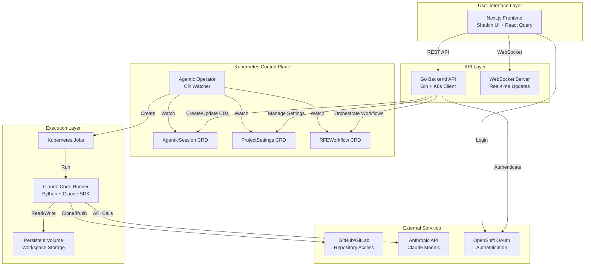

## Component Architecture

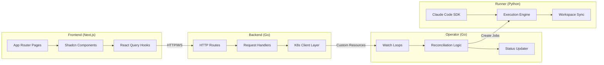

## Agentic Session Lifecycle

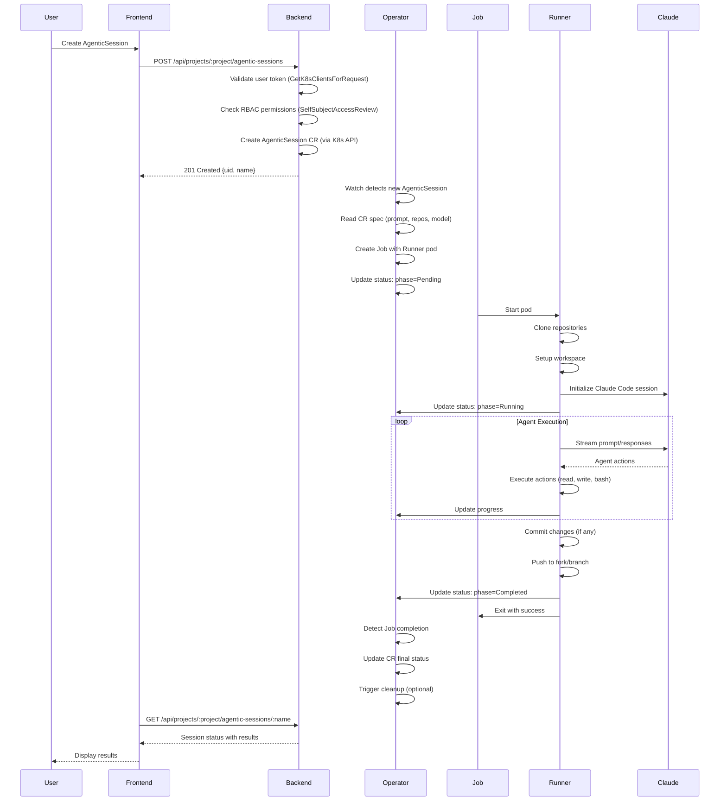

## Authentication & Authorization Flow

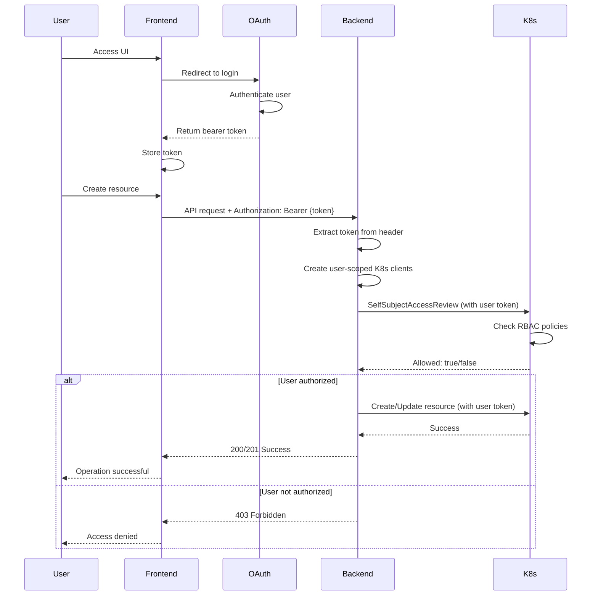

## Multi-Tenancy Architecture

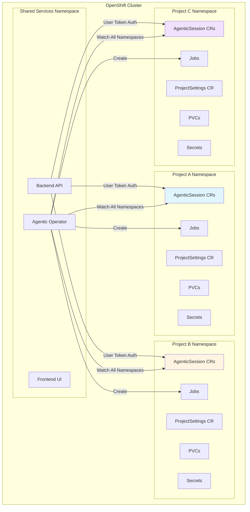

## Data Flow Architecture

```mermaid
flowchart LR
    subgraph "Input"
        REQ[User Request<br/>Prompt + Repos]
    end

    subgraph "API Processing"
        VAL[Validation]
        AUTH[Authorization]
        TRANS[CR Translation]
    end

    subgraph "Kubernetes Storage"
        CR[Custom Resource<br/>AgenticSession]
        STATUS[Status Subresource]
    end

    subgraph "Operator Processing"
        WATCH[Watch Event]
        RECON[Reconciliation]
        JOBCREATE[Job Creation]
    end

    subgraph "Execution"
        POD[Runner Pod]
        WORKSPACE[PVC Workspace]
        RESULTS[Execution Results]
    end

    subgraph "Output"
        UPDATE[Status Updates]
        RESPONSE[API Response]
        DISPLAY[UI Display]
    end

    REQ --> VAL
    VAL --> AUTH
    AUTH --> TRANS
    TRANS --> CR

    CR --> WATCH
    WATCH --> RECON
    RECON --> JOBCREATE
    JOBCREATE --> POD

    POD --> WORKSPACE
    WORKSPACE --> RESULTS
    RESULTS --> UPDATE
    UPDATE --> STATUS

    STATUS --> RESPONSE
    RESPONSE --> DISPLAY
```

## Development Topology (OpenShift Local)

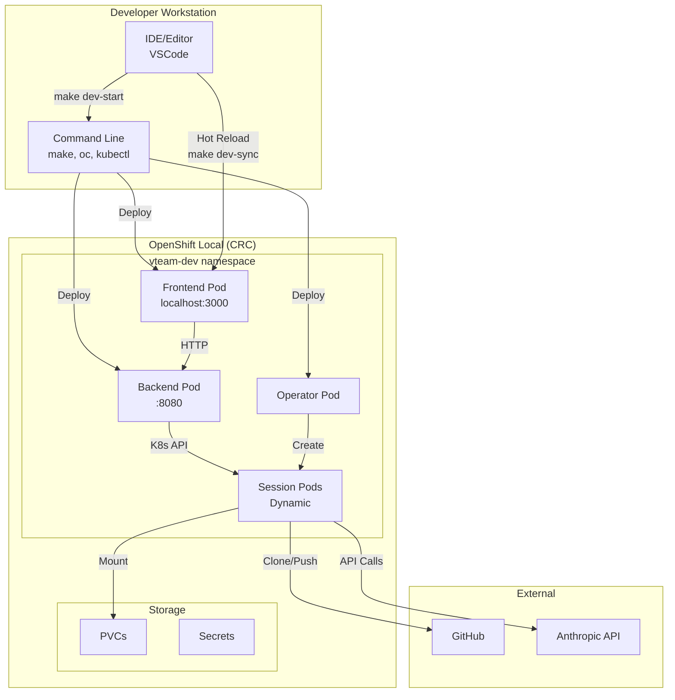

## Production Deployment Topology

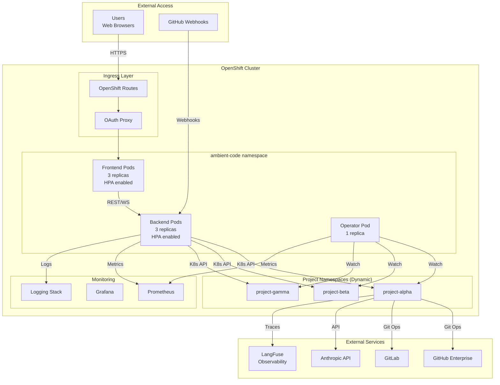

## Network & Service Communication

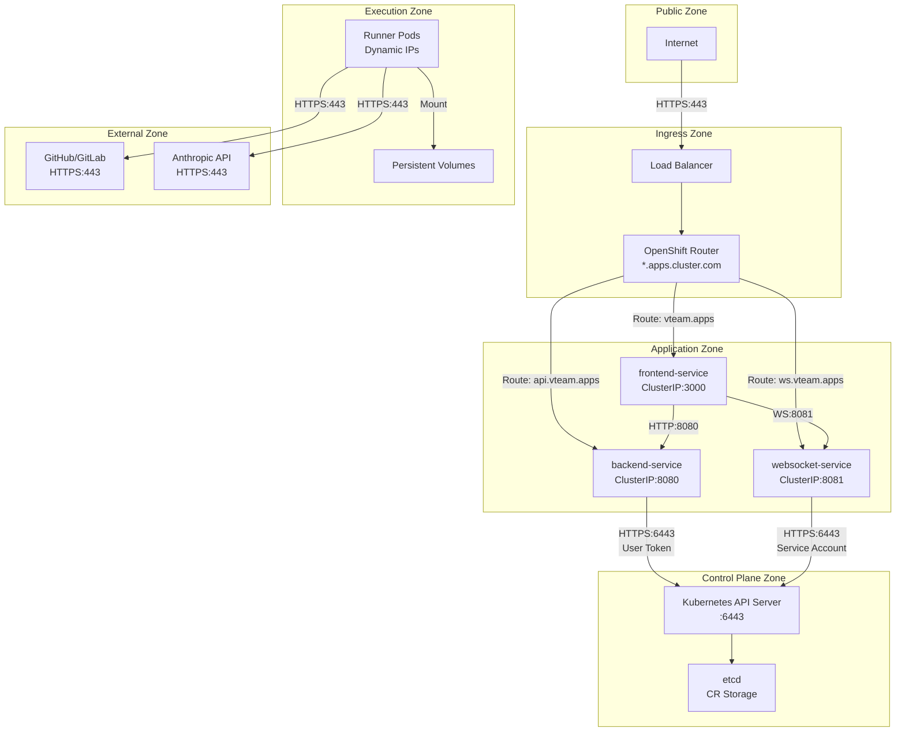

## Custom Resource Structure

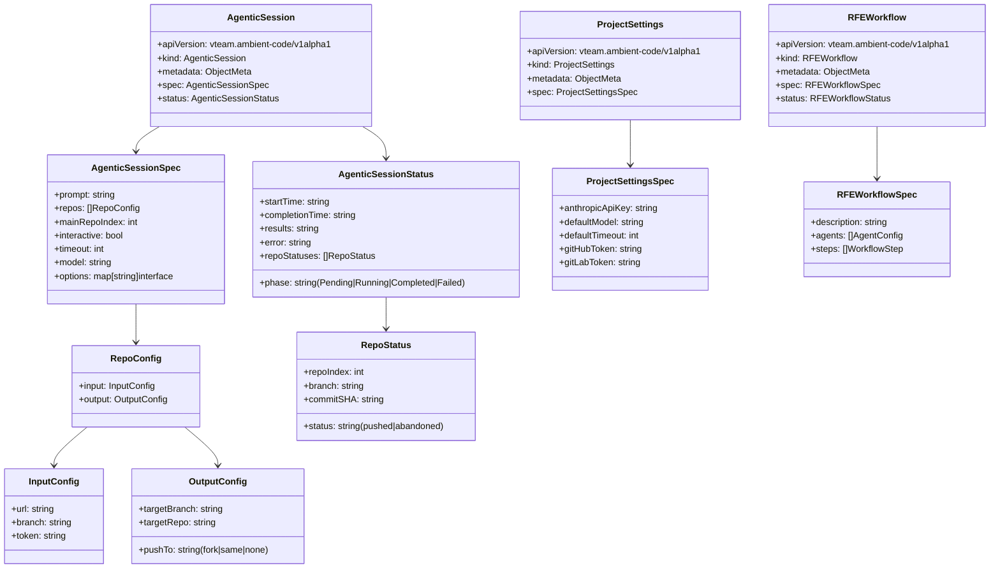

## Resource Ownership & Cleanup

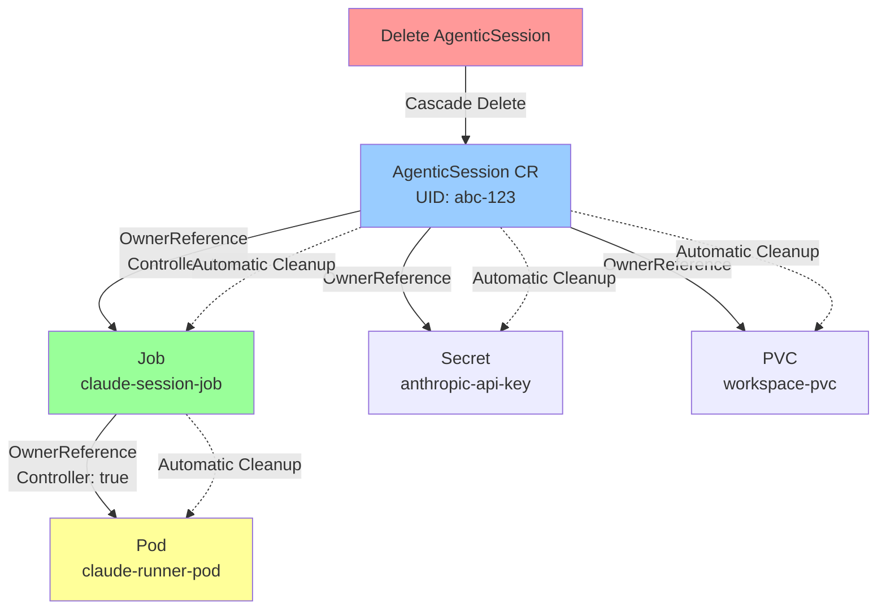

## Error Handling & Status Transitions

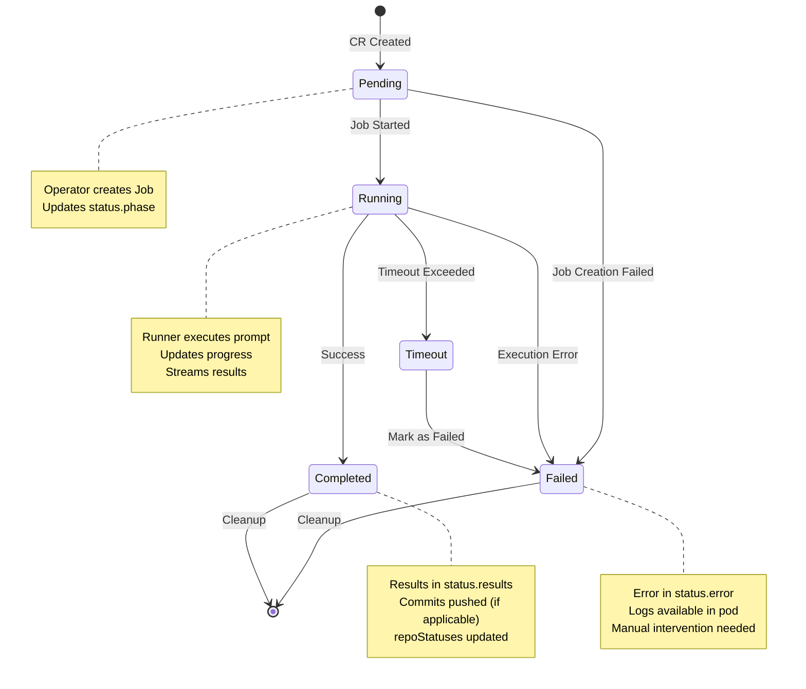

## Multi-Repo Workflow

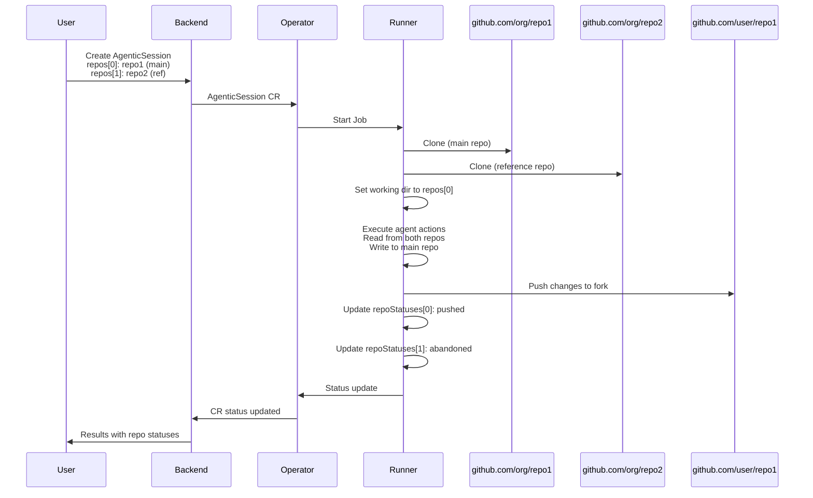

## Monitoring & Observability

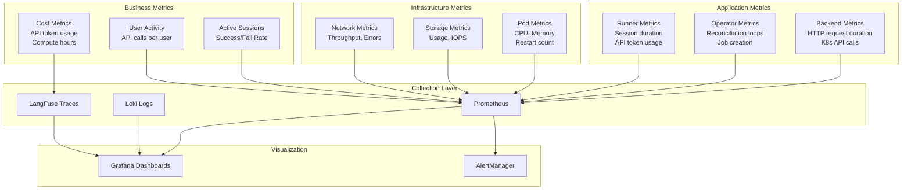

## Security Architecture

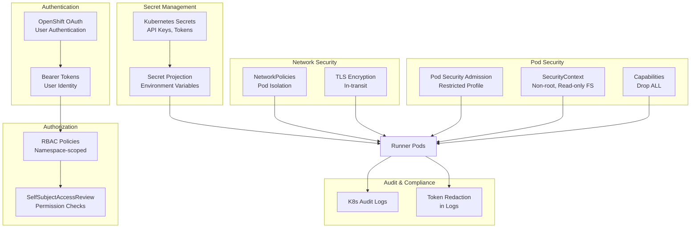

## Key Design Patterns

### User Token Authentication Pattern

All user-initiated API operations MUST use user-scoped Kubernetes clients:

```go
// ALWAYS use for user operations
reqK8s, reqDyn := GetK8sClientsForRequest(c)
if reqK8s == nil {
    c.JSON(http.StatusUnauthorized, gin.H{"error": "Invalid token"})
    return
}
```

Backend service account is ONLY used for:
1. Writing CRs after validation
2. Minting tokens/secrets for runners
3. Cross-namespace operations backend is authorized for

### Status Subresource Pattern

Always update CR status via the `/status` subresource to prevent race conditions:

```go
_, err = DynamicClient.Resource(gvr).
    Namespace(ns).
    UpdateStatus(ctx, obj, v1.UpdateOptions{})
```

### OwnerReference Pattern

Set OwnerReferences on all child resources for automatic cleanup:

```go
ownerRef := v1.OwnerReference{
    APIVersion: "vteam.ambient-code/v1alpha1",
    Kind:       "AgenticSession",
    Name:       sessionName,
    UID:        sessionUID,
    Controller: boolPtr(true),
}
```

### Watch Loop with Reconnection

Operator watches must handle channel closures and reconnect:

```go
for {  // Infinite loop
    watcher, err := client.Watch(ctx, v1.ListOptions{})
    if err != nil {
        time.Sleep(5 * time.Second)
        continue
    }
    for event := range watcher.ResultChan() {
        handleEvent(event)
    }
    watcher.Stop()
    time.Sleep(2 * time.Second)
}
```

## References

- **ADR-0001**: [Kubernetes-Native Architecture](../adr/0001-kubernetes-native-architecture.md)
- **ADR-0002**: [User Token Authentication](../adr/0002-user-token-authentication.md)
- **ADR-0003**: [Multi-Repo Support](../adr/0003-multi-repo-support.md)
- **ADR-0004**: [Go Backend + Python Runner](../adr/0004-go-backend-python-runner.md)
- **CLAUDE.md**: Backend and Operator Development Standards
- **Amber Workflow**: [amber-workflow.md](amber-workflow.md)
