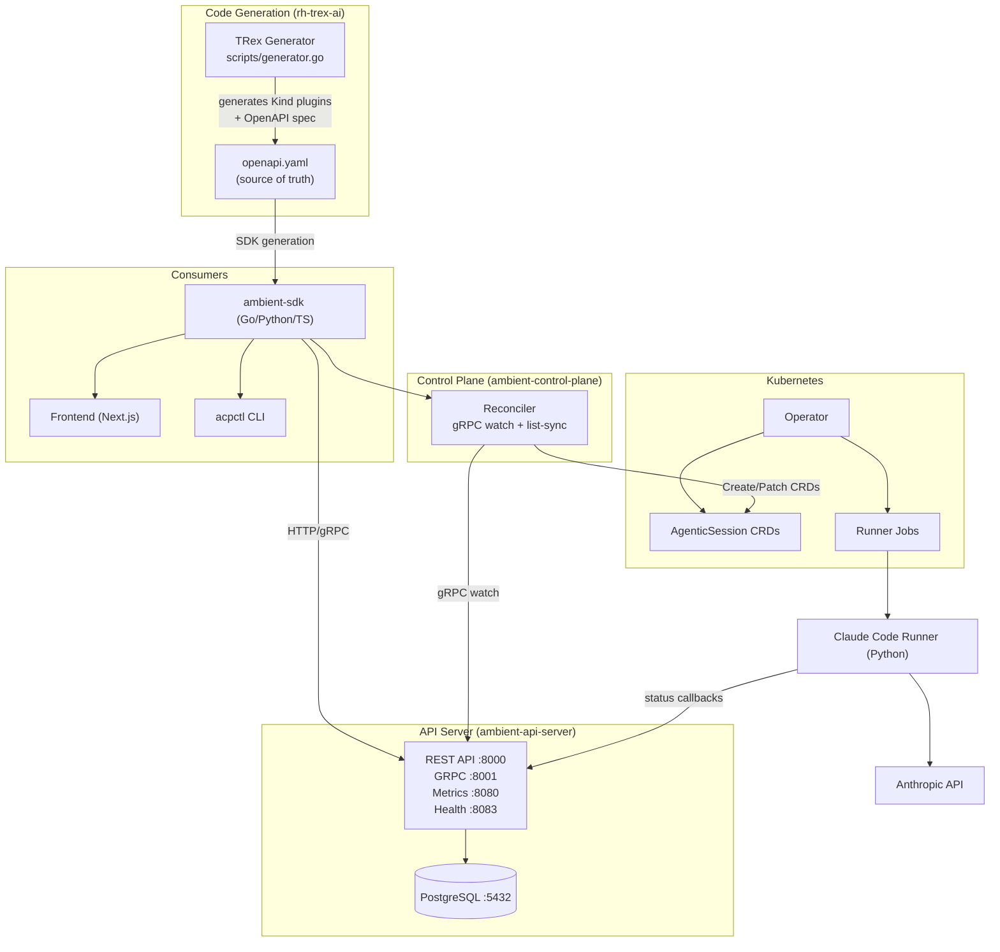
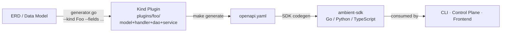

# Architecture Documentation

Technical architecture documentation for the Ambient Code Platform.

## Overview

Two architectures coexist. V1 (legacy) is Kubernetes-native. V2 (current) is REST/PostgreSQL-first with Kubernetes as a reconciliation target, not a data store.

### V1 — Kubernetes-Native (Legacy)

```
User → Frontend → Backend API → K8s Operator → Runner Jobs → Claude Code CLI
```

### V2 — REST/PostgreSQL-First (Current)



### Code Generation Pipeline

How a data model change flows through the system:



See [code-generation.md](../developer/code-generation.md) for the full workflow.

## Components

### V2 Components

| Component | Language | Purpose | Port(s) | Docs |
|-----------|----------|---------|---------|------|
| **ambient-api-server** | Go (rh-trex-ai) | REST + gRPC API, PostgreSQL persistence | 8000 / 8001 / 8080 / 8083 | [README](../../components/ambient-api-server/README.md) |
| **ambient-sdk** | Go / Python / TypeScript | HTTP client libraries, generated from OpenAPI | — | [README](../../components/ambient-sdk/README.md) |
| **ambient-control-plane** | Go | Reconciles API server state into Kubernetes | — | [README](../../components/ambient-control-plane/README.md) |
| **ambient-cli (acpctl)** | Go | CLI using Go SDK | — | [README](../../components/ambient-cli/README.md) |

### V1 Components (Legacy — still operational)

| Component | Language | Purpose | Docs |
|-----------|----------|---------|------|
| **Backend** | Go + Gin | REST API over Kubernetes CRDs | [README](../../components/backend/README.md) |
| **Frontend** | Next.js + Shadcn | Web UI | [README](../../components/frontend/README.md) |
| **Operator** | Go | Kubernetes controller | [README](../../components/operator/README.md) |
| **Runner** | Python | Claude Code CLI execution | [README](../../components/runners/claude-code-runner/README.md) |

### Diagrams

| Diagram | Description |
|---------|-------------|
| [Platform Architecture](./diagrams/platform-architecture.mmd) | Complete system |
| [Component Structure](./diagrams/component-structure.mmd) | Component relationships |
| [Deployment Stack](./diagrams/deployment-stack.mmd) | Deployment topology |
| [Agentic Session Flow](./diagrams/agentic-session-flow.mmd) | Session lifecycle |
| [architecture.md](../../components/architecture.md) | V1 vs V2 transition |

## 🎯 Core Concepts

### Custom Resource Definitions (CRDs)

**AgenticSession** - Represents an AI execution session
- Spec: prompt, repos, interactive mode, timeout, model
- Status: phase, startTime, completionTime, results

**ProjectSettings** - Project-scoped configuration
- API keys, default models, timeout settings
- Namespace-isolated for multi-tenancy

**RFEWorkflow** - Request For Enhancement workflows
- 7-step agent council process
- Multi-agent collaboration

### Multi-Tenancy

- Each **project** maps to a Kubernetes **namespace**
- RBAC enforces namespace-scoped access
- User tokens determine permissions
- No cross-project data access

### Authentication & Authorization

- **Authentication:** OpenShift OAuth (production) or test tokens (dev)
- **Authorization:** User tokens with namespace-scoped RBAC
- **Backend Pattern:** Always use user-scoped K8s clients for operations
- **Security:** Token redaction, no service account fallback

See [ADR-0002: User Token Authentication](../adr/0002-user-token-authentication.md)

## 📋 Architectural Decision Records

**[ADR Directory](../adr/)** - Why we made key technical decisions

| ADR | Title | Status |
|-----|-------|--------|
| [0001](../adr/0001-kubernetes-native-architecture.md) | Kubernetes-Native Architecture | Accepted |
| [0002](../adr/0002-user-token-authentication.md) | User Token Authentication | Accepted |
| [0003](../adr/0003-multi-repo-support.md) | Multi-Repo Support | Accepted |
| [0004](../adr/0004-go-backend-python-runner.md) | Go Backend + Python Runner | Accepted |
| [0005](../adr/0005-nextjs-shadcn-react-query.md) | Next.js + Shadcn + React Query | Accepted |

**Format:** We follow the [ADR template](../adr/template.md) for all architectural decisions.

## 🔄 Request Flow

### Creating an Agentic Session

1. **User** submits session via web UI
2. **Frontend** sends POST to `/api/projects/:project/agentic-sessions`
3. **Backend** validates user token and creates `AgenticSession` CR
4. **Operator** watches CR, creates Kubernetes Job
5. **Job** runs Claude Code runner pod
6. **Runner** executes Claude Code CLI, streams results
7. **Operator** monitors Job, updates CR status
8. **Frontend** displays real-time updates via WebSocket

### Data Flow

```
User Input → Frontend (Next.js)
    ↓
Backend API (Go) → User Token Validation → RBAC Check
    ↓
Kubernetes API → AgenticSession CR created
    ↓
Operator (Go) → Watches CR → Creates Job
    ↓
Runner Pod (Python) → Executes Claude Code → Streams events
    ↓
Operator → Updates CR Status
    ↓
Backend → WebSocket → Frontend → User sees results
```

## 🔐 Security Architecture

### Authentication Layers
1. **OpenShift OAuth** (production) - Cluster-based identity
2. **User Tokens** - Bearer tokens for API authentication
3. **Service Accounts** - Limited to CR writes and token minting

### Authorization Model
- **Namespace-scoped RBAC** - Users only see their authorized projects
- **User-scoped K8s clients** - All API operations use user credentials
- **No privilege escalation** - Backend never falls back to service account

See [Security Standards](../../CLAUDE.md#security-patterns)

## 🧪 Testing Architecture

- **Unit Tests** - Component logic testing (Go, TypeScript)
- **Contract Tests** - API contract validation (Go)
- **Integration Tests** - End-to-end with real K8s (Go)
- **E2E Tests** - User journey testing with Cypress (Kind cluster)

See [Testing Documentation](testing/)

## 📚 Additional Resources

- **[Design Documents](../design/)** - Feature design proposals
- **[Proposals](../proposals/)** - Technical proposals

## 🤝 Contributing to Architecture

When proposing architectural changes:

1. **Check existing ADRs** - Understand current decisions
2. **Draft ADR** - Use [template](adr/template.md)
3. **Discuss** - GitHub Discussions or issue
4. **Review** - Get feedback from maintainers
5. **Implement** - Code + tests + documentation
6. **Update** - Mark ADR as accepted, update relevant docs

---

**Questions?** Open a [GitHub Discussion](https://github.com/ambient-code/vTeam/discussions)
