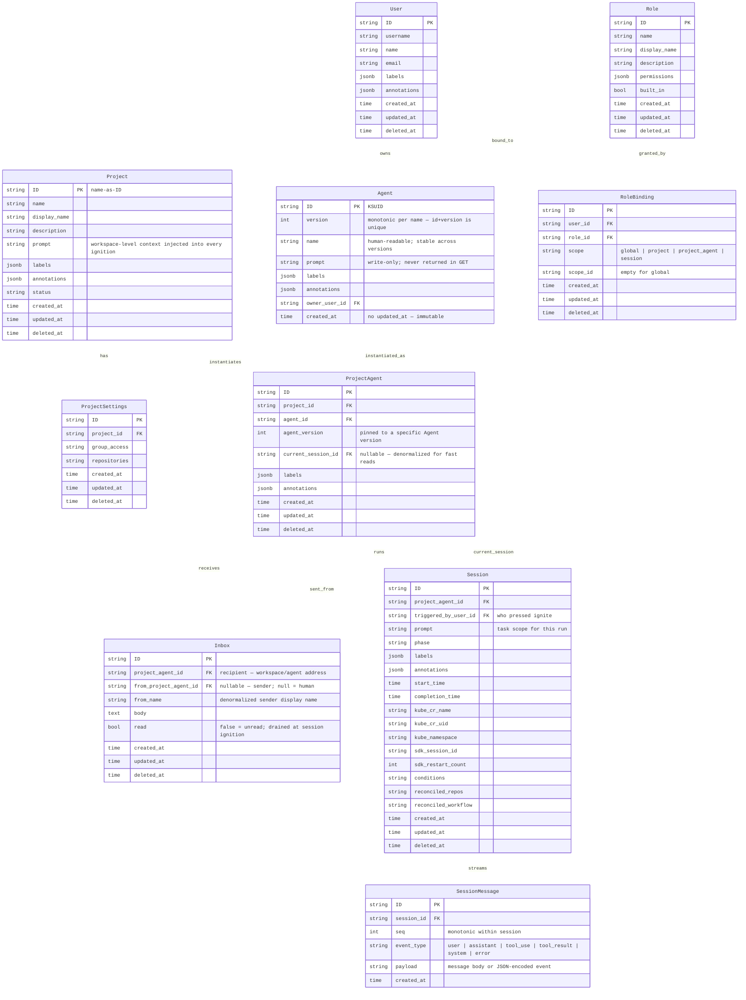

# Ambient Platform Data Model Spec

**Date:** 2026-03-20
**Status:** Proposed — Pending Consensus
**Last Updated:** 2026-03-21 — added `labels` / `annotations` JSONB columns to first-class Kinds

---

## Overview

The Ambient API server provides a coordination layer for orchestrating fleets of persistent agents across projects. The central model separates three concerns:

- **Agent** — a global, immutable definition. Any update to `prompt` creates a new version. Agents exist independently of any project.
- **ProjectAgent** — an instance of an Agent within a Project (workspace). This is the addressable entity: `{project}/{agent-name}`. It holds the inbox and links to the active session.
- **Session** — an ephemeral Kubernetes execution run, created exclusively via agent ignition on a ProjectAgent. Only one active session per ProjectAgent at a time.

This separation enables re-ignition, run history, fleet persistence, and cross-agent messaging across session boundaries.

The Project Home (`/projects/{id}/home`) is a project-scoped live dashboard: every ProjectAgent's latest status and inbox are visible, enabling human operators and orchestrator agents to monitor and coordinate a fleet.

---

## Entity Relationship Diagram



---

## Agent — Global Immutable Definition

Agent is a top-level global Kind. It is not scoped to any project.

| Field | Notes |
|-------|-------|
| `name` | Human-readable, stable across versions. Used as display name and in addressing. |
| `prompt` | Write-only. Never returned in `GET /agents/{id}`. Defines who the agent is. |
| `version` | Monotonic integer, incremented automatically on any PATCH. The old record is preserved. |
| `id + version` | Together form a unique key. A PATCH to prompt creates a new row with `version+1`. |

**Agent is immutable after creation.** PATCH does not update in place — it creates a new version. `ProjectAgent.agent_version` pins an instance to a specific version, providing a full audit trail and rollback by re-pointing.

```
POST /agents          → creates version 1
PATCH /agents/{id}    → creates version 2 (old version preserved)
GET /agents/{id}      → returns latest version by default
GET /agents/{id}?version=1  → returns specific version
```

---

## ProjectAgent — Workspace Instance

ProjectAgent is the addressable entity. The stable address is `{project_name}/{agent_name}`.

A ProjectAgent:
- Is created when an Agent is added to a Project (workspace)
- Pins to a specific Agent version (`agent_version`)
- Holds the persistent inbox (messages survive session boundaries)
- Holds `current_session_id` (denormalized for fast dashboard reads)
- Can be re-pointed to a newer Agent version via PATCH

Only one active Session per ProjectAgent at a time. Ignition is idempotent — if an active session exists, ignite returns it. If not, a new session is created.

---

## Inbox — Persistent Message Queue

Inbox messages are addressed to `{project}/{agent}` (i.e., `project_agent_id`). They are distinct from Session Messages:

| | Inbox | SessionMessage |
|--|-------|---------------|
| Scope | ProjectAgent (persists across sessions) | Session (ephemeral) |
| Created by | Human or another ProjectAgent | LLM turn / runner gRPC push |
| Drained | At session ignition | Never — append-only stream |
| Purpose | Queued intent waiting for next run | Real LLM event stream |

At ignition, all unread Inbox messages are drained: marked `read=true` and injected as context into the Session prompt before the first SessionMessage turn.

---

## Session — Ephemeral Run

Sessions are **not directly creatable**. They are run artifacts created exclusively via `POST /projects/{project_id}/agents/{project_agent_id}/ignite`.

`Session.prompt` scopes the task for this specific run — separate from `Agent.prompt` which defines who the agent is.

```
Project.prompt  → "This workspace builds the Ambient platform API server in Go."
Agent.prompt    → "You are a backend engineer specializing in Go APIs..."
Inbox messages  → "Please also review the RBAC middleware while you're in there"
Session.prompt  → "Implement the session messages handler. Repo: github.com/..."
```

All four are assembled into the ignition context in that order. Pokes roll downhill.

---

## SessionMessage — AG-UI Event Stream

SessionMessages are the real LLM conversation. They are appended by the runner via gRPC `PushSessionMessage` and streamed to clients via SSE.

`seq` is monotonically increasing within a session. `event_type` follows the AG-UI protocol: `user`, `assistant`, `tool_use`, `tool_result`, `system`, `error`.

SessionMessages are never deleted or edited. They are the canonical record of what happened in a session.

---

## CLI Reference (`acpctl`)

The `acpctl` CLI mirrors the API 1-for-1. Every REST operation has a corresponding command.

### API ↔ CLI Mapping

#### Projects

| REST API | `acpctl` Command | Status |
|---|---|---|
| `GET /projects` | `acpctl get projects` | ✅ implemented |
| `GET /projects/{id}` | `acpctl get project <name>` | ✅ implemented |
| `POST /projects` | `acpctl create project --name <n> [--display-name <d>] [--description <d>]` | ✅ implemented |
| `PATCH /projects/{id}` | _(not yet exposed)_ | 🔲 planned |
| `DELETE /projects/{id}` | `acpctl delete project <name>` | ✅ implemented |
| _(context switch)_ | `acpctl project <name>` | ✅ implemented |
| _(context view)_ | `acpctl project current` | ✅ implemented |
| `GET /projects/{id}/home` | _(not yet exposed)_ | 🔲 planned |

#### Agents (Global Registry)

| REST API | `acpctl` Command | Status |
|---|---|---|
| `GET /agents` | `acpctl get agents` | 🔲 planned |
| `GET /agents/{id}` | `acpctl get agent <id>` | 🔲 planned |
| `GET /agents/{id}?version=N` | `acpctl get agent <id> --version N` | 🔲 planned |
| `POST /agents` | `acpctl create agent --name <n> --prompt <p> [--owner-user-id <u>]` | 🔲 planned |
| `PATCH /agents/{id}` | `acpctl update agent <id> --prompt <p>` — creates new version | 🔲 planned |
| `DELETE /agents/{id}` | _(not exposed — agents are global, soft-delete only)_ | 🔲 planned |

#### ProjectAgents (Workspace Instances)

| REST API | `acpctl` Command | Status |
|---|---|---|
| `GET /projects/{id}/agents` | `acpctl get project-agents [--project <p>]` | 🔲 planned |
| `GET /projects/{id}/agents/{pa_id}` | `acpctl get project-agent <pa_id>` | 🔲 planned |
| `POST /projects/{id}/agents` | `acpctl create project-agent --agent <id> --agent-version <v>` | 🔲 planned |
| `PATCH /projects/{id}/agents/{pa_id}` | `acpctl update project-agent <pa_id> --agent-version <v>` | 🔲 planned |
| `DELETE /projects/{id}/agents/{pa_id}` | `acpctl delete project-agent <pa_id>` | 🔲 planned |
| `POST /projects/{id}/agents/{pa_id}/ignite` | `acpctl start <pa_id>` | 🔲 planned |
| `GET /projects/{id}/agents/{pa_id}/ignition` | `acpctl get ignition <pa_id>` — dry run | 🔲 planned |
| `GET /projects/{id}/agents/{pa_id}/sessions` | `acpctl get sessions --project-agent <pa_id>` | 🔲 planned |
| `GET /projects/{id}/agents/{pa_id}/inbox` | `acpctl get inbox <pa_id>` | 🔲 planned |
| `POST /projects/{id}/agents/{pa_id}/inbox` | `acpctl send <pa_id> --body <text>` | 🔲 planned |
| `PATCH /projects/{id}/agents/{pa_id}/inbox/{msg_id}` | `acpctl mark-read <msg_id>` | 🔲 planned |
| `DELETE /projects/{id}/agents/{pa_id}/inbox/{msg_id}` | `acpctl delete inbox-message <msg_id>` | 🔲 planned |

#### Sessions

| REST API | `acpctl` Command | Status |
|---|---|---|
| `GET /sessions` | `acpctl get sessions` | ✅ implemented |
| `GET /sessions` | `acpctl get sessions -w` | ✅ implemented (gRPC watch) |
| `GET /sessions/{id}` | `acpctl get session <id>` | ✅ implemented |
| `GET /sessions/{id}` | `acpctl describe session <id>` | ✅ implemented |
| `DELETE /sessions/{id}` | `acpctl delete session <id>` | ✅ implemented |
| `GET /sessions/{id}/messages` | `acpctl session messages <id>` | ✅ implemented |
| `POST /sessions/{id}/messages` | `acpctl session send <id> --body <text>` | ✅ implemented |

#### RBAC

| REST API | `acpctl` Command | Status |
|---|---|---|
| `GET /roles` | _(not yet exposed)_ | 🔲 planned |
| `POST /roles` | `acpctl create role --name <n> [--permissions <json>]` | ✅ implemented |
| `GET /role_bindings` | _(not yet exposed)_ | 🔲 planned |
| `POST /role_bindings` | `acpctl create role-binding --user-id <u> --role-id <r> --scope <s> [--scope-id <id>]` | ✅ implemented |
| `DELETE /role_bindings/{id}` | _(not yet exposed)_ | 🔲 planned |

#### Auth & Context

| Operation | `acpctl` Command | Status |
|---|---|---|
| Authenticate | `acpctl login [SERVER_URL] --token <t>` | ✅ implemented |
| Log out | `acpctl logout` | ✅ implemented |
| Identity | `acpctl whoami` | ✅ implemented |
| Config get | `acpctl config get <key>` | ✅ implemented |
| Config set | `acpctl config set <key> <value>` | ✅ implemented |

### Global Flags

| Flag | Description |
|---|---|
| `--insecure-skip-tls-verify` | Skip TLS certificate verification |
| `-o json` | JSON output (most `get`/`create` commands) |
| `-o wide` | Wide table output |
| `--limit <n>` | Max items to return (default: 100) |
| `-w` / `--watch` | Live watch mode (sessions only) |
| `--watch-timeout <duration>` | Watch timeout (default: 30m) |

### Project Context

The CLI maintains a current project context in `~/.acpctl/config.yaml` (also overridable via `AMBIENT_PROJECT` env var). Most operations that require `project_id` read it from context automatically.

```sh
acpctl login https://api.example.com --token $TOKEN
acpctl project my-project
acpctl get sessions
acpctl create agent --name overlord --prompt "You coordinate the fleet..."
acpctl create project-agent --agent <id> --agent-version 1
acpctl start <project-agent-id>
```

---

## API Reference

### Projects

```
GET    /api/ambient/v1/projects                              list projects
POST   /api/ambient/v1/projects                              create project
GET    /api/ambient/v1/projects/{id}                         read project
PATCH  /api/ambient/v1/projects/{id}                         update project
DELETE /api/ambient/v1/projects/{id}                         delete project

GET    /api/ambient/v1/projects/{id}/home                    project home — latest status per ProjectAgent (JSON)
GET    /api/ambient/v1/projects/{id}/agents                  list ProjectAgents in this project
GET    /api/ambient/v1/projects/{id}/role_bindings           RBAC bindings scoped to this project
```

### Agents (Global)

```
GET    /api/ambient/v1/agents                                list all agents
POST   /api/ambient/v1/agents                                create agent (version 1)
GET    /api/ambient/v1/agents/{id}                           read agent (latest version)
GET    /api/ambient/v1/agents/{id}?version=N                 read specific version
PATCH  /api/ambient/v1/agents/{id}                           update prompt — creates new version
DELETE /api/ambient/v1/agents/{id}                           soft delete
```

PATCH creates a new Agent row with `version+1`. The prior version is preserved. `prompt` is write-only and never returned in GET responses.

### ProjectAgents

```
GET    /api/ambient/v1/projects/{id}/agents                  list ProjectAgents
POST   /api/ambient/v1/projects/{id}/agents                  add Agent to Project (create ProjectAgent)
GET    /api/ambient/v1/projects/{id}/agents/{pa_id}          read ProjectAgent
PATCH  /api/ambient/v1/projects/{id}/agents/{pa_id}          update agent_version pin
DELETE /api/ambient/v1/projects/{id}/agents/{pa_id}          remove agent from project

POST   /api/ambient/v1/projects/{id}/agents/{pa_id}/ignite   ignite — creates Session (idempotent; one active at a time)
GET    /api/ambient/v1/projects/{id}/agents/{pa_id}/ignition  preview ignition context (dry run)
GET    /api/ambient/v1/projects/{id}/agents/{pa_id}/sessions  session run history
GET    /api/ambient/v1/projects/{id}/agents/{pa_id}/inbox     read inbox (unread first)
POST   /api/ambient/v1/projects/{id}/agents/{pa_id}/inbox     send message to this agent's inbox
PATCH  /api/ambient/v1/projects/{id}/agents/{pa_id}/inbox/{msg_id}   mark message read
DELETE /api/ambient/v1/projects/{id}/agents/{pa_id}/inbox/{msg_id}   delete message

GET    /api/ambient/v1/projects/{id}/agents/{pa_id}/role_bindings    RBAC bindings
```

#### Ignite Response

`POST /projects/{id}/agents/{pa_id}/ignite` is idempotent:
- If a session is already active, it is returned as-is.
- If no active session exists, a new one is created.
- Unread Inbox messages are drained (marked read) and injected into the ignition context.

```json
{
  "session": {
    "id": "2abc...",
    "project_agent_id": "1def...",
    "phase": "pending",
    "triggered_by_user_id": "...",
    "created_at": "2026-03-20T00:00:00Z"
  },
  "ignition_context": "# Agent: API\n\nYou are API...\n\n## Inbox\n...\n\n## Task\n..."
}
```

The ignition context assembles in order:
1. `Project.prompt` (workspace context — shared by all agents in this project)
2. `Agent.prompt` (who you are — from pinned version)
3. Drained Inbox messages (what others have asked you to do)
4. `Session.prompt` (what this run is focused on)
5. Peer ProjectAgent roster with latest status

### Sessions

Sessions are not directly creatable.

```
GET    /api/ambient/v1/sessions/{id}                         read session
DELETE /api/ambient/v1/sessions/{id}                         cancel or delete session

GET    /api/ambient/v1/sessions/{id}/messages                SSE AG-UI event stream
POST   /api/ambient/v1/sessions/{id}/messages                push a message (human turn)
GET    /api/ambient/v1/sessions/{id}/role_bindings           RBAC bindings
```

---

## RBAC

### Scopes

| Scope | Meaning |
|---|---|
| `global` | Applies across the entire platform |
| `project` | Applies to all ProjectAgents and sessions in a project |
| `project_agent` | Applies to one ProjectAgent and all its sessions |
| `session` | Applies to one session run only |

Effective permissions = union of all applicable bindings (global ∪ project ∪ project_agent ∪ session). No deny rules.

### Built-in Roles

| Role | Description |
|---|---|
| `platform:admin` | Full access to everything |
| `platform:viewer` | Read-only across the platform |
| `project:owner` | Full control of a project and all its agents |
| `project:editor` | Create/update ProjectAgents, ignite, send messages |
| `project:viewer` | Read-only within a project |
| `agent:operator` | Ignite and message a specific ProjectAgent |
| `agent:observer` | Read a specific ProjectAgent and its sessions |
| `agent:runner` | Minimum viable pod credential: read agent, push messages, send inbox |

### Permission Matrix

| Role | Projects | Agents | ProjectAgents | Sessions | Documents | Inbox | Home | RBAC |
|---|---|---|---|---|---|---|---|---|
| `platform:admin` | full | full | full | full | full | full | full | full |
| `platform:viewer` | read/list | read/list | read/list | read/list | read/list | — | read | read/list |
| `project:owner` | full | read | full | full | full | full | read | project+agent bindings |
| `project:editor` | read | read | create/update/ignite | read/list | create/update | send/read | read | — |
| `project:viewer` | read | read | read/list | read/list | read/list | — | read | — |
| `agent:operator` | — | read | update/ignite | read/list | — | send/read | — | — |
| `agent:observer` | — | read | read | read/list | — | — | — | — |
| `agent:runner` | — | read | read | read | read | send | — | — |

### RBAC Endpoints

```
GET    /api/ambient/v1/roles
GET    /api/ambient/v1/roles/{id}
POST   /api/ambient/v1/roles
PATCH  /api/ambient/v1/roles/{id}
DELETE /api/ambient/v1/roles/{id}

GET    /api/ambient/v1/role_bindings
POST   /api/ambient/v1/role_bindings
DELETE /api/ambient/v1/role_bindings/{id}

GET    /api/ambient/v1/users/{id}/role_bindings
GET    /api/ambient/v1/projects/{id}/role_bindings
GET    /api/ambient/v1/projects/{id}/agents/{pa_id}/role_bindings
GET    /api/ambient/v1/sessions/{id}/role_bindings
```

---

## Labels and Annotations

Every first-class Kind carries two JSONB columns:

| Column | Purpose | Example values |
|---|---|---|
| `labels` | Queryable key/value tags. Use for filtering, grouping, and selection. | `{"env": "prod", "team": "platform", "tier": "critical"}` |
| `annotations` | Freeform key/value metadata. Use for tooling notes, human remarks, external references. | `{"last-reviewed": "2026-03-21", "jira": "PLAT-123", "owner-slack": "@mturansk"}` |

**Kinds with `labels` + `annotations`:** User, Project, Agent, ProjectAgent, Session

**Kinds without:** Inbox (ephemeral message queue), SessionMessage (append-only event stream), Role, RoleBinding (RBAC internals — structured by design)

### Design: JSONB over EAV or separate tables

Instead of a separate `metadata` table (requires joins) or a polymorphic EAV table (breaks referential integrity), metadata is stored inline in the row it describes. This is the modern hybrid approach:

- **Zero joins**: Data is co-located with the resource.
- **Infinite flexibility**: Every row can carry different keys — no schema migration required to add a new label key.
- **GIN-indexed**: PostgreSQL JSONB supports `GIN` (Generalized Inverted Index), making containment queries (`@>`) nearly as fast as standard column lookups at scale.

```sql
CREATE INDEX idx_projects_labels      ON projects      USING GIN (labels);
CREATE INDEX idx_agents_labels        ON agents        USING GIN (labels);
CREATE INDEX idx_project_agents_labels ON project_agents USING GIN (labels);
CREATE INDEX idx_sessions_labels      ON sessions      USING GIN (labels);
```

### Query patterns

```sql
-- Find all sessions tagged env=prod
SELECT * FROM sessions WHERE labels @> '{"env": "prod"}';

-- Find all ProjectAgents owned by a team
SELECT * FROM project_agents WHERE labels @> '{"team": "platform"}';

-- Read a single annotation
SELECT annotations->>'jira' FROM projects WHERE id = 'my-project';
```

### Convention

- `labels` keys should be short, lowercase, hyphenated (e.g. `env`, `team`, `tier`, `managed-by`).
- `annotations` keys should use reverse-DNS namespacing for tooling (e.g. `ambient.io/last-sync`, `github.com/pr`).
- Neither column enforces a schema — validation is the caller's responsibility.
- Default value: `{}` (empty object). Never `null`.

---

## The Model as a String Tree

Every node in this model is an **ID and a string**. That is the complete primitive.

A `Project` is an ID and a `prompt` string — the workspace context.
An `Agent` is an ID and a `prompt` string — who the agent is.
A `Session` is an ID and a `prompt` string — what this run is focused on.
An `InboxMessage` is an ID and a `body` string — a request addressed to an instance.
A `SessionMessage` is an ID and a `payload` string — one turn in the conversation.

Strings can be simple (`"hello world"`) or arbitrarily complex (a bookmarked system prompt, a structured markdown context block, a multi-section briefing). The model does not care. Every node is still just an ID and a string.

This means the entire data model is an **S-expression** — a composable string tree:

```lisp
(platform "Ambient Platform"

  (user "User"
    (id "KSUID")
    (username "string")
    (name "string")
    (email "string")
    (labels "jsonb — arbitrary key/value tags")
    (annotations "jsonb — arbitrary key/value metadata"))

  (agent "Agent"
    (id "KSUID")
    (version "monotonic int — immutable; PATCH creates new version")
    (name "stable across versions")
    (prompt "write-only — who this agent is")
    (labels "jsonb — arbitrary key/value tags")
    (annotations "jsonb — arbitrary key/value metadata")
    (owner (ref user))

    (project-agent "ProjectAgent — workspace instance of Agent"
      (id "KSUID")
      (agent-version "pinned to specific Agent version")
      (labels "jsonb — arbitrary key/value tags")
      (annotations "jsonb — arbitrary key/value metadata")
      (project (ref project))

      (inbox "Inbox — persistent queue, survives session boundaries"
        (id "KSUID")
        (from (ref project-agent) "nullable — null means human sender")
        (from-name "denormalized display name")
        (body "string — the message")
        (read "bool — false until drained at ignition"))

      (session "Session — ephemeral run, created only via ignite"
        (id "KSUID")
        (triggered-by (ref user))
        (prompt "what this run is focused on")
        (phase "Pending | Creating | Running | Completed | Failed")
        (labels "jsonb — arbitrary key/value tags")
        (annotations "jsonb — arbitrary key/value metadata")
        (kube-cr-name "string")
        (kube-namespace "string")

        (session-message "SessionMessage — AG-UI event stream, append-only"
          (id "KSUID")
          (seq "monotonic int within session")
          (event-type "user | assistant | tool_use | tool_result | system | error")
          (payload "string — message body or JSON-encoded event")))))

  (project "Project"
    (id "name-as-ID")
    (name "string")
    (display-name "string")
    (description "string")
    (prompt "workspace context — injected into every ignition")
    (labels "jsonb — arbitrary key/value tags")
    (annotations "jsonb — arbitrary key/value metadata")

    (project-settings "ProjectSettings"
      (id "KSUID")
      (group-access "string")
      (repositories "string")))

  (role "Role"
    (id "KSUID")
    (name "string — e.g. platform:admin, agent:runner")
    (permissions "jsonb")
    (built-in "bool"))

  (role-binding "RoleBinding — union-only, no deny"
    (id "KSUID")
    (user (ref user))
    (role (ref role))
    (scope "global | project | project_agent | session")
    (scope-id "empty for global")))
```

### Composition

Because every node is a string, **entire agent suites and workspaces compose declaratively**.

The ignition pipeline is string composition — each scope inherits and narrows the string above it:

```
Project.prompt        → workspace context (shared by all agents)
  Agent.prompt        → who this agent is (stable across sessions)
    Inbox messages    → what others have asked (queued intent)
      Session.prompt  → what this run is focused on
```

To compose a new workspace: write a `Project.prompt`. To compose a new agent role: write an `Agent.prompt`. To instantiate that agent in that workspace: create a `ProjectAgent`. To ignite: the system assembles the full context string automatically, in order, from the tree.

A different `Project.prompt` = a different team with different shared context.
The same `Agent` in two projects = the same role operating in two different workspaces.
A poke (`InboxMessage.body`) sent from one `ProjectAgent` to another = a string crossing a node boundary.

This structure means you can define and compose bespoke agent suites — entire fleets with different roles, different workspace contexts, different session scopes — purely by composing strings at the right node in the tree. The platform assembles the ignition context; the model does the rest.

---

## Design Decisions

| Decision | Rationale |
|---|---|
| Agent is global and immutable | Agents are reusable definitions; identity survives across projects and versions |
| PATCH creates a new Agent version | Full audit trail; ProjectAgent pins to a specific version; rollback by re-pointing |
| `prompt` is write-only | Prevents casual reads of sensitive system prompts; enforces intentional versioning |
| ProjectAgent is the addressable instance | `{project}/{agent}` is the stable address; inbox and session history live here |
| One active Session per ProjectAgent | Avoids concurrent conflicting runs; ignition is idempotent |
| Inbox on ProjectAgent, not Session | Messages persist across re-ignitions; addressed to the instance, not the run |
| Inbox drained at ignition | Unread messages become part of the ignition context; session picks up where things left off |
| `current_session_id` denormalized on ProjectAgent | Project Home reads ProjectAgent + session phase without joining through sessions |
| Sessions created only via ignite | Sessions are run artifacts; direct `POST /sessions` does not exist |
| Every layer carries a `prompt` | Project.prompt = workspace context; Agent.prompt = who the agent is; Session.prompt = what this run does; Inbox = prior requests. Pokes roll downhill. |
| `SessionMessage` is append-only | Canonical record of the LLM conversation; never edited or deleted |
| `/projects/{id}/home` replaces blackboard | Simpler name; same concept — per-ProjectAgent status at a glance |
| Four-scope RBAC | `project_agent` scope enables sharing one agent without exposing the whole project |
| `agent:runner` role | Pods get minimum viable credential: read agent definition, push session messages, send inbox |
| Union-only permissions | No deny rules — simpler mental model for fleet operators |
| CLI mirrors API 1-for-1 | Every endpoint has a corresponding command; status tracked explicitly |
| This document is the spec | A reconciler will compare the spec (this doc) against code status and surface gaps |
| `labels` / `annotations` are JSONB, not strings | Enables GIN-indexed key/value queries (`@>` operator) without joins; every row carries its own metadata without a separate EAV table. `labels` = queryable tags; `annotations` = freeform notes. Applied to first-class Kinds: User, Project, Agent, ProjectAgent, Session. Not applied to Inbox (ephemeral messages), SessionMessage (append-only stream), Role/RoleBinding (RBAC internals). |
