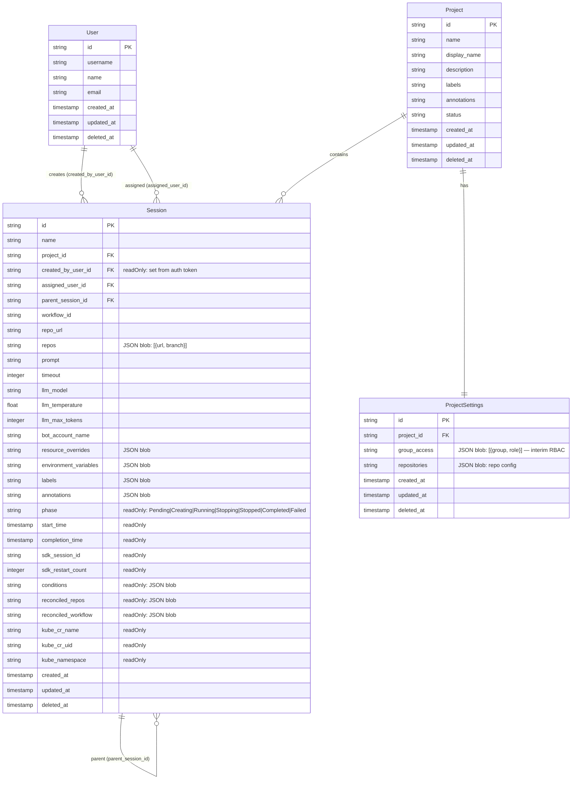

# Ambient Platform — Data Model ERD

This is the canonical entity-relationship diagram for the `ambient-api-server`. It reflects the current OpenAPI spec (`platform-api-server/components/ambient-api-server/openapi/openapi.yaml`) and the backing PostgreSQL models.

All Kinds inherit `id` (KSUID), `kind`, `href`, `created_at`, `updated_at`, and `deleted_at` from `api.Meta` (TRex base). These are omitted from individual entity fields below for clarity but are present on every record.

> **This document is the Desired State spec.** To propose a new Kind or field, open a proposal in `docs/internal/proposals/` that references a diff against this ERD. When the proposal is accepted, this document is updated and the Software Factory reconciles the codebase to match.

---



---

## Notes

### `ProjectSettings.group_access`
A raw JSON string blob today: `[{"group": "my-team", "role": "ambient-project-admin"}]`. This is the current mechanism for granting Kubernetes RBAC access to a project namespace. It is not enforced at the API layer — it is only read by the Control Plane to create K8s `RoleBinding` objects.

**This is a known limitation.** See `docs/internal/proposals/rbac-rolebinding.md` for the proposed replacement.

### Session status fields
Fields marked `readOnly` are populated exclusively by the Control Plane's write-back mechanism (`PATCH /api/ambient/v1/sessions/{id}/status`). They reflect runtime state from the Kubernetes operator and should never be set directly by API clients.

### Session phases
Valid phase transitions:

```
nil/empty ──► Pending ──► Creating ──► Running ──► Stopping ──► Stopped
                                    └──────────────────────────► Completed
                                    └──────────────────────────► Failed
Stopped/Completed/Failed ──► Pending  (restart via /start)
```

### Implicit TRex meta fields
Every entity includes these fields via `api.Meta` (not shown in ERD to reduce noise):

| Field | Type | Description |
|-------|------|-------------|
| `id` | string | KSUID — globally unique, sortable |
| `kind` | string | Resource type name, e.g. `Session` |
| `href` | string | Self-link, e.g. `/api/ambient/v1/sessions/{id}` |
| `created_at` | timestamp | Set on insert, immutable |
| `updated_at` | timestamp | Updated on every write |
| `deleted_at` | timestamp | Soft-delete marker (null = active) |
