# Ambient Platform Data Model Spec

**Date:** 2026-03-20
**Status:** Proposed — Pending Consensus
**Last Updated:** 2026-03-31 — added Credential Kind; extended RoleBinding.scope with `credential`; new credential roles and API endpoints
**Guide:** `ambient-model.guide.md` — implementation waves, gap table, build commands, run log
**Design:** `credentials-session.md` — full Credential Kind design spec and rationale

---

## Overview

The Ambient API server provides a coordination layer for orchestrating fleets of persistent agents across projects. The model is intentionally simple:

- **Project** — a workspace. Groups agents and provides shared context (`prompt`) injected into every agent start.
- **Agent** — a project-scoped, mutable definition. Agents belong to exactly one Project. `prompt` defines who the agent is and is directly editable (subject to RBAC).
- **Session** — an ephemeral Kubernetes execution run, created exclusively via agent start. Only one active Session per Agent at a time.
- **Message** — a single AG-UI event in the LLM conversation. Append-only; the canonical record of what happened in a session.
- **Inbox** — a persistent message queue on an Agent. Messages survive across sessions and are drained into the start context at the next run.
- **Credential** — a platform-scoped, RBAC-owned secret. Stores a Personal Access Token or equivalent for an external provider (GitHub, GitLab, Jira, Google). Consumed by runners at session start.
- **RoleBinding** — binds a Resource to a Role at a given scope (`global`, `project`, `agent`, `session`, `credential`). Ownership and access for all Kinds is expressed through RoleBindings.

The stable address of an agent is `{project_name}/{agent_name}`. It holds the inbox and links to the active session.

---

## Entity Relationship Diagram

```mermaid
%%{init: {'theme': 'default', 'themeVariables': {'attributeColor': '#111111', 'lineColor': '#ffffff', 'edgeLabelBackground': '#333333', 'fontFamily': 'monospace'}}}%%
erDiagram

    User {
        string ID PK
        string username
        string name
        string email
        jsonb  labels
        jsonb  annotations
        time   created_at
        time   updated_at
        time   deleted_at
    }

    Project {
        string ID PK "name-as-ID"
        string name
        string description
        string prompt "workspace-level context injected into every agent start"
        jsonb  labels
        jsonb  annotations
        string status
        time   created_at
        time   updated_at
        time   deleted_at
    }

    ProjectSettings {
        string ID PK
        string project_id FK
        string group_access
        string repositories
        time   created_at
        time   updated_at
        time   deleted_at
    }

    %% ── Agent (project-scoped, mutable) ──────────────────────────────────────

    Agent {
        string ID PK "KSUID"
        string project_id FK
        string name "human-readable; unique within project"
        string prompt "who this agent is — mutable; access controlled via RBAC"
        string current_session_id FK "nullable — denormalized for fast reads"
        jsonb  labels
        jsonb  annotations
        time   created_at
        time   updated_at
        time   deleted_at
    }

    %% ── Inbox (queue on Agent — messages waiting for next session) ────────────

    Inbox {
        string ID PK
        string agent_id FK "recipient — project/agent address"
        string from_agent_id FK "nullable — sender; null = human"
        string from_name "denormalized sender display name"
        text   body
        bool   read "false = unread; drained at session start"
        time   created_at
        time   updated_at
        time   deleted_at
    }

    %% ── Session (ephemeral run — started from an Agent) ────────────────────

    Session {
        string  ID PK
        string  agent_id FK
        string  triggered_by_user_id FK "who started the agent"
        string  prompt "task scope for this run"
        string  phase
        jsonb   labels
        jsonb   annotations
        time    start_time
        time    completion_time
        string  kube_cr_name
        string  kube_cr_uid
        string  kube_namespace
        string  sdk_session_id
        int     sdk_restart_count
        string  conditions
        string  reconciled_repos
        string  reconciled_workflow
        time    created_at
        time    updated_at
        time    deleted_at
    }

    %% ── SessionMessage (AG-UI event stream — real LLM turns) ─────────────────

    SessionMessage {
        string ID PK
        string session_id FK
        int    seq "monotonic within session"
        string event_type "user | assistant | tool_use | tool_result | system | error"
        string payload "message body or JSON-encoded event"
        time   created_at
    }

    %% ── RBAC ─────────────────────────────────────────────────────────────────

    Role {
        string ID PK
        string name
        string display_name
        string description
        jsonb  permissions
        bool   built_in
        time   created_at
        time   updated_at
        time   deleted_at
    }

    RoleBinding {
        string ID PK
        string user_id FK
        string role_id FK
        string scope    "global | project | agent | session | credential"
        string scope_id "empty for global"
        time   created_at
        time   updated_at
        time   deleted_at
    }

    %% ── Credential (platform-scoped PAT/token store) ─────────────────────────

    Credential {
        string ID PK "KSUID"
        string name "human-readable"
        string description
        string provider "github | gitlab | jira | google"
        string token "write-only; stored encrypted"
        string url "nullable; service instance URL"
        string email "nullable; required for Jira"
        jsonb  labels
        jsonb  annotations
        time   created_at
        time   updated_at
        time   deleted_at
    }

    %% ── Relationships ────────────────────────────────────────────────────────

    Project         ||--o{ ProjectSettings  : "has"
    Project         ||--o{ Agent            : "owns"

    User            ||--o{ RoleBinding      : "bound_to"

    RoleBinding     }o--o| Agent            : "owns"
    RoleBinding     }o--o| Credential       : "owns_or_accesses"

    Agent           ||--o{ Session          : "runs"
    Agent           ||--o| Session          : "current_session"
    Agent           ||--o{ Inbox            : "receives"

    Inbox           }o--o| Agent            : "sent_from"

    Session         ||--o{ SessionMessage   : "streams"

    Role            ||--o{ RoleBinding      : "granted_by"
```



---

## Agent — Project-Scoped Mutable Definition

Agent is scoped to a Project. The stable address is `{project_name}/{agent_name}`.

| Field | Notes |
|-------|-------|
| `name` | Human-readable, unique within the project. Used as display name and in addressing. |
| `prompt` | Defines who the agent is. Mutable via PATCH. Access controlled by RBAC (`agent:editor` or higher). |
| `current_session_id` | Denormalized FK to the active Session. Null when no session is running. Used by Project Home for fast reads. |

**Agent is mutable.** PATCH updates in place. There is no versioning. If you need to track prompt history, use `labels`/`annotations` or an external audit log.

```
POST /projects/{id}/agents          → create agent in this project
PATCH /projects/{id}/agents/{id}    → update agent (name, prompt, labels, annotations)
GET /projects/{id}/agents/{id}      → read agent
DELETE /projects/{id}/agents/{id}   → soft delete
```

Only one active Session per Agent at a time. Start is idempotent — if an active session exists, start returns it. If not, a new session is created.

---

## Inbox — Persistent Message Queue

Inbox messages are addressed to an Agent (`agent_id`). They are distinct from Session Messages:

| | Inbox | SessionMessage |
|--|-------|----------------|
| Scope | Agent (persists across sessions) | Session (ephemeral) |
| Created by | Human or another Agent | LLM turn / runner gRPC push |
| Drained | At session start | Never — append-only stream |
| Purpose | Queued intent waiting for next run | Real LLM event stream |

At session start, all unread Inbox messages are drained: marked `read=true` and injected as context into the Session prompt before the first SessionMessage turn.

---

## Session — Ephemeral Run

Sessions are **not directly creatable**. They are run artifacts created exclusively via `POST /projects/{project_id}/agents/{agent_id}/start`.

`Session.prompt` scopes the task for this specific run — separate from `Agent.prompt` which defines who the agent is.

```
Project.prompt  → "This workspace builds the Ambient platform API server in Go."
Agent.prompt    → "You are a backend engineer specializing in Go APIs..."
Inbox messages  → "Please also review the RBAC middleware while you're in there"
Session.prompt  → "Implement the session messages handler. Repo: github.com/..."
```

All four are assembled into the start context in that order. Pokes roll downhill.

---

## SessionMessage — AG-UI Event Stream

SessionMessages are the real LLM conversation. They are appended by the runner via gRPC `PushSessionMessage` and streamed to clients via SSE.

`seq` is monotonically increasing within a session. `event_type` follows the AG-UI protocol: `user`, `assistant`, `tool_use`, `tool_result`, `system`, `error`.

SessionMessages are never deleted or edited. They are the canonical record of what happened in a session.

### Two Event Streams

| Endpoint | Source | Persistence | Purpose |
|---|---|---|---|
| `GET /sessions/{id}/messages` | API server gRPC fan-out | Persisted in DB (replay from `seq=0`) | Durable stream; supports replay and history |
| `GET /sessions/{id}/events` | Runner pod SSE (`GET /events/{thread_id}`) | Ephemeral; runner-local in-memory queue | Live AG-UI turn events during an active run |

The runner's `/events/{thread_id}` endpoint registers an asyncio queue into `bridge._active_streams[thread_id]` and streams every AG-UI event as SSE until `RUN_FINISHED` / `RUN_ERROR` or client disconnect. The API server's `/sessions/{id}/events` proxies this from the runner pod for the active session, routing via pod IP or session service. Keepalive pings fire every 30s to hold the connection open.

---

## CLI Reference (`acpctl`)

The `acpctl` CLI mirrors the API 1-for-1. Every REST operation has a corresponding command.

### API ↔ CLI Mapping

#### Projects

| REST API | `acpctl` Command | Status |
|---|---|---|
| `GET /projects` | `acpctl get projects` | ✅ implemented |
| `GET /projects/{id}` | `acpctl get project <name>` | ✅ implemented |
| `POST /projects` | `acpctl create project --name <n> [--description <d>]` | ✅ implemented |
| `PATCH /projects/{id}` | _(not yet exposed)_ | 🔲 planned |
| `DELETE /projects/{id}` | `acpctl delete project <name>` | ✅ implemented |
| _(context switch)_ | `acpctl project <name>` | ✅ implemented |
| _(context view)_ | `acpctl project current` | ✅ implemented |

#### Agents (Project-Scoped)

| REST API | `acpctl` Command | Status |
|---|---|---|
| `GET /projects/{id}/agents` | `acpctl agent list --project-id <p>` | ✅ implemented |
| `GET /projects/{id}/agents/{agent_id}` | `acpctl agent get --project-id <p> --agent-id <id>` | ✅ implemented |
| `POST /projects/{id}/agents` | `acpctl agent create --project-id <p> --name <n> [--prompt <p>]` | ✅ implemented |
| `PATCH /projects/{id}/agents/{agent_id}` | `acpctl agent update --project-id <p> --agent-id <id> [--name <n>] [--prompt <p>]` | ✅ implemented |
| `DELETE /projects/{id}/agents/{agent_id}` | `acpctl agent delete --project-id <p> --agent-id <id> --confirm` | ✅ implemented |
| `POST /projects/{id}/agents/{agent_id}/start` | `acpctl start <agent-id> --project-id <p> [--prompt <t>]` | ✅ implemented |
| `GET /projects/{id}/agents/{agent_id}/start` | `acpctl agent start-preview --project-id <p> --agent-id <id>` | ✅ implemented |
| `GET /projects/{id}/agents/{agent_id}/sessions` | `acpctl agent sessions --project-id <p> --agent-id <id>` | ✅ implemented |
| `GET /projects/{id}/agents/{agent_id}/inbox` | `acpctl inbox list --project-id <p> --pa-id <id>` | ✅ implemented |
| `POST /projects/{id}/agents/{agent_id}/inbox` | `acpctl inbox send --project-id <p> --pa-id <id> --body <text>` | ✅ implemented |
| `PATCH /projects/{id}/agents/{agent_id}/inbox/{msg_id}` | `acpctl inbox mark-read --project-id <p> --pa-id <id> --msg-id <id>` | ✅ implemented |
| `DELETE /projects/{id}/agents/{agent_id}/inbox/{msg_id}` | `acpctl inbox delete --project-id <p> --pa-id <id> --msg-id <id>` | ✅ implemented |

#### Sessions

| REST API | `acpctl` Command | Status |
|---|---|---|
| `GET /sessions` | `acpctl get sessions` | ✅ implemented |
| `GET /sessions` | `acpctl get sessions -w` | ✅ implemented (gRPC watch) |
| `GET /sessions/{id}` | `acpctl get session <id>` | ✅ implemented |
| `GET /sessions/{id}` | `acpctl describe session <id>` | ✅ implemented |
| `DELETE /sessions/{id}` | `acpctl delete session <id>` | ✅ implemented |
| `GET /sessions/{id}/messages` | `acpctl session messages <id>` | ✅ implemented |
| `POST /sessions/{id}/messages` | `acpctl session send <id> <message>` | ✅ implemented |
| `POST /sessions/{id}/messages` + `GET /sessions/{id}/events` | `acpctl session send <id> <message> -f` | ✅ implemented |
| `POST /sessions/{id}/messages` + `GET /sessions/{id}/events` | `acpctl session send <id> <message> -f --json` | ✅ implemented |
| `GET /sessions/{id}/events` | `acpctl session events <id>` | ✅ implemented |

#### Credentials

| REST API | `acpctl` Command | Status |
|---|---|---|
| `GET /credentials` | `acpctl credential list` | 🔲 planned |
| `GET /credentials?provider={p}` | `acpctl credential list --provider <p>` | 🔲 planned |
| `POST /credentials` | `acpctl credential create --name <n> --provider <p> --token <t\|@->  [--url <u>] [--email <e>] [--description <d>]` | 🔲 planned |
| `GET /credentials/{id}` | `acpctl credential get <id>` | 🔲 planned |
| `PATCH /credentials/{id}` | `acpctl credential update <id> [--token <t>] [--description <d>]` | 🔲 planned |
| `DELETE /credentials/{id}` | `acpctl credential delete <id> --confirm` | 🔲 planned |
| `GET /credentials/{id}/role_bindings` | _(not yet exposed)_ | 🔲 planned |
| `GET /credentials/{id}/token` | `acpctl credential token <id>` | 🔲 planned |

#### RBAC

| REST API | `acpctl` Command | Status |
|---|---|---|
| `GET /roles` | _(not yet exposed)_ | 🔲 planned |
| `POST /roles` | `acpctl create role --name <n> [--permissions <json>]` | ✅ implemented |
| `GET /role_bindings` | _(not yet exposed)_ | 🔲 planned |
| `POST /role_bindings` | `acpctl create role-binding --user-id <u> --role-id <r> --scope <s> [--scope-id <id>]` | ✅ implemented |
| `DELETE /role_bindings/{id}` | _(not yet exposed)_ | 🔲 planned |

#### Auth & Context

| Operation | `acpctl` Command | Status |
|---|---|---|
| Authenticate | `acpctl login [SERVER_URL] --token <t>` | ✅ implemented |
| Log out | `acpctl logout` | ✅ implemented |
| Identity | `acpctl whoami` | ✅ implemented |
| Config get | `acpctl config get <key>` | ✅ implemented |
| Config set | `acpctl config set <key> <value>` | ✅ implemented |

### `acpctl apply` — Declarative Fleet Management

`acpctl apply` reconciles Projects and Agents from declarative YAML files, mirroring `kubectl apply` semantics. It is the primary way to provision and update entire agent fleets from the `.ambient/teams/` directory tree.

#### Supported Kinds

| Kind | Fields applied |
|---|---|
| `Project` | `name`, `description`, `prompt`, `labels`, `annotations` |
| `Agent` | `name`, `prompt`, `labels`, `annotations`, `inbox` (seed messages) |
| `Credential` | `name`, `description`, `provider`, `token` (env var reference), `url`, `email`, `labels`, `annotations` |

`Agent` resources in `.ambient/teams/` files also carry an `inbox` list of seed messages. On apply, any message in the list is posted to the agent's inbox if an identical message (same `from_name` + `body`) does not already exist there.

#### `-f` — File or Directory

```sh
acpctl apply -f <file>               # apply a single YAML file
acpctl apply -f <dir>                # apply all *.yaml files in the directory (non-recursive)
acpctl apply -f -                    # read from stdin
```

Each file may contain one or more YAML documents separated by `---`. Documents with unrecognised `kind` values are skipped with a warning.

Apply behaviour per resource:
- **Project**: if a project with `name` already exists, `PATCH` it (description, prompt, labels, annotations). If it does not exist, `POST` to create it.
- **Agent**: resolved within the current project context. If an agent with `name` already exists in the project, `PATCH` it (prompt, labels, annotations). If it does not exist, `POST` to create it. After upsert, post any inbox seed messages not already present.

Output (default — one line per resource):

```
project/ambient-platform configured
agent/lead configured
agent/api created
agent/fe created
```

With `-o json`: JSON array of all applied resources.

#### `-k` — Kustomize Directory

```sh
acpctl apply -k <dir>                # build kustomization in <dir> and apply the result
```

Equivalent to: build the kustomization (resolve `bases`, `resources`, merge `patches`) into a flat manifest stream, then apply each document in order.

The kustomization schema is a subset of Kubernetes Kustomize, restricted to the fields meaningful for Ambient resources:

```yaml
kind: Kustomization

resources:           # relative paths to YAML files included in this build
  - project.yaml
  - lead.yaml

bases:               # other kustomization directories to include first
  - ../../base

patches:             # strategic-merge patches applied after resource collection
  - path: project-patch.yaml
    target:
      kind: Project
      name: ambient-platform
  - path: agents-patch.yaml
    target:
      kind: Agent   # no name = apply to all Agent resources
```

Patches use **strategic merge**: scalar fields overwrite, maps merge, sequences replace.

Output is identical to `-f`.

#### Examples

```sh
# Apply the full base fleet
acpctl apply -f .ambient/teams/base/

# Apply the dev overlay (resolves base + patches)
acpctl apply -k .ambient/teams/overlays/dev/

# Apply a single agent file
acpctl apply -f .ambient/teams/base/lead.yaml

# Dry-run: show what would change without applying
acpctl apply -k .ambient/teams/overlays/prod/ --dry-run

# Pipe from stdin
cat lead.yaml | acpctl apply -f -
```

#### Flags

| Flag | Description |
|---|---|
| `-f <path>` | File, directory, or `-` for stdin. Mutually exclusive with `-k`. |
| `-k <dir>` | Kustomize directory. Mutually exclusive with `-f`. |
| `--dry-run` | Print what would be applied without making API calls. |
| `-o json` | JSON output (array of applied resources). |
| `--project <name>` | Override project context for Agent resources. |

#### Status column

| Output | Meaning |
|---|---|
| `created` | Resource did not exist; POST succeeded. |
| `configured` | Resource existed; PATCH applied one or more changes. |
| `unchanged` | Resource existed and matched desired state; no API call made. |

#### CLI reference row additions

| Command | Status |
|---|---|
| `acpctl apply -f <path>` | 🔲 planned |
| `acpctl apply -k <dir>` | 🔲 planned |

### Global Flags

| Flag | Description |
|---|---|
| `--insecure-skip-tls-verify` | Skip TLS certificate verification |
| `-o json` | JSON output (most `get`/`create` commands) |
| `-o wide` | Wide table output |
| `--limit <n>` | Max items to return (default: 100) |
| `-w` / `--watch` | Live watch mode (sessions only) |
| `--watch-timeout <duration>` | Watch timeout (default: 30m) |

### Project Context

The CLI maintains a current project context in `~/.acpctl/config.yaml` (also overridable via `AMBIENT_PROJECT` env var). Most operations that require `project_id` read it from context automatically.

```sh
acpctl login https://api.example.com --token $TOKEN
acpctl project my-project
acpctl get sessions
acpctl create agent --name overlord --prompt "You coordinate the fleet..."
acpctl start overlord
```

---

## API Reference

### Projects

```
GET    /api/ambient/v1/projects                              list projects
POST   /api/ambient/v1/projects                              create project
GET    /api/ambient/v1/projects/{id}                         read project
PATCH  /api/ambient/v1/projects/{id}                         update project
DELETE /api/ambient/v1/projects/{id}                         delete project

GET    /api/ambient/v1/projects/{id}/role_bindings           RBAC bindings scoped to this project
```

### Agents (Project-Scoped)

```
GET    /api/ambient/v1/projects/{id}/agents                  list agents in this project
POST   /api/ambient/v1/projects/{id}/agents                  create agent
GET    /api/ambient/v1/projects/{id}/agents/{agent_id}       read agent
PATCH  /api/ambient/v1/projects/{id}/agents/{agent_id}       update agent (name, prompt, labels, annotations)
DELETE /api/ambient/v1/projects/{id}/agents/{agent_id}       soft delete

POST   /api/ambient/v1/projects/{id}/agents/{agent_id}/start     start — creates Session (idempotent; one active at a time)
GET    /api/ambient/v1/projects/{id}/agents/{agent_id}/start     preview start context (dry run — no session created)
GET    /api/ambient/v1/projects/{id}/agents/{agent_id}/sessions  session run history
GET    /api/ambient/v1/projects/{id}/agents/{agent_id}/inbox     read inbox (unread first)
POST   /api/ambient/v1/projects/{id}/agents/{agent_id}/inbox     send message to this agent's inbox
PATCH  /api/ambient/v1/projects/{id}/agents/{agent_id}/inbox/{msg_id}   mark message read
DELETE /api/ambient/v1/projects/{id}/agents/{agent_id}/inbox/{msg_id}   delete message

GET    /api/ambient/v1/projects/{id}/agents/{agent_id}/role_bindings    RBAC bindings
```

#### Ignite Response

`POST /projects/{id}/agents/{agent_id}/start` is idempotent:
- If a session is already active, it is returned as-is.
- If no active session exists, a new one is created.
- Unread Inbox messages are drained (marked read) and injected into the start context.

```json
{
  "session": {
    "id": "2abc...",
    "agent_id": "1def...",
    "phase": "pending",
    "triggered_by_user_id": "...",
    "created_at": "2026-03-20T00:00:00Z"
  },
  "start_context": "# Agent: API\n\nYou are API...\n\n## Inbox\n...\n\n## Task\n..."
}
```

The start context assembles in order:
1. `Project.prompt` (workspace context — shared by all agents in this project)
2. `Agent.prompt` (who you are)
3. Drained Inbox messages (what others have asked you to do)
4. `Session.prompt` (what this run is focused on)
5. Peer Agent roster with latest status

### Sessions

Sessions are not directly creatable.

```
GET    /api/ambient/v1/sessions/{id}                         read session
DELETE /api/ambient/v1/sessions/{id}                         cancel or delete session

GET    /api/ambient/v1/sessions/{id}/messages                SSE AG-UI event stream
POST   /api/ambient/v1/sessions/{id}/messages                push a message (human turn)
GET    /api/ambient/v1/sessions/{id}/events                  SSE AG-UI event stream from runner pod (live turn events)
GET    /api/ambient/v1/sessions/{id}/role_bindings           RBAC bindings
```

### Credentials

```
GET    /api/ambient/v1/credentials                           list credentials visible to the caller
GET    /api/ambient/v1/credentials?provider={provider}       filter by provider
POST   /api/ambient/v1/credentials                           create a credential
GET    /api/ambient/v1/credentials/{id}                      read credential (metadata only; token never returned)
PATCH  /api/ambient/v1/credentials/{id}                      update credential
DELETE /api/ambient/v1/credentials/{id}                      soft delete
GET    /api/ambient/v1/credentials/{id}/role_bindings        RBAC bindings on this credential
GET    /api/ambient/v1/credentials/{id}/token                fetch raw token — restricted to credential:token-reader
```

`token` is accepted on `POST` and `PATCH` but **never returned** by the standard read endpoints. It is stored encrypted in the database. The database row is the authoritative store; a future Vault integration can be adopted by pointing the row at a Vault path without changing the API surface.

`GET /credentials/{id}/token` is the **only** endpoint that returns the raw token. It is gated by the `credential:token-reader` role — a distinct role not implied by `credential:reader`. Runners are granted `credential:token-reader` by the platform at session start. Human users and service accounts do not hold this role by default.

#### Provider Enum

| Provider | Service | Token type | `url` | `email` |
|----------|---------|------------|-------|---------|
| `github` | GitHub.com or GitHub Enterprise | Personal Access Token | optional; required for GHE | — |
| `gitlab` | GitLab.com or self-hosted | Personal Access Token | optional; required for self-hosted | — |
| `jira` | Jira Cloud (Atlassian) | API Token | required (Atlassian instance URL) | required (used in Basic auth) |
| `google` | Google Cloud / Workspace | Service Account JSON serialized to string | — | — |

#### Token Response Shape (Runner)

When a runner fetches a credential, the response payload shape is consistent across providers:

```json
{ "provider": "gitlab", "token": "glpat-...",       "url": "https://gitlab.myco.com" }
{ "provider": "github", "token": "github_pat_...",  "url": "https://github.com" }
{ "provider": "jira",   "token": "ATATT3x...",      "url": "https://myco.atlassian.net", "email": "bot@myco.com" }
{ "provider": "google", "token": "{\"type\":\"service_account\", ...}" }
```

`token` is always present. `url` and `email` are included when set. Google's token field carries the full Service Account JSON serialized as a string.

---

## RBAC

### Scopes

| Scope | Meaning |
|---|---|
| `global` | Applies across the entire platform |
| `project` | Applies to all Agents and sessions in a project |
| `agent` | Applies to one Agent and all its sessions |
| `session` | Applies to one session run only |
| `credential` | Applies to one Credential resource |

Effective permissions = union of all applicable bindings (global ∪ project ∪ agent ∪ session ∪ credential). No deny rules.

For Credential resolution at session start, the resolver walks agent → project → global and returns the most specific matching credential for the requested provider. A narrower scope always wins.

#### Credential Scope — Access Granularity

A credential is a platform-level resource. What determines who and what can use it is entirely the RoleBinding scope. The same credential can be shared at any granularity:

| RoleBinding scope | scope_id | Effect |
|-------------------|----------|--------|
| `credential` | `credential_id` | Ownership or explicit per-credential grant. Auto-created as `credential:owner` at creation. |
| `agent` | `agent_id` | Only one specific agent (and its sessions) can use this credential. |
| `project` | `project_id` | All agents in a project share this credential automatically. |
| `global` | _(empty)_ | Platform-wide fallback; every session resolves this credential when no narrower binding exists. |

Named patterns:
- **Personal PAT** — user creates credential; `credential:owner` binding is private to them.
- **Project Robot Account** — shared credential with a `project`-scoped `credential:reader` binding; all agents in the project use it.
- **Agent-specific identity** — `agent`-scoped binding; one agent runs as a specific identity without exposing it to siblings.
- **Platform-wide credential** — `global`-scoped binding; acts as the org-wide fallback for any session on the platform.

Users may hold many credentials and share them across many projects. RBAC expresses sharing; there is no hardcoded ownership field.

### Built-in Roles

| Role | Description |
|---|---|
| `platform:admin` | Full access to everything |
| `platform:viewer` | Read-only across the platform |
| `project:owner` | Full control of a project and all its agents |
| `project:editor` | Create/update Agents, ignite, send messages |
| `project:viewer` | Read-only within a project |
| `agent:operator` | Ignite and message a specific Agent |
| `agent:editor` | Update prompt and metadata on a specific Agent |
| `agent:observer` | Read a specific Agent and its sessions |
| `agent:runner` | Minimum viable pod credential: read agent, push messages, send inbox |
| `credential:owner` | Full control of a Credential: update token, delete, manage bindings. Auto-granted at creation. |
| `credential:reader` | Read credential metadata (name, provider, url, email). Token value is never included. |
| `credential:token-reader` | Fetch the raw token via `GET /credentials/{id}/token`. Granted only to runner service accounts. Human users do not hold this role. |

### Permission Matrix

| Role | Projects | Agents | Sessions | Inbox | Home | RBAC |
|---|---|---|---|---|---|---|
| `platform:admin` | full | full | full | full | full | full |
| `platform:viewer` | read/list | read/list | read/list | — | read | read/list |
| `project:owner` | full | full | full | full | read | project+agent bindings |
| `project:editor` | read | create/update/ignite | read/list | send/read | read | — |
| `project:viewer` | read | read/list | read/list | — | read | — |
| `agent:operator` | — | update/ignite | read/list | send/read | — | — |
| `agent:editor` | — | update | — | — | — | — |
| `agent:observer` | — | read | read/list | — | — | — |
| `agent:runner` | — | read | read | send | — | — |
| `credential:owner` | — | — | — | — | — | manage bindings | metadata: full | token: — |
| `credential:reader` | — | — | — | — | — | — | metadata: read | token: — |
| `credential:token-reader` | — | — | — | — | — | — | metadata: — | token: read |

### RBAC Endpoints

```
GET    /api/ambient/v1/roles
GET    /api/ambient/v1/roles/{id}
POST   /api/ambient/v1/roles
PATCH  /api/ambient/v1/roles/{id}
DELETE /api/ambient/v1/roles/{id}

GET    /api/ambient/v1/role_bindings
POST   /api/ambient/v1/role_bindings
DELETE /api/ambient/v1/role_bindings/{id}

GET    /api/ambient/v1/users/{id}/role_bindings
GET    /api/ambient/v1/projects/{id}/role_bindings
GET    /api/ambient/v1/projects/{id}/agents/{agent_id}/role_bindings
GET    /api/ambient/v1/sessions/{id}/role_bindings
GET    /api/ambient/v1/credentials/{id}/role_bindings
```

The `credential:token-reader` role is granted to the runner service account by the platform at session start. It is never granted via user-facing `POST /role_bindings`. It is a platform-internal binding managed by the operator.

```
```

---

## Labels and Annotations

Every first-class Kind carries two JSONB columns:

| Column | Purpose | Example values |
|---|---|---|
| `labels` | Queryable key/value tags. Use for filtering, grouping, and selection. | `{"env": "prod", "team": "platform", "tier": "critical"}` |
| `annotations` | Freeform key/value metadata. Use for tooling notes, human remarks, external references. | `{"last-reviewed": "2026-03-21", "jira": "PLAT-123", "owner-slack": "@mturansk"}` |

**Kinds with `labels` + `annotations`:** User, Project, Agent, Session, Credential

**Kinds without:** Inbox (ephemeral message queue), SessionMessage (append-only event stream), Role, RoleBinding (RBAC internals — structured by design)

### Design: JSONB over EAV or separate tables

Instead of a separate `metadata` table (requires joins) or a polymorphic EAV table (breaks referential integrity), metadata is stored inline in the row it describes. This is the modern hybrid approach:

- **Zero joins**: Data is co-located with the resource.
- **Infinite flexibility**: Every row can carry different keys — no schema migration required to add a new label key.
- **GIN-indexed**: PostgreSQL JSONB supports `GIN` (Generalized Inverted Index), making containment queries (`@>`) nearly as fast as standard column lookups at scale.

```sql
CREATE INDEX idx_projects_labels     ON projects     USING GIN (labels);
CREATE INDEX idx_agents_labels       ON agents       USING GIN (labels);
CREATE INDEX idx_sessions_labels     ON sessions     USING GIN (labels);
CREATE INDEX idx_credentials_labels  ON credentials  USING GIN (labels);
```

### Query patterns

```sql
-- Find all sessions tagged env=prod
SELECT * FROM sessions WHERE labels @> '{"env": "prod"}';

-- Find all Agents owned by a team
SELECT * FROM agents WHERE labels @> '{"team": "platform"}';

-- Read a single annotation
SELECT annotations->>'jira' FROM projects WHERE id = 'my-project';
```

### Convention

- `labels` keys should be short, lowercase, hyphenated (e.g. `env`, `team`, `tier`, `managed-by`).
- `annotations` keys should use reverse-DNS namespacing for tooling (e.g. `ambient.io/last-sync`, `github.com/pr`).
- Neither column enforces a schema — validation is the caller's responsibility.
- Default value: `{}` (empty object). Never `null`.

---

## The Model as a String Tree

Every node in this model is an **ID and a string**. That is the complete primitive.

A `Project` is an ID and a `prompt` string — the workspace context.
An `Agent` is an ID and a `prompt` string — who the agent is.
A `Session` is an ID and a `prompt` string — what this run is focused on.
An `InboxMessage` is an ID and a `body` string — a request addressed to an agent.
A `SessionMessage` is an ID and a `payload` string — one turn in the conversation.

Strings can be simple (`"hello world"`) or arbitrarily complex (a bookmarked system prompt, a structured markdown context block, a multi-section briefing). The model does not care. Every node is still just an ID and a string.

This means the entire data model is a **composable JSON tree** — four nodes, each an ID and a string:

```json
{
  "project": {
    "id": "ambient-platform",
    "prompt": "This workspace builds the Ambient platform API server in Go. All agents operate on the same codebase. Prefer small, focused PRs. All code must pass gofmt, go vet, and golangci-lint before commit.",
    "labels": { "env": "prod", "team": "platform" },
    "annotations": { "github.com/repo": "ambient/platform" }
  },
  "agent": {
    "id": "01HXYZ...",
    "name": "be",
    "prompt": "You are a backend engineer specializing in Go REST APIs and Kubernetes operators. You write idiomatic Go, prefer explicit error handling over panic, and follow the plugin architecture in components/ambient-api-server/plugins/. You never use the service account client directly — always GetK8sClientsForRequest.",
    "labels": { "role": "backend", "lang": "go" },
    "annotations": { "ambient.io/specialty": "grpc,rest,k8s" }
  },
  "inbox": [
    {
      "id": "01HDEF...",
      "from": "overlord",
      "body": "While you're in the sessions plugin, also harden the subresource handler — agent_id is interpolated directly into a TSL search string."
    },
    {
      "id": "01HGHI...",
      "from": null,
      "body": "The presenter nil-pointer in projectAgents and inbox needs a guard before this goes to staging."
    }
  ],
  "session": {
    "id": "01HABC...",
    "prompt": "Implement WatchSessionMessages gRPC handler with SSE fan-out and replay. Replay all existing messages to new subscribers before switching to live delivery. Repo: github.com/ambient/platform, path: components/ambient-api-server/plugins/sessions/.",
    "labels": { "wave": "3", "feature": "session-messages" },
    "annotations": { "github.com/pr": "ambient/platform#142" }
  },
  "message": {
    "event_type": "user",
    "payload": "Begin. Start with the gRPC handler, then wire SSE, then write the integration test."
  }
}
```

### Composition

Because every node is a string, **entire agent suites and workspaces compose declaratively**.

The start context pipeline is string composition — each scope inherits and narrows the string above it:

```
Project.prompt        → workspace context (shared by all agents)
  Agent.prompt        → who this agent is
    Inbox messages    → what others have asked (queued intent)
      Session.prompt  → what this run is focused on
```

To compose a new workspace: write a `Project.prompt`. To define a new agent role: write an `Agent.prompt` and create the Agent in the project. To start: the system assembles the full context string automatically, in order, from the tree.

A different `Project.prompt` = a different team with different shared context.
An Agent with the same name in two projects = the same role operating in two different workspaces (separate records, independently mutable).
A poke (`InboxMessage.body`) sent from one Agent to another = a string crossing a node boundary.

This structure means you can define and compose bespoke agent suites — entire fleets with different roles, different workspace contexts, different session scopes — purely by composing strings at the right node in the tree. The platform assembles the start context; the model does the rest.

---

## Design Decisions

| Decision | Rationale |
|---|---|
| Agent is project-scoped, not global | Simplicity. An agent's identity and prompt are contextual to the project it serves. No indirection via a global registry. |
| Agent.prompt is mutable | Prompt editing is a routine operational task. RBAC controls who can change it. No versioning overhead. |
| Agent ownership via RBAC, not a hardcoded FK | Ownership is expressed as a RoleBinding (`scope=agent`, `scope_id=agent_id`). Enables multi-owner and delegated ownership consistently across all Kinds. |
| Credential ownership via RBAC, same pattern | `RoleBinding(scope=credential, scope_id=credential_id, role=credential:owner)` auto-created at credential creation. Enables shared Robot Accounts and team-wide PATs without schema changes. |
| Credential is platform-scoped, not project-scoped | Credentials (especially Robot Accounts) are shared across teams and projects. Nesting under a project would force duplication. |
| Credential token is write-only | Prevents token exfiltration via the standard REST API. Raw token only surfaced to runners via the runtime credentials path, not to end users. |
| Five-scope RBAC (`global`, `project`, `agent`, `session`, `credential`) | `credential` scope enables per-credential access grants; combined with project/global scope it allows Robot Accounts shared at any granularity. |
| One active Session per Agent | Avoids concurrent conflicting runs; start is idempotent |
| Inbox on Agent, not Session | Messages persist across re-ignitions; addressed to the agent, not the run |
| Inbox drained at start | Unread messages become part of the start context; session picks up where things left off |
| `current_session_id` denormalized on Agent | Project Home reads Agent + session phase without joining through sessions |
| Sessions created only via start | Sessions are run artifacts; direct `POST /sessions` does not exist |
| Every layer carries a `prompt` | Project.prompt = workspace context; Agent.prompt = who the agent is; Session.prompt = what this run does; Inbox = prior requests. Pokes roll downhill. |
| `SessionMessage` is append-only | Canonical record of the LLM conversation; never edited or deleted |
| `agent:editor` role | Allows prompt updates without full operator access |
| `agent:runner` role | Pods get minimum viable credential: read agent definition, push session messages, send inbox |
| Union-only permissions | No deny rules — simpler mental model for fleet operators |
| CLI mirrors API 1-for-1 | Every endpoint has a corresponding command; status tracked explicitly |
| This document is the spec | A reconciler will compare the spec (this doc) against code status and surface gaps |
| `labels` / `annotations` are JSONB, not strings | Enables GIN-indexed key/value queries (`@>` operator) without joins; every row carries its own metadata without a separate EAV table. `labels` = queryable tags; `annotations` = freeform notes. Applied to first-class Kinds: User, Project, Agent, Session. Not applied to Inbox, SessionMessage, Role/RoleBinding. |

---

## Credential — Usage

```sh
# Create a GitLab PAT — token via env var (avoids shell history exposure)
acpctl credential create --name my-gitlab-pat --provider gitlab \
  --token "$GITLAB_PAT" --url https://gitlab.myco.com
# credential/my-gitlab-pat created

# Token via stdin (also avoids shell history)
echo "$GITLAB_PAT" | acpctl credential create --name my-gitlab-pat --provider gitlab \
  --token @- --url https://gitlab.myco.com

# List credentials
acpctl credential list
# NAME              PROVIDER  URL                      CREATED
# my-gitlab-pat     gitlab    https://gitlab.myco.com  2026-03-31

# Rotate a token
acpctl credential update my-gitlab-pat --token "$GITLAB_PAT_NEW"

# Share a Robot Account with an entire project
acpctl create role-binding --user-id alice@myco.com --role-id credential:reader \
  --scope project --scope-id my-project

# Declarative apply — token sourced from env var
```

```yaml
kind: Credential
metadata:
  name: platform-gitlab-pat
spec:
  provider: gitlab
  token: $GITLAB_PAT
  url: https://gitlab.myco.com
  labels:
    team: platform
```

```sh
acpctl apply -f credential.yaml
# credential/platform-gitlab-pat created
```

---

## Design Decisions — Credential

| Decision | Rationale |
|----------|-----------|
| Token stored in database, encrypted at rest | Single authoritative store. A future Vault integration can be adopted by pointing the DB row at a Vault path without changing the API surface. |
| `google` token serialized as a string | Service Account JSON is serialized into the single `token` field. Keeps the schema uniform across all providers. |
| No validation on creation | First-use error is acceptable. Avoids a network call to the provider at creation time and the failure modes that come with it. |
| Credential rotation is user-managed | Users update the token via `PATCH` or `acpctl credential update`. No platform-side rotation or expiry tracking. |
| No migration utility for existing K8s Secrets | Users re-enter credentials via the new API. The old Secret-based path is removed when the new API is live. |
| Users may hold many credentials, share across many projects | RBAC expresses sharing. No limit on how many credentials a user holds or how many projects a credential is shared to. |

---

## Implementation Coverage Matrix

_Last updated: 2026-03-22. Use this as the authoritative index — click into component source to verify._

| Area | API Server | Go SDK | CLI (`acpctl`) | Notes |
|---|---|---|---|---|
| **Sessions — CRUD** | ✅ | ✅ `SessionAPI.{Get,List,Create,Update,Delete}` | ✅ `get/create/delete session` | |
| **Sessions — start/stop** | ✅ `/start` `/stop` | ✅ `SessionAPI.{Start,Stop}` | ✅ `start`/`stop` commands | |
| **Sessions — messages (list/push/watch)** | ✅ `/messages` | ✅ `PushMessage`, `ListMessages`, `WatchSessionMessages` (gRPC) | ✅ `session messages`, `session send` | gRPC watch via `session_watch.go` |
| **Sessions — live events (SSE proxy)** | ✅ `/events` → runner pod | ✅ `SessionAPI.StreamEvents` → `io.ReadCloser` | ✅ `session events` | Runner must be Running; 502 if unreachable |
| **Sessions — labels/annotations** | ✅ PATCH accepts `labels`/`annotations` | ✅ fields on `Session` type; `SessionAPI.Update(patch map[string]any)` | ⚠️ no dedicated subcommand; use `acpctl get session -o json` + manual PATCH | |
| **Agents — CRUD** | ✅ `/projects/{id}/agents` | ✅ `ProjectAgentAPI.{ListByProject,GetByProject,GetInProject,CreateInProject,UpdateInProject,DeleteInProject}` | ✅ `agent list/get/create/update/delete` | |
| **Agents — start/start-preview** | ✅ `/start` | ✅ `ProjectAgentAPI.{Start,GetStartPreview}` | ✅ `start <id>`, `agent start-preview` | Idempotent — returns existing session if active |
| **Agents — sessions history** | ✅ `/sessions` sub-resource | ✅ `ProjectAgentAPI.Sessions` | ✅ `agent sessions` | Returns `SessionList` scoped to agent |
| **Agents — labels/annotations** | ✅ PATCH accepts `labels`/`annotations` | ✅ fields on `ProjectAgent` type; `UpdateInProject(patch map[string]any)` | ⚠️ via `agent update` with raw patch; no typed helpers | |
| **Inbox — list/send** | ✅ GET/POST `/inbox` | ✅ `InboxMessageAPI.{ListByAgent,Send}` + `ProjectAgentAPI.{ListInboxInProject,SendInboxInProject}` | ✅ `inbox list`, `inbox send` | |
| **Inbox — mark-read/delete** | ✅ PATCH/DELETE `/inbox/{id}` | ✅ `InboxMessageAPI.{MarkRead,DeleteMessage}` | ✅ `inbox mark-read`, `inbox delete` | |
| **Projects — CRUD** | ✅ | ✅ `ProjectAPI.{Get,List,Create,Update,Delete}` | ✅ `get/create/delete project`, `project set/current` | `project patch` not exposed in CLI |
| **Projects — labels/annotations** | ✅ PATCH accepts `labels`/`annotations` | ✅ fields on `Project` type; `ProjectAPI.Update(patch map[string]any)` | ⚠️ no dedicated subcommand | |
| **RBAC — roles** | ✅ | ✅ `RoleAPI` | ✅ `create role` only; list/get not exposed | |
| **RBAC — role bindings** | ✅ | ✅ `RoleBindingAPI` | ✅ `create role-binding` only; list/delete not exposed | |
| **Credentials — CRUD** | 🔲 | 🔲 | 🔲 `credential list/get/create/update/delete` | New Kind; not yet implemented |
| **Credentials — token fetch (runner)** | 🔲 `GET /credentials/{id}/token` | 🔲 | n/a | Gated by `credential:token-reader`; granted to runner SA by operator |
| **Declarative apply** | n/a | uses SDK | ✅ `apply -f`, `apply -k` | Upsert semantics; supports inbox seeding |
| **Declarative apply — Credential kind** | n/a | 🔲 | 🔲 | Planned; token sourced from env var in YAML |

### Labels/Annotations — SDK Ergonomics Gap

All Kinds with `labels`/`annotations` store them as JSON strings in the DB (`*string` in the Go model) but as structured maps in the OpenAPI schema. The Go SDK type carries `Labels *string` / `Annotations *string` (matching the DB column). Consumers doing label/annotation operations must marshal/unmarshal the JSON string themselves — there are no typed `PatchLabels`/`PatchAnnotations` helper methods in the SDK.

**Workaround:** Use `Update(ctx, id, map[string]any{"labels": labelsMap, "annotations": annotationsMap})`. The API server accepts the map directly and stores it as JSON.

**Permanent fix:** Add `PatchLabels` / `PatchAnnotations` typed helpers to `SessionAPI`, `ProjectAgentAPI`, and `ProjectAPI` in the SDK — these should accept `map[string]string` and call `Update` internally.

### CLI — Known Gaps vs Spec

| Command | Status | Path to close |
|---|---|---|
| `PATCH /projects/{id}` | 🔲 no CLI project-patch command | add `acpctl project update` subcommand |
| Project/Agent/Session label subcommands | 🔲 no `acpctl label`/`acpctl annotate` | add typed label helpers to SDK first, then CLI |
| `GET /roles`, `GET /role_bindings` | 🔲 list/get not exposed | add to `get` command resource switch |
| `DELETE /role_bindings/{id}` | 🔲 not exposed | add to `delete` command resource switch |


 Manual Test

  # 1. Project
  acpctl create project --name test-cred-1 --description "cred test"
  acpctl project test-cred-1

  # 2. Agent
  acpctl agent create --project-id test-cred-1 --name github-agent \
    --prompt "You are a GitHub automation agent."

  AGENT_ID=$(acpctl agent list --project-id test-cred-1 -o json | python3 -c "import sys,json; print(json.load(sys.stdin)['items'][0]['id'])")
  echo "AGENT_ID=$AGENT_ID"

  # 3. Credential (apply from file — only working path)
  printf 'kind: Credential\nname: github-pat-test\nprovider: github\ntoken: %s\ndescription: test\n' \
    "$(cat ~/projects/secrets/github.ambient-pat.token)" > /tmp/cred.yaml
  acpctl apply -f /tmp/cred.yaml && rm /tmp/cred.yaml

  CRED_ID=$(acpctl get credentials -o json | python3 -c "import sys,json; print(next(i['id'] for i in json.load(sys.stdin)['items'] if i['name']=='github-pat-test'))")
  echo "CRED_ID=$CRED_ID"

  # 4. Role binding
  ROLE_ID=$(acpctl get roles -o json | python3 -c "import sys,json; print(next(i['id'] for i in json.load(sys.stdin)['items'] if i['name']=='credential:token-reader'))")
  MY_USER=$(acpctl whoami | awk '/^User:/{print $2}')
  echo "ROLE_ID=$ROLE_ID  MY_USER=$MY_USER"

  acpctl create role-binding --user-id "$MY_USER" --role-id "$ROLE_ID" \
    --scope agent --scope-id "$AGENT_ID"

  # 5. Start session
  SESSION_ID=$(acpctl start github-agent --project-id test-cred-1 \
    --prompt "Fetch credential $CRED_ID token and confirm you received it." \
    -o json | python3 -c "import sys,json; print(json.load(sys.stdin)['id'])")
  echo "SESSION_ID=$SESSION_ID"

  # 6. Watch events
  acpctl session events "$SESSION_ID"
