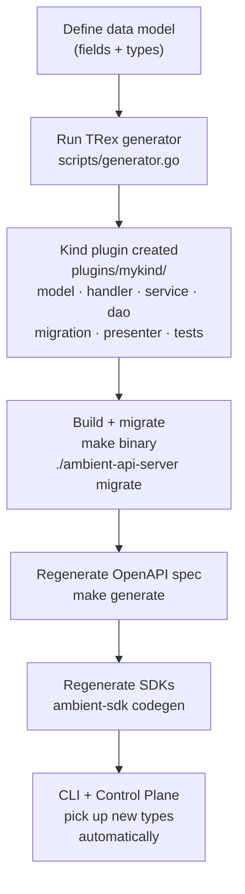

# Code Generation Workflow

The Ambient API Server is built on [rh-trex-ai](https://github.com/openshift-online/rh-trex-ai), a framework that generates complete CRUD plugins from a single command. A new resource type ("Kind") becomes a working REST + gRPC endpoint with database migrations, OpenAPI spec, and tests in one step.

## The Pipeline



## Step 1 — Generate a Kind

```bash
cd components/ambient-api-server

go run ./scripts/generator.go \
  --kind MyResource \
  --fields "name:string:required,description:string,priority:int,enabled:bool" \
  --project ambient-api-server \
  --repo github.com/ambient-code/platform/components
```

### Field Types

| Type | Go type | Notes |
|------|---------|-------|
| `string` | `string` / `*string` | |
| `int` | `int32` / `*int32` | |
| `int64` | `int64` / `*int64` | |
| `bool` | `bool` / `*bool` | |
| `float` / `float64` | `float64` / `*float64` | |
| `time` | `time.Time` / `*time.Time` | stored as UTC |

Append `:required` for non-nullable, `:optional` (default) for nullable pointer types.

### What Gets Created

```
plugins/my_resources/
├── plugin.go       init() — registers everything via side effects
├── model.go        GORM struct + PatchRequest
├── handler.go      HTTP handlers (Create, Get, List, Patch, Delete)
├── service.go      business logic, OnUpsert / OnDelete event hooks
├── dao.go          database operations
├── presenter.go    model ↔ OpenAPI conversion
├── migration.go    gormigrate schema migration
├── mock_dao.go     mock for unit tests
└── *_test.go       integration tests + test factories

openapi/openapi.my_resources.yaml   OpenAPI spec fragment
```

## Step 2 — Wire the Plugin

Add a side-effect import in `cmd/ambient-api-server/main.go`:

```go
import (
    _ "github.com/ambient-code/platform/components/ambient-api-server/plugins/my_resources"
)
```

The plugin's `init()` self-registers routes, controllers, migrations, and presenter paths.

## Step 3 — Migrate and Test

```bash
make binary
./ambient-api-server migrate

make test                  # unit tests
make test-integration      # integration tests (spins up testcontainer PostgreSQL)
```

## Step 4 — Regenerate OpenAPI Spec

```bash
make generate
```

This rebuilds `pkg/api/openapi/` from the YAML fragments in `openapi/`. The generated Go client in `pkg/api/openapi/` is checked in — **never edit it manually**.

## Step 5 — Regenerate SDKs

After the OpenAPI spec is updated, regenerate the SDKs:

```bash
cd components/ambient-sdk
# Follow SDK-specific codegen instructions in ambient-sdk/README.md
```

The Go SDK, Python SDK, and TypeScript SDK all derive types from the same `openapi.yaml`. Once regenerated, the CLI and Control Plane pick up new types on their next build — no changes needed in those components.

## Endpoints (auto-generated)

Every Kind gets five endpoints at `GET|POST|GET|PATCH|DELETE /api/ambient/v1/{kinds}`:

```
GET    /api/ambient/v1/my_resources            list (supports ?search=, ?page=, ?size=, ?orderBy=)
POST   /api/ambient/v1/my_resources            create
GET    /api/ambient/v1/my_resources/{id}       get
PATCH  /api/ambient/v1/my_resources/{id}       update
DELETE /api/ambient/v1/my_resources/{id}       delete
```

## Customizing Generated Code

The generator produces working stubs — customize them after generation:

| File | Common customizations |
|------|-----------------------|
| `service.go` | Add business logic in `OnUpsert` / `OnDelete` |
| `handler.go` | Add request validation, custom error messages |
| `presenter.go` | Control which fields are exposed in API responses |
| `migration.go` | Add indexes, constraints, default values |

## Search Query Syntax

The `?search=` parameter uses [Tree Search Language (TSL)](https://github.com/yaacov/tree-search-language):

```
name = 'foo'
priority > 3
name like 'test%' and enabled = true
id in ('abc', 'def')
```

## rh-trex-ai Framework Reference

The generator and runtime are provided by the upstream `rh-trex-ai` module. Key packages:

| Package | Purpose |
|---------|---------|
| `pkg/api` | `Meta` base type, `NewID()` (KSUID), event types |
| `pkg/handlers` | `Handle`, `HandleList`, `HandleGet`, `HandleDelete` |
| `pkg/services` | `GenericService` with TSL search |
| `pkg/db` | `SessionFactory`, advisory locks, migrations |
| `pkg/controllers` | `KindControllerManager` (event-driven) |

For local development against an unreleased upstream, add a `replace` directive in `go.mod` (do not commit):

```
replace github.com/openshift-online/rh-trex-ai => ../../../openshift-online/rh-trex-ai
```
