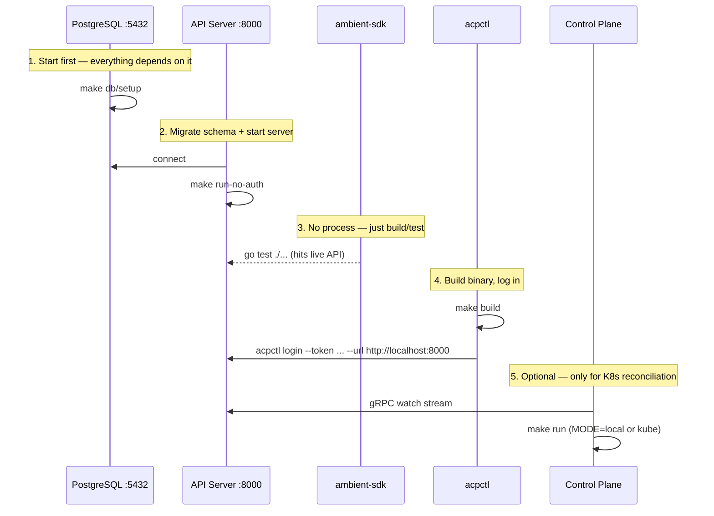

# Running the V2 Stack Locally

The V2 stack is: **PostgreSQL → API Server → (SDK) → CLI / Control Plane**. Each layer depends on the one before it.

## Prerequisites

| Tool | Version | Purpose |
|------|---------|---------|
| Go | 1.24+ | API Server, Control Plane, CLI |
| Podman or Docker | any | PostgreSQL container |
| `kubectl` / `oc` | any | Control Plane kube mode only |

## Port Map

| Service | Port | Notes |
|---------|------|-------|
| PostgreSQL | 5432 | managed by `make db/setup` |
| API Server — REST | 8000 | primary endpoint |
| API Server — gRPC | 8001 | watch streams |
| API Server — Metrics | 8080 | Prometheus |
| API Server — Health | 8083 | `/health` |
| Control Plane — AG-UI proxy | 9080 | local mode only |

## Startup Sequence



### 1. PostgreSQL

```bash
cd components/ambient-api-server
make db/setup
```

Supports both Docker and Podman (auto-detected). To force one:
```bash
make db/setup CONTAINER_ENGINE=docker
```

Verify: `pg_isready -h localhost -p 5432`

### 2. API Server

```bash
cd components/ambient-api-server
make run-no-auth     # dev mode — no auth, schema auto-migrated on start
```

Verify:
```bash
curl http://localhost:8083/health        # → {"status":"ok"}
curl http://localhost:8000/api/ambient/v1/sessions
```

> For auth-enabled mode: `make run` (requires OIDC config)

### 3. SDK (no process)

The SDK is a library — no server to start. Verify it works against the running API:

```bash
cd components/ambient-sdk/go-sdk
go test ./...

cd ../python-sdk
pytest
```

### 4. CLI

```bash
cd components/ambient-cli
make build

./acpctl login --token dev-token --url http://localhost:8000 --project default
./acpctl whoami
./acpctl get sessions
```

Config is stored at `~/.config/ambient/config.json`. Override with `AMBIENT_CONFIG`.

### 5. Control Plane (optional)

The control plane is only needed if you want session CRs reconciled into Kubernetes, or to run runner processes locally (local mode).

**Local mode** (no Kubernetes required):
```bash
cd components/ambient-control-plane
AMBIENT_API_TOKEN=dev-token \
AMBIENT_API_SERVER_URL=http://localhost:8000 \
MODE=local \
make run
```

**Kube mode** (requires cluster + kubeconfig):
```bash
cd components/ambient-control-plane
AMBIENT_API_TOKEN=dev-token \
AMBIENT_API_SERVER_URL=http://localhost:8000 \
MODE=kube \
KUBECONFIG=~/.kube/config \
make run
```

## Smoke Test

After the full stack is up:

```bash
# Create a session
./acpctl create session \
  --name smoke-test \
  --prompt "echo hello world" \
  --project default

# Watch it
./acpctl get sessions
./acpctl describe session <id>
```

## Teardown

```bash
cd components/ambient-api-server
make db/teardown     # stops PostgreSQL container
```

## Troubleshooting

| Symptom | Fix |
|---------|-----|
| `connection refused :5432` | Run `make db/setup` |
| `secrets/db.host: no such file` | Copy `secrets/` from example or create files with `localhost`, `5432`, `ambient_api_server`, `postgres`, `postgres` |
| CLI `401 Unauthorized` | In no-auth mode, any token works. In auth mode, set a valid OIDC token |
| Control plane `AMBIENT_API_TOKEN required` | Set the env var — even a dummy value works in local mode |
| gRPC connection refused | API server must be running; gRPC is on port 8001 |
