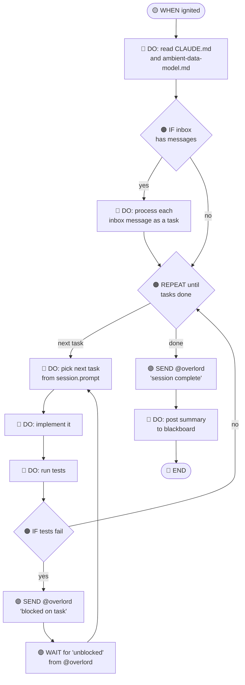
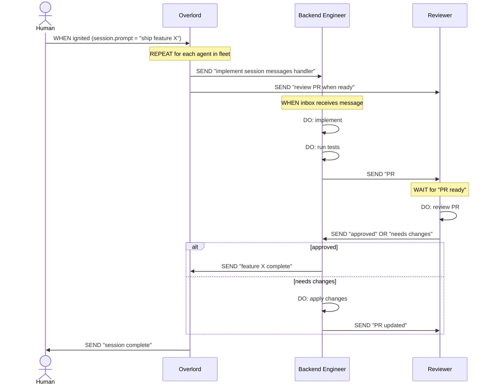
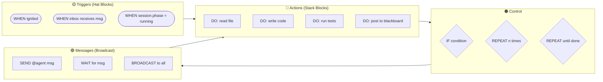
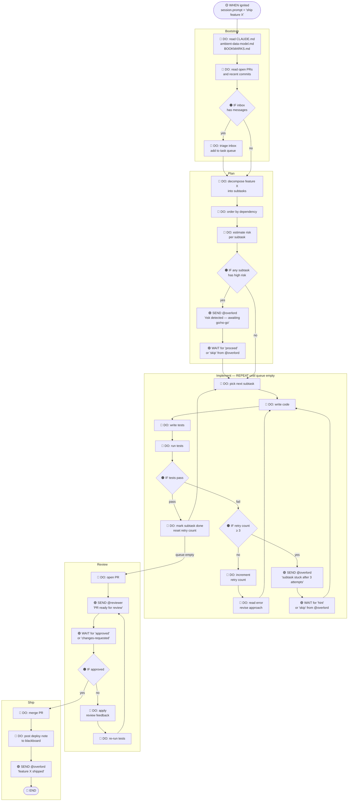

# Agent Script — Visual Language Proposal

**Date:** 2026-03-22
**Status:** Proposal

---

## Motivation

Scratch proves that a small number of composable visual constructs — hat blocks (triggers), stack blocks (actions), control blocks (if/repeat), and broadcast blocks (messages) — are sufficient to express arbitrarily complex behavior. The same reduction applies to agent orchestration. An agent session is just a trigger, a sequence of actions, some branching, and message passing. That is the complete primitive.

This proposal defines a minimal visual block language for agent scripts that:

1. Renders as Mermaid diagrams (readable in any markdown viewer)
2. Maps 1-for-1 onto the PASM model (Project → Agent → Session → Message)
3. Can be stored as `Agent.prompt` or `Session.prompt` and executed by the runner

---

## The Block Palette

Six block types. No more.

| Block | Scratch Equivalent | Colour |
|---|---|---|
| `WHEN` | Hat block — trigger | Yellow |
| `DO` | Stack block — action | Blue |
| `IF / ELSE` | Control block | Orange |
| `REPEAT` | Loop block | Orange |
| `SEND` | Broadcast block | Purple |
| `WAIT` | Wait-for-broadcast block | Purple |

---

## Mermaid Notation

### Single agent script — ignition flow



---

### Multi-agent message passing — broadcast model



---

### The six blocks as a grammar



---

### Full engineering workflow — feature delivery with escalation and retry

A longer example showing nested control, multi-agent coordination, retry loops, and final reconciliation.



---

## Mapping to PASM

Every block maps to a field in the data model:

| Block | PASM Field | Notes |
|---|---|---|
| `WHEN ignited` | `Session.prompt` trigger | The ignition event starts the script |
| `DO` | `SessionMessage` (user turn) | Each action becomes a message turn |
| `IF` | Inline in `Session.prompt` | Expressed as conditional instruction text |
| `REPEAT` | Inline in `Session.prompt` | Loop expressed as iterative instruction |
| `SEND @agent msg` | MCP `push_message` / `POST /agents/{id}/inbox` | Writes to recipient's Inbox or spawns a child session via @mention |
| `WAIT for msg` | MCP `watch_session_messages` / `GET /agents/{id}/inbox` | Streams or polls inbox for a matching message |

---

## Purple Blocks Are MCP Calls

The purple SEND and WAIT blocks are not abstract — they map directly to MCP tool calls available to every agent via the sidecar:

| Block | MCP Tool | What it does |
|---|---|---|
| `SEND @agent "task"` | `push_message` with `@mention` | Resolves the agent, spawns a child session, passes the task as `prompt` |
| `SEND @overlord "status"` | `push_message` | Pushes a user message to the Overlord's session |
| `WAIT for "approved"` | `watch_session_messages` | Subscribes to the session stream; unblocks when matching message arrives |
| `BROADCAST to fleet` | `push_message` × N | One `push_message` per agent in the fleet; each spawns a parallel child session |
| `READ project state` | `get_project` | Reads project annotations as shared state |
| `WRITE agent state` | `patch_agent_annotations` | Writes durable key-value state to the agent |

This means every purple block in a Mermaid diagram corresponds to a concrete function call the runner can make. The block language is not metaphorical — it is directly executable via MCP.

---

## Annotations as Programmable State

Annotations on projects, agents, and sessions form a three-level scoped state store accessible from any MCP call:

| Scope | MCP Tool | Lifetime | Use Case |
|---|---|---|---|
| `Session.annotations` | `patch_session_annotations` | Session lifetime | In-flight task status, retry count, current step |
| `Agent.annotations` | `patch_agent_annotations` | Persistent (survives sessions) | Last completed task, accumulated index SHA, external IDs |
| `Project.annotations` | `patch_project_annotations` | Project lifetime | Feature flags, fleet configuration, cross-agent handoff state |

Because annotations are readable via `get_session` / `get_agent` / `get_project` and writable via MCP patch tools, any external application — a CI pipeline, a webhook handler, a frontend dashboard — can read and write agent state using only the REST API. No custom database required. The platform is the state store.

### Example: cross-agent handoff via annotations

```
BE agent (session A):
  SEND patch_agent_annotations({
    "myapp.io/last-pr": "PR #142",
    "myapp.io/status": "review-requested"
  })
  SEND push_message(@reviewer, "PR #142 ready")
  WAIT watch_session_messages → "approved"
  SEND patch_agent_annotations({"myapp.io/status": "shipping"})

Reviewer agent (session B):
  WAIT watch_session_messages → "PR #142 ready"
  DO: review
  SEND push_message(@be, "approved")
  SEND patch_agent_annotations({"myapp.io/status": "idle"})

External CI pipeline:
  GET /api/ambient/v1/projects/{id}/agents/{be-id}
  → reads annotations["myapp.io/status"] = "shipping"
  → triggers deploy job
```

Any application can be built on top of Ambient this way. The agents are the compute. The annotations are the state. The inbox and session messages are the bus.

---

The full script above serialises as `Session.prompt`:

```
## When ignited

- do: read CLAUDE.md and ambient-data-model.md
- if inbox has messages:
    - do: process each inbox message as a task
- repeat until tasks done:
    - do: pick next task
    - do: implement it
    - do: run tests
    - if tests fail:
        - send: @overlord "blocked on {task}"
        - wait: "unblocked" from @overlord
- send: @overlord "session complete"
- do: post summary to blackboard
```

---

## Why This Works

Scratch's insight was that **most programs are just event → sequence → branch → loop → message**. Agent scripts are no different. The runner already executes free-text prompts as instructions — this proposal just adds lightweight structure so that:

1. Humans can read and edit scripts visually (Mermaid renders in GitHub, Obsidian, Notion)
2. Agents can parse and generate scripts in the same format they receive
3. The Overlord can compose multi-agent workflows by wiring SEND/WAIT blocks between agents
4. A future UI can render the Mermaid diagram live as the session executes, highlighting the current block

The block language is not a new runtime. It is structured `Session.prompt`. The runner executes it as natural language. The structure is for humans and orchestrators, not the interpreter.
