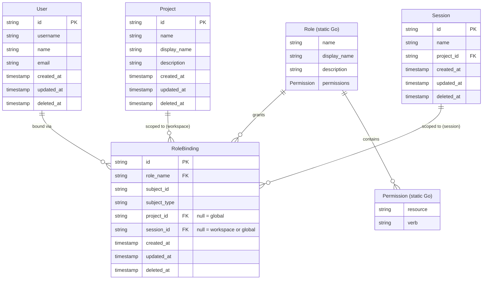

# Software Factory: ERD-Driven RBAC for Ambient Platform

## Overview

This document proposes using the **Software Factory pattern** already present in Ambient to add RBAC to the `ambient-api-server` — not by hand-coding, but by declaring the desired data model as a Mermaid ERD and letting the factory reconcile reality with spec.

The ERD is the **Desired State**. The Software Factory is the **Control Plane**. The codebase is **Status**.

---

## The Software Factory Pattern

TRex (our upstream framework, `openshift-online/rh-trex-ai`) ships a generator script that reads a Kind name and field list, then produces the full CRUD stack:

- GORM model (`model.go`)
- DAO layer (`dao.go`)
- Service layer (`service.go`)
- HTTP handler (`handler.go`)
- OpenAPI YAML spec
- Database migration
- Integration test scaffold
- Go, Python, and TypeScript SDK clients

The current process is **manual**: a developer runs the generator, then wires routes, runs SDK generation, and updates CLI, Frontend, and Control Plane by hand.

The **Software Factory** vision: the ERD is committed to `docs/design/`. The factory (our multi-agent pipeline) reads the ERD diff, computes what changed, and automatically propagates the change through every component — with Reviewer gates at each stage.

This document is the spec for the RBAC feature. The factory should be able to build it.

---

## Design Principle: Static vs Dynamic

RBAC has two fundamentally different kinds of data:

| Concept | Nature | Storage | Why |
|---------|--------|---------|-----|
| **Permission** | What actions exist on what resources | Static Go constants | Compile-time safety, TDD, exhaustive switch coverage, no runtime surprises |
| **Role** | Named groups of Permissions | Static Go structs | Same reasons — roles are part of the product contract, not user data |
| **RoleBinding** | Which User (or Group) holds which Role in which Project | Dynamic database record | Users and projects change at runtime; bindings are user data |

Permissions and Roles are **code**, not data. They live in Go alongside the handlers that enforce them. Adding a new Permission means writing a new constant, updating tests, and getting a compile error if any handler forgets to check it. This is the TDD-friendly approach.

RoleBindings are **data**. They are created and deleted by operators at runtime and must be stored, queried, and synced to Kubernetes.

---

## RBAC Data Model — Desired State (ERD)

Only `RoleBinding` is a database-backed Kind. `User`, `Project`, and `Session` already exist. `Permission` and `Role` are static Go — shown in the ERD for relationship clarity only, marked as static.

RoleBindings have three scopes, evaluated from broadest to narrowest:

| Scope | Fields set | Meaning |
|-------|-----------|--------|
| **Global** | `project_id = null`, `session_id = null` | Subject has this role across all workspaces and sessions |
| **Workspace** | `project_id = <id>`, `session_id = null` | Subject has this role within a specific workspace only |
| **Session** | `project_id = <id>`, `session_id = <id>` | Subject has this role on a specific session only |

The middleware unions all matching bindings across all three scopes. A global binding does not override a workspace or session restriction — it is additive. The narrowest scope can grant permissions the broader scope does not, but cannot revoke them.



---

## Static Layer: Permissions and Roles in Go

Permissions and Roles are declared as typed constants and structs in the API server. No database table, no REST endpoints, no migration.

### Permissions

```go
type Verb string
const (
    VerbCreate Verb = "create"
    VerbRead   Verb = "read"
    VerbUpdate Verb = "update"
    VerbDelete Verb = "delete"
    VerbList   Verb = "list"
    VerbWatch  Verb = "watch"
)

type Resource string
const (
    ResourceSession        Resource = "sessions"
    ResourceProject        Resource = "projects"
    ResourceProjectSettings Resource = "project_settings"
    ResourceRoleBinding    Resource = "role_bindings"
)

type Permission struct {
    Resource Resource
    Verb     Verb
}
```

### Built-in Roles

```go
type Role struct {
    Name        string
    DisplayName string
    Description string
    // Scope is implicit from RoleBinding fields, not stored on Role
    Permissions []Permission
}

var (
    RoleProjectAdmin = Role{
        Name:        "ambient-project-admin",
        DisplayName: "Project Administrator",
        Scope:       "project",
        Permissions: []Permission{
            {ResourceSession, VerbCreate},
            {ResourceSession, VerbRead},
            {ResourceSession, VerbUpdate},
            {ResourceSession, VerbDelete},
            {ResourceSession, VerbList},
            {ResourceSession, VerbWatch},
            {ResourceProject, VerbRead},
            {ResourceProject, VerbUpdate},
            {ResourceProjectSettings, VerbRead},
            {ResourceProjectSettings, VerbUpdate},
            {ResourceRoleBinding, VerbCreate},
            {ResourceRoleBinding, VerbRead},
            {ResourceRoleBinding, VerbDelete},
            {ResourceRoleBinding, VerbList},
        },
    }

    RoleProjectEdit = Role{
        Name:        "ambient-project-edit",
        DisplayName: "Project Editor",
        Scope:       "project",
        Permissions: []Permission{
            {ResourceSession, VerbCreate},
            {ResourceSession, VerbRead},
            {ResourceSession, VerbUpdate},
            {ResourceSession, VerbList},
            {ResourceSession, VerbWatch},
        },
    }

    RoleProjectView = Role{
        Name:        "ambient-project-view",
        DisplayName: "Project Viewer",
        Scope:       "project",
        Permissions: []Permission{
            {ResourceSession, VerbRead},
            {ResourceSession, VerbList},
            {ResourceSession, VerbWatch},
            {ResourceProject, VerbRead},
        },
    }

    AllRoles = []Role{RoleProjectAdmin, RoleProjectEdit, RoleProjectView}
)
```

The permission check middleware evaluates all three scopes. Given a request's resource + verb, it:
1. Loads all RoleBindings for the caller matching any of: global, the request's workspace, or the request's session
2. Resolves each `role_name` to a static `Role` from `AllRoles`
3. Unions all `Permission` sets across all matched bindings
4. Checks whether the required `{Resource, Verb}` is present in the union

No database join is needed for the permission set — roles and their permissions are in memory. Only `RoleBinding` rows are queried at runtime.

---

## Dynamic Layer: RoleBinding (database-backed Kind)

`RoleBinding` is the only new Kind generated by the TRex factory. It binds a subject (User or Group) to a static Role name at one of three scopes.

### Field Definitions

| Field | Type | Description |
|-------|------|-------------|
| `role_name` | string (required) | Name of a static Role, e.g. `ambient-project-admin` |
| `subject_id` | string (required) | User ID or Group name being bound |
| `subject_type` | string (required) | `User` or `Group` |
| `project_id` | string | Workspace scope — null means global |
| `session_id` | string | Session scope — null means workspace or global |

**Scope rules:**
- `project_id = null, session_id = null` → global binding
- `project_id = <id>, session_id = null` → workspace-scoped binding
- `project_id = <id>, session_id = <id>` → session-scoped binding
- `project_id = null, session_id = <id>` → invalid, rejected with `400 Bad Request`

`role_name` is validated against the static `AllRoles` slice on create. Unknown role names are rejected with `400 Bad Request`.

### TRex Generator Invocation

Only one Kind needs to be generated:

```bash
go run ./scripts/generator.go \
  --kind RoleBinding \
  --fields "role_name:string:required,subject_id:string:required,subject_type:string:required,project_id:string,session_id:string"
```

This produces: `model.go`, `dao.go`, `service.go`, `handler.go`, `openapi.roleBindings.yaml`, migration, and integration test scaffold.

---

## Software Factory Cascade

When this ERD is committed, the factory executes the following cascade:

```
Step 1 — API (ambient-api-server)
  ├── Write static rbac/permissions.go and rbac/roles.go
  ├── Run TRex generator for RoleBinding (1 Kind only)
  ├── Add role_name validation in RoleBinding service (reject unknown roles)
  ├── Add permission-check middleware: resolve caller's RoleBindings → static Role → Permission set
  └── Run 60+ integration tests → must pass

Step 2 — SDK Generator (ambient-sdk)
  ├── Update parser.go resource map: add RoleBinding
  ├── Run make generate-sdk
  └── Produces: Go + Python + TypeScript SDK types and client for RoleBinding only

Step 3 (parallel) — CLI (acpctl)
  ├── Cherry-pick SDK generated RoleBinding files
  ├── Add subcommands: acpctl get role-bindings, acpctl create role-binding, acpctl delete role-binding
  ├── Add acpctl get roles (reads static AllRoles via a lightweight /api/ambient/v1/roles endpoint)
  └── Build + test

Step 3 (parallel) — Frontend
  ├── Cherry-pick TS SDK generated RoleBinding files
  ├── Replace GroupAccess JSON textarea in Project Settings with typed role assignment UI
  └── Build + test (0 errors, 0 warnings)

Step 4 — Control Plane
  ├── Cherry-pick SDK + API changes
  ├── Remove GroupAccess JSON parser from ProjectSettingsReconciler (no longer needed)
  └── 113+ tests → must pass

Step 5 — Cluster
  ├── No new CRDs — RoleBindings live in PostgreSQL, enforced entirely by the API
  ├── Rebuild images, deploy
  └── E2E: create RoleBinding via API → attempt session create as bound user → verify 200; attempt as unbound user → verify 403
```

---

## Why This Matters: Current State vs Desired State

### Current State (Status)

- `ProjectSettings.GroupAccess` is a raw JSON blob: `[{"group":"my-team","role":"ambient-project-admin"}]`
- Control Plane parses this JSON and creates K8s `RoleBinding` objects — fragile, untyped
- Role names are unvalidated strings; typos silently grant no access
- No permission enforcement on `ambient-api-server` endpoints — any authenticated caller can do anything
- No API-level CRUD for role assignments — operators must patch raw JSON

### Desired State

- `RoleBinding` is a first-class REST resource with full CRUD and OpenAPI spec
- Role names are validated against static `AllRoles` at write time — typos are rejected immediately
- Permission middleware enforces access on every `ambient-api-server` endpoint
- Control Plane's `RoleBindingReconciler` syncs database records to K8s `RoleBinding` objects
- Frontend and CLI expose typed role assignment UX

### The Gap (Factory Work)

| Component | Gap |
|-----------|-----|
| API | Static `rbac/` package + 1 generated Kind (RoleBinding) + permission middleware |
| SDK | 1 generated resource client (RoleBinding) |
| CLI | 3 new subcommands (get/create/delete role-binding) + `get roles` |
| Frontend | Typed role assignment UI replaces GroupAccess textarea |
| Control Plane | RoleBinding reconciler replaces GroupAccess JSON parser |
| Cluster | No CRD changes — enforcement is entirely within the API server |

---

## Relationship to Kubernetes RBAC

This RBAC model is **API-native**, not Kubernetes-native. Permissions, Roles, and RoleBindings exist entirely within the `ambient-api-server` and its PostgreSQL database. Kubernetes RBAC is not involved.

| API Concept | Enforced By | Location |
|-------------|-------------|----------|
| `Permission` (static) | Permission middleware on every handler | Go code in `ambient-api-server` |
| `Role` (static) | Permission middleware resolves role → permission set | Go code in `ambient-api-server` |
| `RoleBinding` (dynamic) | Permission middleware loads caller's bindings from DB | PostgreSQL via `ambient-api-server` |

When a request arrives, the middleware:
1. Extracts the caller's identity from the bearer token
2. Determines the request scope: global, workspace (`project_id` from path/header), or session (`session_id` from path)
3. Queries `RoleBinding` for all bindings where `subject_id` matches the caller **at any scope that applies** (global bindings always apply; workspace bindings apply to all sessions within that workspace; session bindings apply only to that session)
4. Resolves each `role_name` to a static `Role` from `AllRoles`
5. Unions all `Role.Permissions` across matched bindings
6. Checks whether the required `{Resource, Verb}` pair is present in the union
7. Returns `403 Forbidden` if no binding grants the permission

Kubernetes RBAC remains responsible for cluster-level access (who can call `kubectl`, who can read Secrets, etc.). The `ambient-api-server` RBAC governs access to the platform's own API resources — Sessions, Projects, RoleBindings. These are separate concerns and do not need to be kept in sync.

---

## Dark Factory Vision

In the fully autonomous version of this workflow:

1. A developer commits this document to `main`
2. The factory detects the ERD diff via a git watcher
3. Overlord parses the diff, identifies `RoleBinding` as the new database-backed Kind
4. Factory generates, tests, reviews, and merges each component in cascade order
5. Cluster redeploys with zero human implementation work

Current autonomy: **L2** (Supervised — agents implement, humans approve merges).
Target: **L4** (Dark — ERD diff triggers fully autonomous cascade).

The gap to L4:
- ERD diff parser in Overlord (distinguishes static vs dynamic Kinds)
- Automated PR merge wired to Reviewer approval signal + CI green
- Automated cluster smoke test as final gate

---

## References

- TRex generator documentation: https://github.com/openshift-online/rh-trex-ai/blob/main/scripts/generator.md
- Current API server models: `platform-api-server/components/ambient-api-server/plugins/`
- Current Control Plane reconciler: `platform-control-plane/components/ambient-control-plane/internal/reconciler/reconciler.go`
- Software Factory pipeline: `docs/internal/developer/local-development/software-factory.md`
- Current RBAC constants (backend): `components/backend/handlers/permissions.go`
