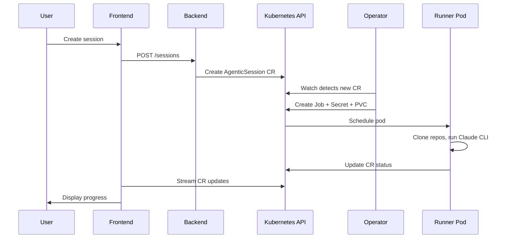

The platform is built on Kubernetes and uses Custom Resource Definitions (CRDs) as its primary data model. The core resource is the **AgenticSession** -- a custom resource that represents a single AI agent execution from creation through completion.

## Session flow

Every session follows this path through the system:

```
User creates session --> Backend creates CR --> Operator watches CR -->
Operator spawns Job --> Pod runs Claude CLI --> Results update CR --> UI displays progress
```



---

## Components

**Backend** -- Go REST API using Gin. Handles session CRUD, project management, and integration configuration. All operations use the requesting user's Kubernetes token, never the backend's own service account.

**Operator** -- Go controller built with controller-runtime. Watches AgenticSession CRDs and reconciles desired state by creating Jobs, Secrets, and PVCs with proper owner references.

**Runner** -- Python process that runs inside each Job pod. Wraps the Claude Code CLI, streams output back to the CR status, and handles graceful shutdown on timeout or cancellation.

**Frontend** -- NextJS application with Shadcn UI components. Provides the session creation dialog, real-time chat interface, and workspace management. Uses React Query for server state.

**Public API** -- Stateless Go HTTP gateway. Proxies requests to the backend without direct Kubernetes access, intended for external integrations like the GitHub Action.

---

## Key architectural decisions

The project maintains [Architectural Decision Records](https://github.com/ambient-code/platform/tree/main/docs/internal/adr) for the full rationale behind each choice. The major decisions:

- **Kubernetes-native with CRDs** ([ADR-0001](https://github.com/ambient-code/platform/blob/main/docs/internal/adr/0001-kubernetes-native-architecture.md)) -- Sessions are Kubernetes custom resources, not database rows. The operator pattern handles lifecycle management, and standard Kubernetes tooling (RBAC, namespaces, resource quotas) provides multi-tenancy.

- **User token authentication** ([ADR-0002](https://github.com/ambient-code/platform/blob/main/docs/internal/adr/0002-user-token-authentication.md)) -- Every API operation that touches Kubernetes runs with the calling user's token. The backend never uses its own service account for user-initiated actions, ensuring Kubernetes RBAC is the single source of authorization.

- **Go for backend and operator, Python for runner** ([ADR-0004](https://github.com/ambient-code/platform/blob/main/docs/internal/adr/0004-go-backend-python-runner.md)) -- Go is the standard for Kubernetes controllers and provides strong performance for the API layer. The runner uses Python because the Claude Code SDK integration and tool orchestration benefit from Python's flexibility.

- **NextJS with Shadcn UI** ([ADR-0005](https://github.com/ambient-code/platform/blob/main/docs/internal/adr/0005-nextjs-shadcn-react-query.md)) -- Server-side rendering for initial page loads, client-side interactivity for the chat interface, and a consistent component library that follows accessibility standards.

---

## Further reading

- [Design documents](https://github.com/ambient-code/platform/tree/main/docs/internal/design) -- Session reconciliation, runner-operator contract, status redesign
- [Architecture diagrams](https://github.com/ambient-code/platform/tree/main/docs/internal/architecture/diagrams) -- Mermaid diagrams for system overview, session lifecycle, deployment stack
