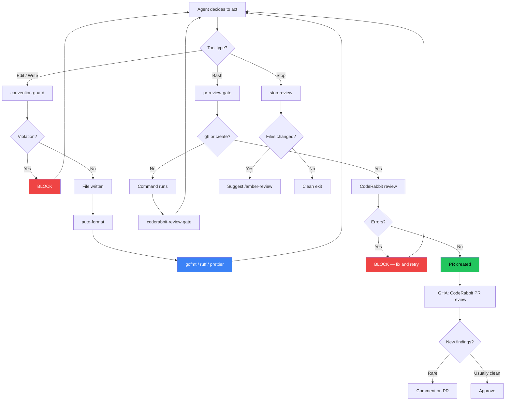
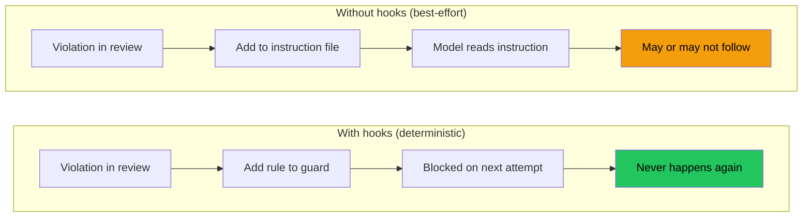

The harness is the set of agents, skills, hooks, and convention docs that shape how Claude Code behaves when working in this repository. It enforces project standards automatically — blocking bad patterns before they land, formatting code on save, and surfacing review checklists at the right moments.

Everything lives under `.claude/` and `scripts/claude-hooks/`, configured through `.claude/settings.json`.

## Architecture

The harness wraps Claude Code's tool call lifecycle with enforcement, formatting, and review:



## Hooks

**Why hooks instead of prompt instructions?** Prompt instructions are recommendations — "never use `panic()`" in a CLAUDE.md file is guidance the model can ignore under context pressure, conflicting user instructions, or simple oversight.

A `PreToolUse` hook that exits with code 2 is a **rule** — it blocks the tool call deterministically, outside the model. The model cannot override it, negotiate around it, or forget it. This makes hooks the right enforcement mechanism for hard invariants (security, conventions), while prompt instructions remain useful for soft guidance (style preferences, suggestions). Hooks also work identically across Vertex AI and Anthropic API backends, whereas prompt-type hooks have compatibility issues with some providers.

The rules in `convention-guard.sh` and the checks in the review agents are not static — they are populated through continuous learning. When a convention violation slips through and gets caught in review, the fix goes into the guard or agent so the same mistake is blocked automatically next time. The harness gets stricter over time without requiring anyone to remember what went wrong.

All hooks in this harness are **command hooks** (`"type": "command"`), not prompt hooks. Command hooks run a shell script and use the exit code to allow (0) or block (2) the tool call. Prompt hooks inject text into the model's context — they are recommendations, not enforcement. We use command hooks exclusively because they are deterministic and provider-agnostic (Anthropic API, Vertex AI, Bedrock).

The harness uses Claude Code's [hooks system](https://docs.anthropic.com/en/docs/claude-code/hooks) to intercept tool calls at three lifecycle points:

| Hook | Trigger | What It Does |
|------|---------|--------------|
| **PreToolUse** `Edit\|Write` | Before any file write | `convention-guard.sh` — blocks convention violations |
| **PreToolUse** `Bash` | Before any shell command | `pr-review-gate.sh` — intercepts `gh pr create`, runs CodeRabbit review |
| **PostToolUse** `Edit\|Write` | After any file write | `auto-format.sh` — runs gofmt, ruff, or prettier on the saved file |
| **PostToolUse** `Bash` | After any shell command | `coderabbit-review-gate.sh` — post-command review checks |
| **Stop** | When agent finishes | `stop-review.sh` — reminds to run `/amber-review` if files changed |

### Convention Guard

`scripts/claude-hooks/convention-guard.sh` is the primary enforcement hook. Its rules are **learned content** — each check exists because that specific violation occurred in a real session and was caught in review. When a new pattern of mistake is identified, a corresponding rule is added to the guard so it is blocked automatically going forward. The guard gets stricter over time as the team learns.

It checks every file write against project conventions:

- **Frontend**: blocks raw HTML elements (`<button>`, `<input>`) — must use Shadcn UI components
- **Frontend**: blocks manual `fetch()` in components — must use React Query hooks
- **Backend**: blocks direct K8s client usage without user tokens — must use `GetK8sClientsForRequest`
- **Go**: blocks `panic()` in production code — must return `fmt.Errorf`
- **Go**: blocks `errors.IsAlreadyExists` — must use reconcile (update-or-create) patterns
- **Go**: blocks silently swallowed errors (`_ = ...`)
- **Manifests**: blocks containers without `SecurityContext` (`runAsNonRoot`, drop capabilities)
- **Manifests/workflows**: warns about image reference consistency
- **Skills**: reminds about Anthropic skill-creator standards
- **New features**: suggests gating behind a feature flag

The hook exits with code 2 to block the tool call, with the reason shown to the agent via stderr.

### Auto-Format

`scripts/claude-hooks/auto-format.sh` runs the appropriate formatter after every file write:

| File type | Formatter |
|-----------|-----------|
| `.go` | `gofmt -w` |
| `.py` | `ruff format` |
| `.ts`, `.tsx`, `.js`, `.jsx` | `prettier --write` |

Skips silently if the formatter is not installed.

## Review Agents

Six per-component review agents live in `.claude/agents/`. Each checks a specific part of the codebase against its conventions:

| Agent | Scope | Checks |
|-------|-------|--------|
| `backend-review` | `components/backend/` | panic usage, service account misuse, type assertion safety, error handling, token security |
| `frontend-review` | `components/frontend/src/` | raw HTML elements, manual fetch, `any` types, `interface` usage, component size, missing states |
| `operator-review` | `components/operator/` | OwnerReferences, SecurityContext, reconciliation patterns, resource limits, panic usage |
| `runner-review` | `components/runners/ambient-runner/` | async patterns, credential handling, error propagation, hardcoded secrets |
| `security-review` | auth, RBAC, tokens, containers | cross-cutting security review |
| `convention-eval` | full codebase | scored alignment report against all documented conventions |

The `/align` skill dispatches `convention-eval` to produce a scored report.

## Skills

Skills are reusable workflows invoked with slash commands. The harness includes:

| Skill | Command | Purpose |
|-------|---------|---------|
| `/align` | Convention check | Runs `convention-eval` agent, produces scored alignment report |
| `/amber-review` | Code review | Comprehensive review using component-level standards |
| `/dev-cluster` | Cluster management | Manages local kind clusters for testing |
| `/scaffold` | Code generation | Generates file sets for new integrations, endpoints, or feature flags |
| `/unleash-flag` | Feature flags | Sets up workspace-scoped feature flags with Unleash |
| `/memory` | Memory management | Search, audit, prune, and create project memories |
| `/cypress-demo` | Video demos | Creates Cypress-based feature demos with cursor effects and captions |
| `/pr-fixer` | PR fixes | Triggers Amber to auto-fix a PR (rebase, address comments, push) |

## Convention Docs

These files are the context that guides your agents. They are loaded into the model's context window at session start and referenced by hooks and review agents throughout. The quality of agent output is directly proportional to the quality of these files — stale rules, vague guidance, or contradictory instructions produce unreliable agent behavior. Curate them like production code. Garbage in, garbage out.

The harness consolidates conventions into component-level files rather than a central directory:

- `CLAUDE.md` — project-wide conventions (authoritative)
- `BOOKMARKS.md` — links to all component guides and references
- `components/backend/DEVELOPMENT.md` — Go backend conventions
- `components/backend/ERROR_PATTERNS.md` — error handling patterns
- `components/backend/K8S_CLIENT_PATTERNS.md` — Kubernetes client usage
- `components/frontend/DEVELOPMENT.md` — frontend conventions
- `components/frontend/REACT_QUERY_PATTERNS.md` — React Query patterns
- `components/operator/DEVELOPMENT.md` — operator conventions
- `docs/security-standards.md` — security standards

## Adding to the Harness

**New hook**: Add a script to `scripts/claude-hooks/`, register it in `.claude/settings.json` under the appropriate lifecycle event and tool matcher. Always use absolute paths — prefix the command with `cd "$(git rev-parse --show-toplevel)" &&` so the hook resolves regardless of the shell's working directory:

```json
"command": "cd \"$(git rev-parse --show-toplevel)\" && bash scripts/claude-hooks/my-hook.sh"
```

Bare relative paths like `"command": "bash scripts/claude-hooks/my-hook.sh"` will fail when cwd isn't the repo root.

**New agent**: Create a markdown file in `.claude/agents/` with frontmatter (`name`, `description`) and the agent prompt.

**New skill**: Create a directory under `.claude/skills/<name>/` with `SKILL.md` (frontmatter + instructions) and `evals/evals.json` (test cases). Follow the [Anthropic skill-creator standard](https://docs.anthropic.com/en/docs/claude-code/skills).

**New convention**: This is the most common addition. Conventions flow through a layered system:

1. **Identify the scope.** If it applies to one component, add it to that component's `DEVELOPMENT.md`. If it applies across components, add it to `CLAUDE.md`.
2. **Add to BOOKMARKS.md** if the convention references external docs, patterns files, or guides that the agent needs to find.
3. **Decide if it's enforceable.** If the violation can be detected mechanically (grep for a pattern, check a file path), add a rule to `convention-guard.sh`. This promotes the convention from a recommendation to a rule — the agent is blocked from violating it.
4. **Add to review agents** if the violation requires judgment (architectural fit, naming quality, missing error handling). Update the relevant agent in `.claude/agents/` so it checks for the pattern during reviews.

`CLAUDE.md` and `BOOKMARKS.md` are the authoritative source of conventions. The hooks and agents enforce subsets of those conventions mechanically. If a convention is only in a hook but not documented in `CLAUDE.md` or a component guide, it's invisible to anyone reading the project — add the documentation first, then the enforcement.

## Migrating to Other Tools

The harness is built on Claude Code, but most of its value is in the convention docs and review logic — not the hook wiring. Here's what transfers and what doesn't.

### What's portable

| Layer | Claude Code | Cursor | Copilot | Codex |
|-------|-------------|--------|---------|-------|
| Convention docs | `CLAUDE.md` | `.cursorrules` | `AGENTS.md` | `AGENTS.md` |
| Component guides | `DEVELOPMENT.md` files | Same (agent reads repo) | Same | Same |
| Review agents | `.claude/agents/*.md` | Custom rules / prompts | — | — |
| Skills | `.claude/skills/` | — | `AGENTS.md` commands | — |
| MCP servers | `mcpServers` in config | MCP support (native) | MCP support | — |

The convention docs (`CLAUDE.md`, component `DEVELOPMENT.md` files, `BOOKMARKS.md`) are plain markdown. To migrate, copy their content into the target tool's instruction file (`.cursorrules`, `AGENTS.md`). The conventions themselves don't change — only the file the tool reads.

### What doesn't transfer

**Hooks have no equivalent in other tools.** The convention guard, auto-formatter, and PR review gate are Claude Code-specific. In Cursor or Copilot, these rules become recommendations in the instruction file rather than enforced blocks. The model might follow them; it might not.

Workarounds:
- **Pre-commit hooks** cover some of the same ground (lint, format, secrets detection) and work with any tool
- **CI checks** catch what pre-commit misses, but the feedback loop is slower (push, wait for CI, fix, push again vs. instant block)
- **`.cursorrules`** can include "always run X before Y" instructions, but enforcement depends on model compliance

The harness's continuous learning loop (violation found → rule added to guard → never happens again) degrades to a manual process without hooks: violation found → rule added to instruction file → model may or may not follow it.



## Relationship to Open Standards

This harness is built on Claude Code primitives (`settings.json`, agents, skills, hooks). If you're working in a multi-tool environment or want portability, here's how the pieces map to open standards:

### AGENTS.md

[AGENTS.md](https://github.com/anthropics/agents-md) is an emerging convention for giving any AI coding agent repository-level instructions — similar to what `CLAUDE.md` does for Claude Code, but tool-agnostic. The harness's convention docs (`CLAUDE.md`, component `DEVELOPMENT.md` files) are already structured in a way that transfers directly to an `AGENTS.md` file. The key difference is that `AGENTS.md` is passive (read by the agent at startup), while the harness hooks are active (they block violations in real time).

To adopt `AGENTS.md` alongside this harness: extract the convention rules from `CLAUDE.md` and component guides into an `AGENTS.md` at the repo root. Agents that support it (Copilot, Cursor, Windsurf, Codex) will pick it up. The hooks remain Claude Code-specific enforcement.

### agentskills.io

[agentskills.io](https://agentskills.io) defines a portable format for skills and MCP servers that work across Claude Code, Copilot CLI, and other agents. Skills in this harness (`.claude/skills/`) follow the Claude Code format. To make them portable:

1. Package skills as an agentskills.io plugin with a `plugin.json` manifest
2. Skills become cross-client — the same skill works in Claude Code, Copilot CLI, and any agent that supports the spec
3. MCP servers are already portable by design (the protocol is agent-agnostic)

The harness hooks (`convention-guard.sh`, `auto-format.sh`, `pr-review-gate.sh`) are Claude Code-specific and don't have an agentskills.io equivalent yet — hooks are the enforcement layer that the open standards don't address.
