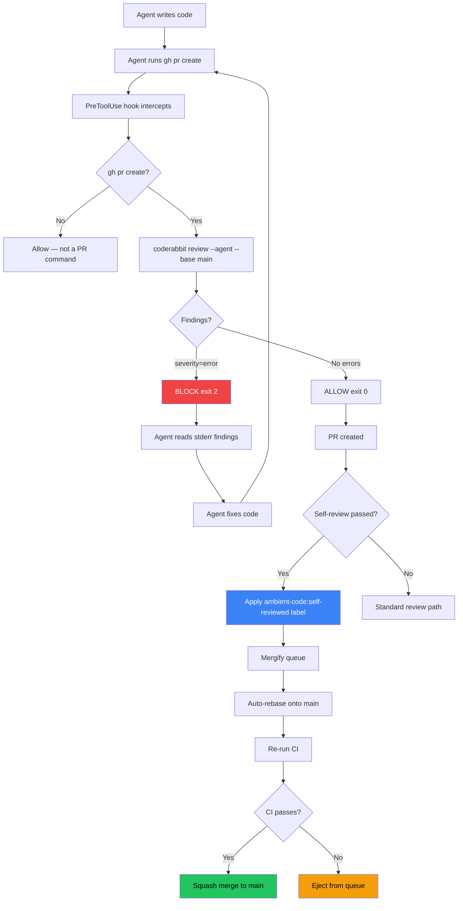

The PR review gate is a Claude Code hook that intercepts `gh pr create` and runs an AI-powered code review before the PR is created. If the review finds blocking issues, the agent fixes them and retries. The PR arrives clean.

This implements [ADR-0008](https://github.com/ambient-code/platform/blob/main/docs/internal/adr/0008-automate-code-reviews.md), which replaces human code review with automated confidence layers.

## How It Works



The hook is registered in `.claude/settings.json` as a PreToolUse handler on `Bash` tool calls. Non-`gh pr create` commands pass through instantly.

## Where It Runs

The same script (`scripts/hooks/pr-review-gate.sh`) works in three contexts:

| Runtime | Mechanism |
|---------|-----------|
| **Claude Code CLI** | `.claude/settings.json` hooks loaded directly |
| **ACP sessions** | Claude Agent SDK spawns CLI with `--setting-sources project` — same hooks apply |
| **CI / standalone** | Run `bash scripts/hooks/pr-review-gate.sh` directly (no `CLAUDE_TOOL_INPUT` — runs review immediately) |

## Circuit Breakers

The gate is designed to never block indefinitely:

| Condition | Behavior |
|-----------|----------|
| No changed files | Allow (exit 0) |
| CodeRabbit CLI not installed | **Block** (exit 2) — CLI is required |
| Rate limited | Allow (exit 0) — don't block on transient limits |
| Auth failure | Allow (exit 0) — public repos work without auth |
| Findings with severity=error | **Block** (exit 2) — agent must fix |
| Findings below error severity | Allow (exit 0) |

## Self-Reviewed Label

When both the agent's self-review and the review gate pass, the `ambient-code:self-reviewed` label is applied to the PR. This label signals to Mergify that the PR can be merged without human approval.

### Merge Queues

Mergify is configured with three priority queues:

| Queue | Trigger | Use case |
|-------|---------|----------|
| `urgent` | `hotfix` label | Production incidents |
| `self-reviewed` | `ambient-code:self-reviewed` label | Agent-authored PRs that passed automated review |
| `default` | 1 human approval | PRs that need human review |

All queues auto-rebase onto main and re-run CI before merging.

## The Review Stack

The review gate is one layer of a multi-layer confidence stack:

1. **Pre-commit hooks** — lint, format, secrets detection (runs on `git commit`)
2. **Convention guard** — blocks convention violations on every file write (runs continuously)
3. **PR review gate** — AI-powered review of the full branch diff (runs on `gh pr create`)
4. **CI checks** — E2E tests, lint, kustomize validation (runs on push)
5. **Mergify queue** — auto-rebase, re-run CI, squash merge (runs on label)

Each layer catches different classes of issues. The review gate specifically targets architectural fit, security patterns, and convention adherence that mechanical linting cannot detect.

## CodeRabbit Configuration

The review gate uses CodeRabbit CLI with project-specific configuration in `.coderabbit.yaml`:

- **Review profile**: `chill` — focuses on real issues, less verbose
- **Path instructions**: component-specific guidance (Go backend, TypeScript frontend, Python runner, K8s manifests, GitHub Actions)
- **Pre-merge checks**: performance/algorithmic complexity, security/secret handling, Kubernetes resource safety

See [CodeRabbit Integration](/platform/features/coderabbit/) for API key setup and private repo support.

## Running Manually

Outside of Claude Code, run the review gate directly:

```bash
# Review the current branch diff against main
bash scripts/hooks/coderabbit-review-gate.sh

# Or use CodeRabbit CLI directly
coderabbit review --agent --base main
```
