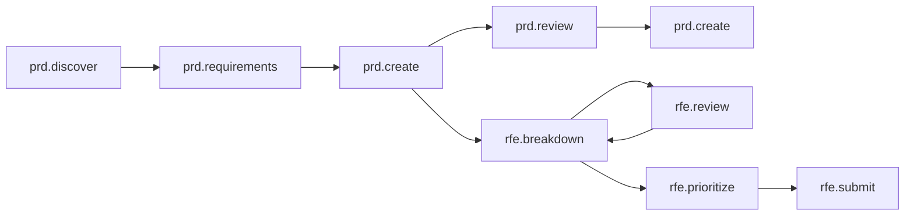

The PRD / RFE workflow helps product managers create comprehensive Product Requirements Documents and systematically break them down into actionable Request for Enhancement (RFE) items. The goal is to produce requirements documentation that is detailed enough for a senior engineer or architect to accept for implementation.

## When to use

- You need to create a formal PRD for a new feature or product initiative.
- You want to break a PRD into well-scoped RFEs that can be tracked as individual work items.
- You want agent-assisted prioritization using frameworks like RICE, MoSCoW, or Value vs. Effort.
- You want to submit RFEs directly to Jira from the workflow.

## Workflow overview

The workflow follows a structured progression from discovery through requirements, PRD creation, review loops, RFE breakdown, and submission:

## Commands

### Discovery and requirements

| Command | Purpose |
|---------|---------|
| `/prd.discover` | Product discovery -- define the problem statement, research user pain points, analyze competitive landscape, document assumptions and success metrics. |
| `/prd.requirements` | Transform discovery insights into specific, testable requirements with user stories, acceptance criteria, and MoSCoW prioritization. |

### PRD creation and review

| Command | Purpose |
|---------|---------|
| `/prd.create` | Draft or update the PRD with executive summary, product vision, goals, success metrics, and detailed requirements. |
| `/prd.review` | Review the PRD for completeness, technical feasibility, and architecture alignment. |
| `/prd.sources` | List all data sources that informed the PRD (documents, code, research, external sources). |

### RFE breakdown and submission

| Command | Purpose |
|---------|---------|
| `/rfe.breakdown` | Decompose the PRD into implementable RFEs with clear acceptance criteria, technical dependencies, and sizing estimates. |
| `/rfe.review` | Review individual RFEs for technical feasibility, testability, and architecture alignment. |
| `/rfe.prioritize` | Prioritize RFEs using RICE, MoSCoW, Value vs. Effort, and Kano frameworks. Generate an implementation roadmap. |
| `/rfe.submit` | Format RFEs and submit them to Jira (or provide manual submission instructions if Jira is not connected). |
| `/rfe.speedrun` | Automatically run the entire workflow from discovery to Jira submission, pausing only for critical questions. |

## Sub-agent collaboration

The workflow engages specialized agents at each phase:

- **Bailey (Business Analyst)** -- Business analysis and requirements elicitation.
- **Morgan (Technical Writer)** -- Documentation quality, clarity, and structure.
- **Parker (Product Manager)** -- Market strategy, competitive analysis, RICE scoring, business value.
- **Quinn (Product Strategist)** -- Product strategy and roadmap planning.
- **Riley (Product Owner)** -- User stories, acceptance criteria, backlog management, MoSCoW prioritization.
- **Ryan (UX Researcher)** -- User insights grounded in available research studies.
- **Terry (Technical Writer)** -- Technical writing and documentation standards.

## Data connections

The discovery phase can pull from multiple sources when configured:

- **Google Drive** -- Access product documents, stakeholder notes, and related assets.
- **UXR MCP** -- Structured access to user research reports and findings.
- **User-uploaded files** -- Supporting materials uploaded directly to the session.
- **Code repositories** -- Access to relevant codebases for technical context.
- **Jira** -- When the Jira MCP integration is configured in your workspace, RFEs can be submitted directly as tickets. Without it, the workflow provides manual submission instructions.

## Generated artifacts

| Artifact | Path |
|----------|------|
| Discovery document | `artifacts/discovery.md` |
| Requirements document | `artifacts/requirements.md` |
| Product Requirements Document | `artifacts/prd.md` |
| PRD quality checklist | `artifacts/prd-checklist.md` |
| PRD review report | `artifacts/prd-review-report.md` |
| RFE master list | `artifacts/rfes.md` |
| Individual RFE files | `artifacts/rfe-tasks/RFE-001-*.md`, `RFE-002-*.md`, etc. |
| Prioritization analysis | `artifacts/prioritization.md` |
| Jira ticket mapping | `artifacts/jira-tickets.md` |

## Quality rubric

The workflow includes a built-in quality rubric that evaluates RFEs on five dimensions, each scored from 1 to 5:

| Criterion | What it measures |
|-----------|-----------------|
| **Completeness** | Structural completeness and organization. |
| **Professionalism** | Professional perspective and strategic depth. |
| **Tone** | Language quality and communicative tone. |
| **Purpose** | Clarity of purpose and stakeholder alignment. |
| **Actionability** | Actionability and testability of requirements. |

After generating RFEs, the agent automatically evaluates them against this rubric and produces an aggregate score out of 25.

## Tips

- **Use `/rfe.speedrun` for a quick pass.** It runs the entire workflow end-to-end, only pausing for critical questions. Good for a first draft that you can refine.
- **Run review loops.** The workflow supports iterating on both the PRD (`/prd.review` then `/prd.create`) and the RFEs (`/rfe.review` then `/rfe.breakdown`). Multiple passes improve quality.
- **Connect Jira early.** If Jira MCP is configured in your workspace, `/rfe.submit` will create tickets automatically with proper field mapping and dependency links. Without it, you get manual submission instructions.
- **Leverage data sources.** Connect Google Drive and UXR MCP during workspace setup to give the discovery phase access to existing research and documents.
